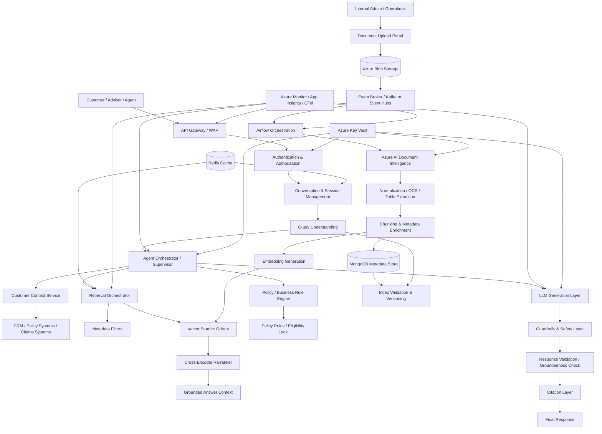
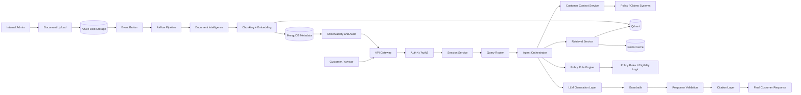
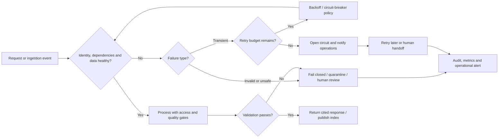

# Insurance AI Assistant Architecture

## 1. Business Problem and Solution Overview

### Business problem

Insurance customers and advisors often manually search through long and complex policy documents, brochures, claims procedures, regulatory guidance, FAQs, and terms and conditions. This creates several business problems:

- slow responses to customer inquiries
- inconsistent answers across support channels
- heavy dependency on support teams for repetitive policy questions
- difficulty scaling operations across products, regions, and lines of business
- low transparency when answering policy or claims questions
- high operational cost tied to manual document review and research

### Business need

The organization needs an enterprise-grade AI assistant that can:

- answer questions about policies, coverage, eligibility, exclusions, and procedures
- provide customer-specific answers using approved data and policy sources
- ground answers in authoritative documents and policy evidence
- support internal advisors and customer support teams
- ensure compliance, safety, explainability, and traceability
- scale securely across large document sets and customer traffic

### Solution overview

The Insurance AI Assistant combines:

- enterprise document ingestion and indexing
- policy-aware retrieval augmented generation (RAG)
- customer context integration from enterprise systems
- business rule reasoning for eligibility and policy interpretation
- guardrails and validation before final answer generation
- citations, auditability, and governance controls

This is designed as a secure production-grade AI assistant for policy and claims workflows chatbot.

---

## 2. System Requirements

The system must support:

- policy and claims Q&A for customers and insurance advisors
- retrieval of answers from policy documents, brochures, claim manuals, FAQs, and terms & conditions
- customer-specific responses based on policy/account context with strict access control
- accurate citations back to source documents and chunk-level evidence
- multi-step reasoning for coverage, premium eligibility, claims procedures, and product recommendations
- governance-safe output with guardrails, risk detection, and human escalation paths
- auditability, traceability, and compliance with financial services requirements
- high availability for customer-facing operations and advisor workflows
- secure and scalable ingestion of high-volume documents and updates

---

## 3. Functional Requirements

### Customer-facing capabilities

- natural-language Q&A over policy and claims content
- retrieval of policy clauses, definitions, exclusions, endorsements, schedules, and procedures
- claims eligibility checks using policy rules and customer data
- guidance on claim procedures and required documentation
- product and coverage recommendation based on customer profile and business logic
- FAQ support with contextual follow-up
- conversation memory across a session
- source citations and rationale for each answer
- multi-turn guided conversational experiences

### Administrative capabilities

- document upload and ingestion workflow
- document versioning and metadata tracking
- chunk-level provenance and source mapping
- re-indexing after document revisions or corrections
- role-based access to internal and external information
- monitoring of retrieval success, answer quality, and safety events

---

## 4. Non-Functional Requirements

- availability: 99.9%+ for customer-facing APIs
- latency: p95 under 3-5 seconds for standard Q&A; complex workflows may require asynchronous handling
- security: end-to-end encryption, least privilege, and strict controls for PII and customer data
- scalability: support for high concurrency and growing document corpora
- reliability: retries, idempotent ingestion, and safe fallback behavior
- observability: traces, metrics, logs, and retrieval diagnostics
- explainability: every answer must be grounded in authoritative sources
- compliance: role-based access, retention, audit logging, and governance controls
- maintainability: modular architecture, explicit contracts, and clear ownership boundaries

---

## 5. Assumptions

- the organization has enterprise identity and access management already deployed
- policy and claims data exist in CRM, policy systems, and claims systems via APIs or batch feeds
- most source documents are PDFs, semi-structured policy records, product brochures, and legal/claims documents
- some content requires OCR, table extraction, and layout-aware parsing
- the system will initially be Azure-first with portability in mind for future expansion
- human review is required for sensitive scenarios, especially claim denials and legal interpretation
- not all answers will be fully automated; some must route to human advisor workflows

---

## 6. Architecture Principles

- security by default
- least privilege for data access and retrieval
- source-first answer generation
- human oversight for compliance-sensitive decisions
- idempotent and version-aware processing
- prefer managed enterprise services over custom infrastructure unless clearly justified
- keep retrieval, orchestration, and generation loosely coupled
- build in guardrails at multiple layers: input, retrieval, reasoning, and output
- optimize for explainability and traceability, not only answer fluency
- fail-safe rather than fail-open

---

## 7. Component Architecture

### High-level flow

User
→ API Gateway
→ Authentication / Authorization
→ Conversation / Session Management
→ Query Understanding
→ Agent Orchestration
→ Customer Context Retrieval
→ RAG Retrieval
→ Re-ranking
→ Policy / Business Rule Reasoning
→ Recommendation / Answer Generation
→ Guardrails
→ Response Validation
→ Source Citation
→ Final Response

### Core components

- API Gateway: handles routing, WAF, quotas, and external API exposure
- Identity & Authorization: enterprise IAM, RBAC, ABAC, and policy enforcement
- Conversation Service: session state, memory, and user intent tracking
- Query Understanding: intent detection, classification, and routing
- Agent Orchestrator: coordinates retrieval, reasoning, policy rules, and final response generation
- Customer Context Service: retrieves policy, customer, and claims context from authoritative systems
- Retrieval Service: semantic search with metadata constraints
- Re-ranker: improves retrieval precision using cross-encoder or LLM-based ranking
- Policy / Rule Engine: applies business logic, exclusions, and policy interpretation requirements
- LLM Orchestration Layer: models, prompts, tool use, and structured output handling
- Guardrail Layer: checks for unsafe, inappropriate, or compliance-risk behavior
- Validation Layer: ensures answers are grounded in evidence and consistent with policy logic
- Citation Layer: ensures each answer maps to document and chunk source references
- Audit Service: stores prompts, retrieval context, answer traces, and escalation records

---

## 8. Data Architecture

### Data domains

- policy documents and source files
- customer and policy records
- claims metadata and status
- document metadata and version history
- vector embeddings and retrieval metadata
- conversation and session state
- audit and compliance records

### Recommended data stores

- Azure Blob Storage: original immutable source documents and extracted artifacts
- MongoDB: metadata, document versions, processing state, audit information, chunk metadata, and source references
- Qdrant: embeddings, payload metadata, retrieval context, and vector search indexes
- Redis: retrieval caching, session state, hot context caching, rate limiting, and distributed locks where useful
- optional relational DB: only if strong transactional or reporting requirements appear; not mandatory for early production

### Design patterns

- immutable source files stored in Blob Storage
- versioned metadata stored in MongoDB
- embeddings stored in Qdrant keyed to chunk IDs and document versions
- traceability retained from source document → chunk → embedding → answer → citation
- access logs and answer traces captured for every customer-facing interaction

---

## 9. RAG Architecture

### Recommended RAG flow

1. parse and classify the query
2. determine the user’s data access permissions and customer context scope
3. retrieve relevant customer and policy metadata
4. query the vector index using semantic search with metadata filters
5. optionally use lexical retrieval or hybrid retrieval for exact policy terminology
6. re-rank top results using cross-encoder scoring
7. filter to high-confidence, role-compatible, and current-version documents
8. pass retrieved evidence to the LLM as constrained context
9. require answer grounding against evidence before final output summary
10. enforce source citations and answer validation before returning to the user

### Why this is appropriate

- insurance policies are long, dense, and highly structured
- exact keyword matching alone is insufficient for nuanced questions
- metadata such as policy year, product type, jurisdiction, document version, and claim type materially affects the answer
- cross-encoder reranking improves retrieval precision and lowers hallucination risk

### Important design choices

- keep retrieval and generation separate
- use chunk-level provenance and source citations
- use metadata filters rather than broad vector-only retrieval
- track document version awareness so stale policy answers are avoided

---

## 10. Multi-Agent Architecture

A single monolithic LLM agent is not ideal for regulated enterprise scenarios. A supervisor + specialist pattern is preferred.

### Recommended specialist agents

- Router Agent: classifies each request into workflow type such as FAQ, policy lookup, claim eligibility, recommendation, or escalation
- Retrieval Agent: handles search, metadata filtering, and reranking
- Policy Reasoning Agent: interprets policy language and applies business rules
- Customer Context Agent: retrieves relevant policy, customer, and claims information
- Safety / Guardrail Agent: validates privacy and policy safety boundaries
- Validation Agent: checks groundedness, citations, and final answer consistency

### Preferred implementation model

- use LangGraph for supervisor-driven stateful orchestration when explicit workflow control is needed
- use simpler orchestration if the organization prefers a lower-complexity FastAPI + service-based design
- avoid excessive agent sprawl; use disciplined orchestration, not complexity for its own sake

---

## 11. Document Ingestion Architecture

### Ingestion pipeline

Admin
→ Document Upload / Portal
→ Object Storage
→ Event Notification
→ Event Broker (Kafka or managed Event Hubs)
→ Airflow Orchestration
→ Azure AI Document Intelligence
→ Document Normalization
→ Chunking
→ Metadata Enrichment
→ Embedding Generation
→ Qdrant Indexing
→ MongoDB Metadata / Version Tracking
→ Validation and Index Health Checks

### Why Azure AI Document Intelligence is important

- superior for scanned PDFs and layout-heavy documents
- strong for forms, tables, and semi-structured insurance records
- good fit for policy docs, claims manuals, and legacy PDF formats
- better than naïve extraction for complex insurance artifacts

### Ingestion best practices

- use chunking strategies tuned for insurance policy language: clause-based, section-based, table-aware, concise retrieval chunks
- enrich each chunk with metadata: product type, coverage line, region, document version, effective date, jurisdiction, language, and document owner
- preserve provenance for each chunk to source document and version
- include quality gates before embedding and indexing
- reprocess documents on version change while retaining prior version history
- handle OCR errors and extraction exceptions explicitly

---

## 12. Backend Architecture

### Preferred technology stack

- Python
- FastAPI
- Pydantic
- AsyncIO
- REST APIs

### Why this is appropriate

- Python is well suited to AI and ML workflows
- FastAPI offers high performance, strong validation, and developer ergonomics
- Pydantic provides reliable validation of request and response contracts
- AsyncIO supports high-throughput retrieval and orchestration flows

### Recommended service split

- API layer
- session management service
- retrieval service
- customer context service
- policy reasoning service
- ingestion pipeline service
- audit and telemetry service

### Additional technologies to evaluate selectively

- gRPC for internal service-to-service communication when latency and contract strictness matter
- Celery/RQ for async jobs where needed
- SQL database only if strong relational reporting or transactional requirements arise

---

## 13. Deployment Architecture

### Recommended production deployment stack

- Docker
- Kubernetes on AKS
- Azure Container Registry
- Azure Blob Storage
- Azure Key Vault
- Azure Monitor
- Application Insights
- Azure API Management or equivalent ingress layer
- managed Kafka or Event Hubs where needed
- CI/CD via GitHub Actions or Azure DevOps

### Why this stack is appropriate

- Azure-native and enterprise-friendly
- mature operations and security controls
- strong support for container orchestration and autoscaling
- easier governance and compliance management

### What to avoid

- overbuilding a large microservices mesh for a moderate workload
- unnecessary infrastructure layers
- poor network isolation and insufficient ingress controls

---

## 14. Security Architecture

### Core controls

- OAuth2 / OIDC authentication for users and services
- RBAC / ABAC for permission checks by role and context
- PII detection and masking before LLM calls when needed
- retrieval filtering based on user permissions and policy scope
- encryption in transit and at rest
- private networking and private endpoints where possible
- WAF and DDoS protection at the edge
- secrets managed in Azure Key Vault
- careful retention and deletion policies
- secure configuration and prompt handling
- rate limiting and abuse protection

### AI-specific security risks to address

- prompt injection from user input or retrieved documents
- retrieval poisoning via tampered source documents
- data leakage across tenants or roles
- unsupported extraction of customer or policy info
- unsafe or non-compliant model-generated answers

### Guardrail layers

- input validation and sanitization
- prompt injection detection
- retrieval filtering and role-based access checks
- answer grounding and evidence validation
- output safety filters
- human escalation for high-risk decision paths

---

## 15. Observability Architecture

### Needed telemetry

- request latency and throughput
- retrieval latency and quality
- token usage and cost per request
- rerank performance
- guardrail triggers and safety events
- answer groundedness and citation success
- ingestion pipeline health and job failures
- operational alerts for key business workflows

### Recommended tools

- OpenTelemetry for instrumentation
- Azure Monitor and Application Insights for logs, metrics, and tracing
- LangSmith only when deep model experimentation is necessary
- centralized structured logging across user and ingestion workflows

### Why it matters

Insurance AI workloads are not just UX features. They are business-critical and compliance-sensitive. Without proper observability, failures can go undetected while users rely on them.

---

## 16. Failure and Recovery Architecture

### Failure design principles

- retries with exponential backoff for transient failures
- idempotent ingestion and indexing jobs
- dead-letter handling for event-processing failures
- graceful degradation when a dependency is unavailable
- circuit breakers for downstream services
- stale document reprocessing and correction workflows
- clear rollback procedures for prompts, retrieval logic, or model changes

### Fail-safe behavior

- if retrieval fails, return a limited safe response or ask the user to retry
- if customer context is unavailable, do not infer unsupported customer-specific coverage details
- for sensitive claim or denial workflows, route to manual review rather than risk a wrong automated answer

---

## 17. Scalability Architecture

### Scalability dimensions

- concurrent user requests
- document ingestion throughput
- retrieval performance with large corpora
- vector index growth
- multi-tenant request isolation
- burst traffic handling

### Recommended measures

- horizontal scaling of API and orchestration services
- queue-based asynchronous ingestion and heavy processing
- metadata filtering to reduce retrieval cost
- Redis hot cache and short-lived state
- autoscaling around queue depth and API load
- query-time pruning of low-value documents

---

## 18. CI/CD Architecture

### Recommended pipeline

- pull request checks: linting, unit tests, schema validation, security scans
- container builds and image signing
- integration tests for retrieval and backend flows
- deployment to dev and test environments
- production deployment with approval gates and rollout controls
- automatic rollback on health or quality regressions

### For AI workflows, version everything

- model versions
- prompt versions
- retrieval configurations
- chunking logic
- evaluation datasets
- guardrail policies

---

## 19. Testing Strategy

### Test layers

- unit tests for validation, retrieval logic, business rules, and output formatting
- integration tests for ingestion, indexing, retrieval, and customer context retrieval
- end-to-end tests for claims flows, FAQ flows, recommendation flows, and escalations
- safety tests for prompt injection, PII leakage, and unsupported claims
- performance tests for concurrency and ingestion throughput
- regression tests for document updates, stale index handling, and citation issues

### Evaluation datasets

Use gold-standard question sets with:

- expected answers
- expected evidence/citations
- relevant policy clauses
- correct denial or approval logic
- edge-case handling for ambiguous or restricted questions

---

## 20. Governance Strategy

### Mandatory guardrails

- AI usage policy and risk classification
- human review for claim denial and compliance-sensitive decisions
- documentation of model choices and evaluation results
- data classification, retention, and deletion policies
- access review and recertification for customer and policy data
- approval workflow for policy content changes and document ingestion
- audit trails for model outputs and user interactions
- incident response playbooks for model failures and retrieval issues

### Governance operating model

- product owner, compliance/legal, security, and engineering jointly own policy decisions
- customer-specific answers should be evidence-backed and permission-justified
- stale or superseded documents must not be used when more recent policy versions are active

---

## 21. Cost Considerations

### Main cost drivers

- LLM inference cost
- embedding generation cost
- OCR and document processing cost
- storage and vector indexing cost
- telemetry and logging volume
- rerank and orchestration compute

### Cost control approaches

- use smaller models for routing and guardrails
- use premium models only for final reasoning and answer synthesis where needed
- cache frequent retrieval results and common FAQ answers
- add quality gates to avoid repeated document reprocessing
- use metadata filtering to reduce retrieval cost
- limit context windows to relevant chunks
- monitor token usage and model cost continuously
- set budget alarms and usage guardrails for operations teams

---

## 22. Technology Stack Assessment

### Keep

- OpenAI GPT models for reasoning and answer synthesis
- OpenAI text-embedding-3-large for semantic retrieval
- Qdrant for vector search and retrieval metadata
- MongoDB for metadata and versioning
- Redis for caching, throttling, and short-lived state
- Azure Blob Storage for source documents and processed artifacts
- Azure AI Document Intelligence for PDFs and layout-heavy extraction
- Python, FastAPI, Pydantic, AsyncIO for backend services
- Docker, AKS, ACR, Key Vault, Azure Monitor, and Application Insights for deployment and operations

### Use selectively

- LangGraph: useful for explicit multi-agent orchestration and workflow state
- LangChain: helpful for abstraction, but avoid unnecessary complexity if direct SDKs are sufficient
- LangSmith: useful for experimentation and tracing when needed
- BGE cross-encoder: recommended for reranking quality
- NeMo Guardrails: useful if the organization wants a policy-first guardrail framework; otherwise, implement guardrails in the app and orchestration layer

### Avoid unless justified

- Kafka if a managed broker or equivalent already exists and is sufficient
- additional data stores without clear architectural need
- complex microservice topology without operational necessity

---

## 23. High-Level System Diagram

This diagram captures the complete enterprise flow: user request handling, customer-context retrieval, RAG retrieval, policy/business rule reasoning, output validation, and asynchronous ingestion/indexing.

---

## 24. Component Interaction Diagram

This diagram shows the service dependencies and data flow across user interactions, policy reasoning, and ingestion/indexing workflows.

---

## 25. Supporting Detailed Architecture Documents

This parent README is the top-level reference. Supporting design documents are linked below:

- [rag-architecture.md](./rag-architecture.md)
- [deployment-architecture.md](./deployment-architecture.md)
- [backend-architecture.md](./backend-architecture.md)

### Detailed document coverage

- [rag-architecture.md](./rag-architecture.md): retrieval, reranking, chunking, citation strategy, and RAG evaluation
- [deployment-architecture.md](./deployment-architecture.md): cloud deployment, AKS, storage, monitoring, and production operations
- [backend-architecture.md](./backend-architecture.md): service responsibilities, FastAPI backend design, and dependency model

---

## 26. Production Recommendations

- keep policy reasoning conservative and evidence-based
- use metadata filters heavily to reduce irrelevant retrieval
- require citations for all factual or policy-based answers
- maintain strict access controls for customer-specific policies and claims
- use a human escalation path for claim denials and legal interpretation
- monitor retrieval quality, model cost, and safety events continuously
- treat document ingestion as a production-grade workflow, not a one-time batch task

---

## 27. Edge Case & Failure Handling

The system must fail safely: it should not return customer-specific coverage conclusions when authorization, source freshness, evidence quality, or validation cannot be established. Detailed component-specific scenarios are documented in the [RAG architecture](./rag-architecture.md), [deployment architecture](./deployment-architecture.md), and [backend architecture](./backend-architecture.md).

### Scenario: Customer or advisor is not authorized for requested data

- **Why it can happen:** Expired credentials, missing role claims, incorrect customer-policy association, or an authorization service outage.
- **How the architecture detects it:** Identity token validation and an authorization check fail, time out, or return no matching customer relationship.
- **How the system handles/recover from it:** Deny access before retrieving customer data; refresh identity context only through the approved identity flow. Do not retry an authorization denial as if it were transient.
- **Fallback behavior:** Return a generic access error or direct the user to the supported service channel; do not reveal whether another customer or policy exists.
- **Impact on the user/system:** The user cannot complete that customer-specific request; no protected data is disclosed.
- **Monitoring/alerting required:** Track authorization denials and dependency errors separately; alert on spikes, latency, and possible cross-tenant access anomalies.

### Scenario: Policy source is stale, conflicting, or not fully indexed

- **Why it can happen:** A new policy version arrives while indexing is incomplete, document metadata is incorrect, or a superseded source remains searchable.
- **How the architecture detects it:** Version/effective-date filters and ingestion validation identify missing, stale, duplicate, or conflicting versions; query evaluation can detect no current-version evidence.
- **How the system handles/recover from it:** Keep the new version unavailable until indexing and metadata validation pass; retain the previous approved version only when its effective period applies; reprocess or correct the source with lineage intact.
- **Fallback behavior:** State that current policy evidence is unavailable and route the user to an advisor rather than infer coverage from a stale document.
- **Impact on the user/system:** Answer may be delayed or escalated; prevents materially incorrect policy guidance.
- **Monitoring/alerting required:** Alert on ingestion age, index/version mismatch, validation failure, and searches with no current-version result.

### Scenario: Critical dependency is unavailable or degraded

- **Why it can happen:** Regional or zone outage, network failure, rate limiting, resource exhaustion, or a managed service incident affects the LLM, vector store, customer systems, or event broker.
- **How the architecture detects it:** Timeouts, health/readiness probes, dependency error rates, queue lag, circuit-breaker state, and latency SLO breaches.
- **How the system handles/recover from it:** Apply bounded retries with backoff for transient errors, circuit-break failing dependencies, use redundant instances or replayable queues where configured, and restore/reprocess from durable source data.
- **Fallback behavior:** Disable only the affected capability when safe. Do not provide customer-specific answers if customer context is unavailable; offer a retry or human handoff.
- **Impact on the user/system:** Reduced functionality or slower response, while unaffected APIs and ingestion work may continue.
- **Monitoring/alerting required:** Alert on SLO breaches, dependency health, circuit-breaker state, queue depth/age, and recovery/replication lag.

### Scenario: Answer generation or validation fails

- **Why it can happen:** Model timeout or malformed output, prompt/configuration regression, insufficient evidence, citation mismatch, or guardrail service failure.
- **How the architecture detects it:** Structured-output/schema validation, groundedness and citation checks, safety outcomes, model timeouts, and evaluation/quality metrics.
- **How the system handles/recover from it:** Retry only transient model errors within a request budget; reject invalid drafts; preserve trace data; roll back a bad prompt/model configuration; route sensitive or repeatedly invalid cases to review.
- **Fallback behavior:** Return a safe limitation or escalation response; never return an unvalidated answer as success.
- **Impact on the user/system:** The user receives a limited answer or human handoff instead of potentially misleading advice.
- **Monitoring/alerting required:** Alert on model errors, validation rejection rate, citation failures, safety-trigger trends, and answer-quality regressions.

### Cross-system recovery path

The system retries only recoverable transient failures; invalid or unsafe states fail closed. Durable source documents, queues, audit records, and versioned configuration support replay and rollback without silently changing the basis of an answer.

---

## 28. Final Summary

The Insurance AI Assistant is designed as a secure, production-grade AI system that brings together enterprise knowledge retrieval, policy-aware reasoning, customer context integration, and robust governance. It is optimized for insurance use cases where accuracy, traceability, policy compliance, explainability, and operational safety are essential.

The architecture balances:

- AI reasoning
- RAG quality
- enterprise security
- operational scalability
- observability and auditability
- human oversight and governance

This makes it suitable for an enterprise insurance environment that needs trustworthy, explainable AI support rather than a demo-only chatbot.
