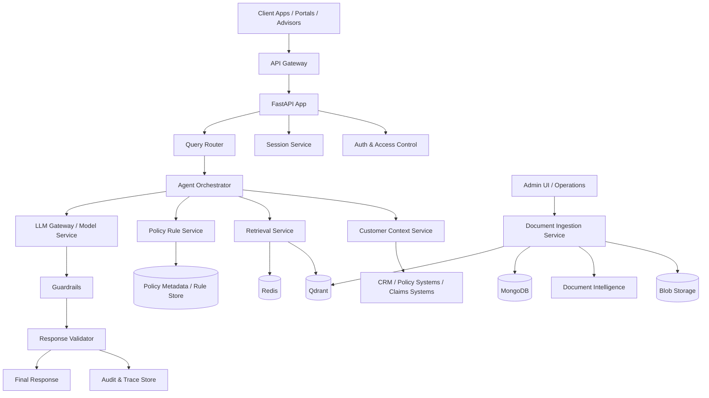
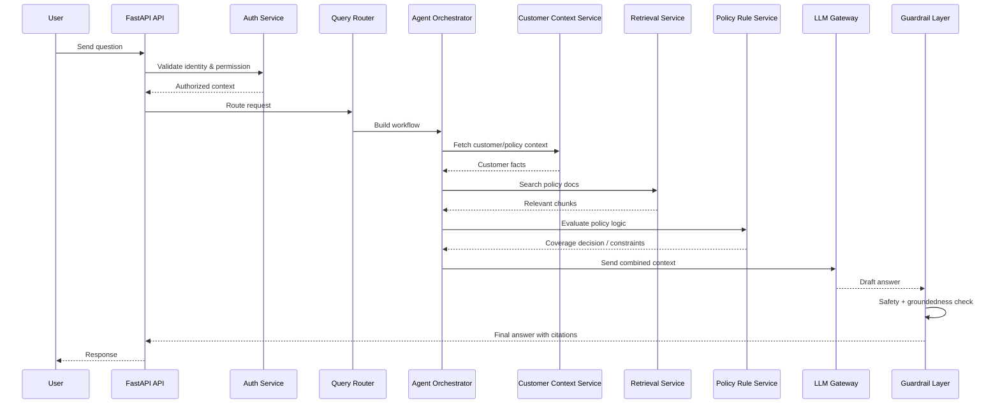
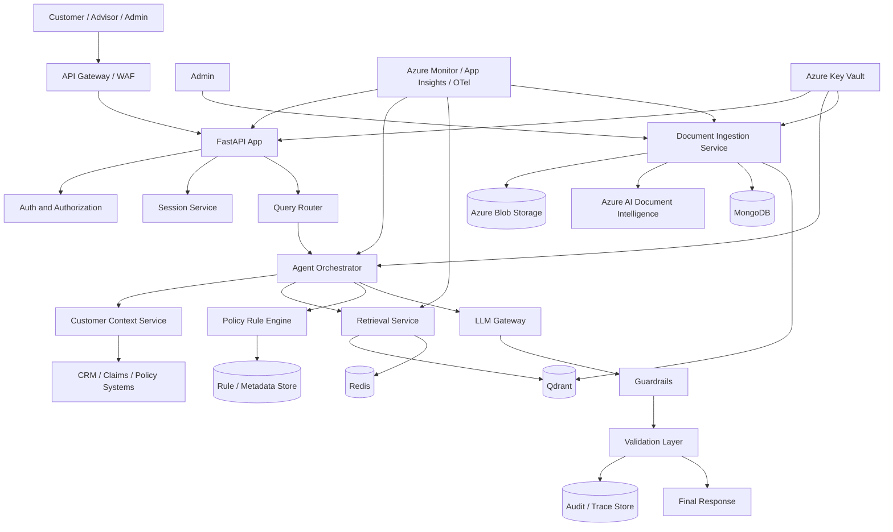
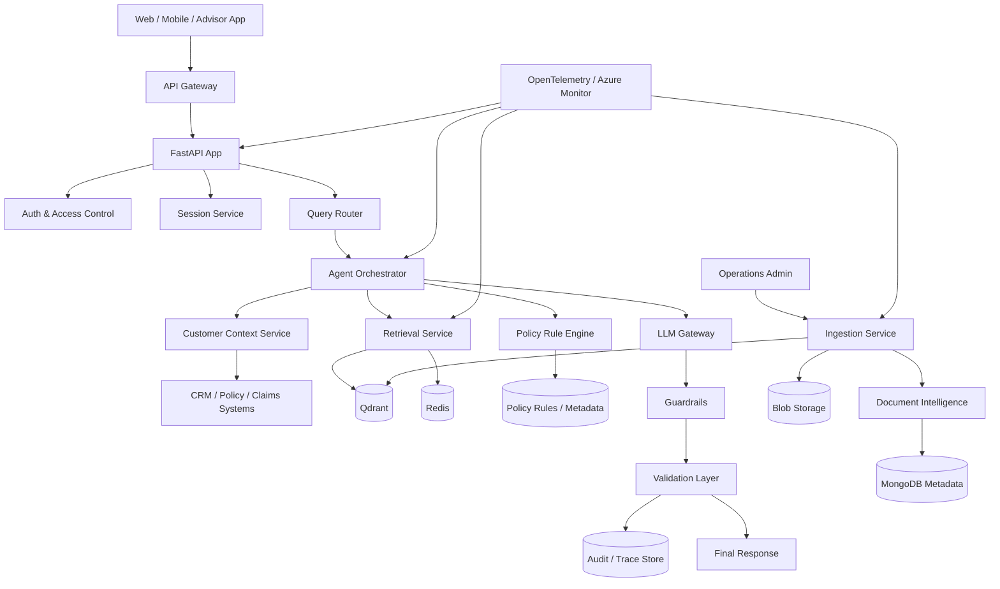
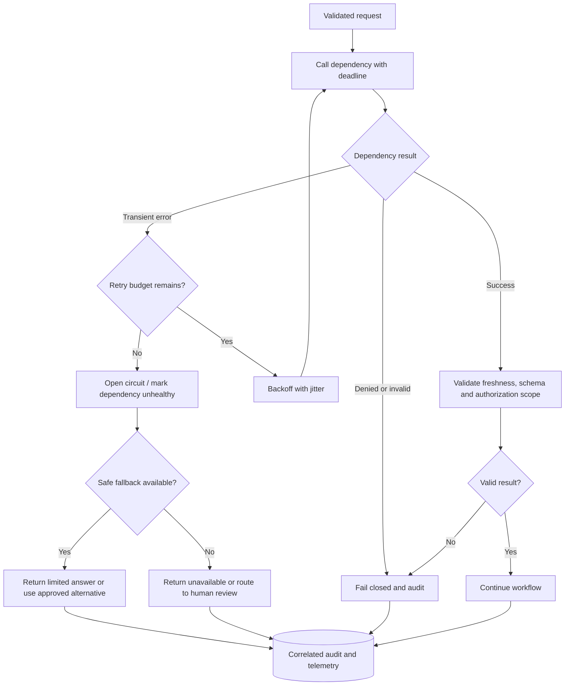

# Backend Architecture for Insurance AI Assistant

## Overview

This document describes the backend architecture for the enterprise insurance AI assistant. The backend must support:

- secure API interfaces
- retrieval and orchestration logic
- customer and policy context access
- vector-search integration
- document ingestion and metadata workflows
- auditability and telemetry
- operational resilience and scalability

The preferred implementation stack is Python with FastAPI, Pydantic, and AsyncIO, with enterprise-grade deployment on Azure and Kubernetes.

---

## 1. Backend Objectives

The backend should:

- expose a secure REST API for customers, advisors, and internal operations
- orchestrate retrieval, customer data gathering, and model reasoning
- enforce role-based and policy-based access checks before returning answers
- support both synchronous and asynchronous workflows
- keep the AI logic modular and testable
- log all decisions, retrievals, safety events, and answer traces

---

## 2. Recommended Backend Stack

### Core technologies

- Python
- FastAPI
- Pydantic
- AsyncIO
- Uvicorn / ASGI runtime
- Structured logging
- OpenTelemetry
- Redis for caches and short-term sessions
- MongoDB for metadata and audit information
- Qdrant for vector retrieval

### Why this stack is appropriate

- Python is a standard for AI, ML, and enterprise backend engineering
- FastAPI provides high performance and strong type validation
- Pydantic guarantees validated request and response schemas
- AsyncIO helps when calling retrieval systems, database services, and LLM wrappers concurrently
- The backend remains easy to test, secure, and operationalize in production

---

## 3. Backend Service Breakdown



---

## 4. Service Responsibilities

### 4.1 API gateway and entrypoint
Responsibilities:

- provide HTTP API for all user requests
- route by workflow type
- enforce rate limits and request validation
- inject tenant / role context
- expose only the required interfaces externally

### 4.2 Authentication and authorization service
Responsibilities:

- verify identity via OAuth2/OIDC or enterprise IAM
- determine user role and access rights
- verify policy or claim access restrictions
- prevent cross-user data leakage

### 4.3 Session and conversation service
Responsibilities:

- store session state
- persist conversation context
- track user interaction history
- maintain short-lived memory for multi-turn conversations

### 4.4 Query router
Responsibilities:

- classify user intent
- distinguish FAQ, policy lookup, claim status, coverage inquiry, recommendation, or escalation
- choose whether to use retrieval, rules, or a human workflow

### 4.5 Agent orchestrator
Responsibilities:

- coordinate multi-step reasoning flows
- call retrieval, customer context, policy rules, and LLM services
- maintain deterministic workflow state for auditability

### 4.6 Customer context service
Responsibilities:

- fetch policy details, customer profile, claims state, coverage information
- combine business data with retrieved document evidence
- ensure any customer facts are permission-checked before use

### 4.7 Retrieval service
Responsibilities:

- build search queries based on user intent and customer context
- apply metadata filters (product, document type, region, policy version)
- consult Qdrant for vector retrieval
- optionally apply lexical retrieval or hybrid query logic
- call rerankers and then assemble evidence for the model

### 4.8 Policy rule service
Responsibilities:

- evaluate claim eligibility and business rules
- apply policy logic for coverage, exclusions, waiting periods, and claim procedure checks
- be strict about not inferring unsupported coverage scenarios

### 4.9 LLM gateway
Responsibilities:

- manage model API calls
- handle prompt templates and structured output generation
- track model version and cost usage
- enforce guardrails and fallback logic

### 4.10 Guardrail and validation service
Responsibilities:

- detect prompt injection and unsafe input
- ensure retrieved evidence is used properly
- validate answer grounding and citation completeness
- detect poor or unsupported output and route to review if needed

### 4.11 Audit and trace service
Responsibilities:

- record user request details
- log all retrieved evidence and policy decision inputs
- save model outputs and citations
- persist approval or escalation decisions

---

## 5. Backend Request Flow



---

## 6. Data Contracts and Domain Models

### 6.1 Request models
Use Pydantic schemas for:

- conversation request
- policy query request
- claims lookup request
- document upload request
- admin workflow action request

### 6.2 Response models
Use structured response models for:

- final answer payload
- citations
- guardrail status
- retrieval metadata
- workflow trace summary

### Example response skeleton

```python
from pydantic import BaseModel
from typing import List, Optional

class Citation(BaseModel):
    doc_id: str
    chunk_id: str
    section_title: Optional[str]
    page_number: Optional[int]
    version: str

class AnswerResponse(BaseModel):
    answer: str
    citations: List[Citation]
    confidence: float
    guardrail_status: str
    escalation_required: bool = False
```

---

## 7. Asynchronous Processing Patterns

Some backend workflows are not user-interactive and should run asynchronously.

### Example workloads

- document ingestion
- embedding generation
- chunk indexing
- background audits
- batch data refreshes
- reindexing after policy updates

### Pattern recommendation

- Use async job queues or event-driven processing for these tasks
- Keep synchronous user-facing workflows short and responsive
- Do not block the user API while large ingestion or indexing tasks execute

---

## 8. Storage and Integration Layer

### Persistent stores

- MongoDB for metadata and audit records
- Qdrant for retrieval vectors
- Redis for sessions and caches
- Blob storage for raw source documents and extracted outputs

### Integration patterns

- use repository/service abstractions for each storage system
- isolate AI service calls behind ports/adapters
- treat external systems as dependencies to help with testing and resilience

---

## 9. Authentication and Authorization Model

### Identity model

- enterprise SSO / OAuth2 / OIDC
- service-to-service authentication via managed identity or JWTs

### Authorization model

- RBAC for roles such as adviser, customer, admin, operations
- ABAC for customer-specific contextual access
- document access filtered at retrieval time

### Principle

Never assume a user can access all policy documents just because they are logged in.

---

## 10. Security in the Backend

### Required protections

- input validation at API boundaries
- sanitization for user-controlled content
- prompt-injection defense in orchestration logic
- masking of PII before sending data to LLMs when necessary
- secure storage and rotation of secrets
- least-privilege service permissions
- strict logging without leaking sensitive data

### High-risk backend flows

- customer-specific policy retrieval
- claims eligibility decisions
- denials or exceptions handling
- internal document ingestion and metadata updates

These should usually have additional validation and audit checks.

---

## 11. Observability and Telemetry

The backend must create rich operational telemetry.

### Required telemetry

- request latency by endpoint
- error rate and exception traces
- retrieval latency and status
- model latency and token usage
- business workflow state transitions
- safety and guardrail triggers
- audit events for policy or claims answers

### Implementation

- OpenTelemetry instrumentation across services
- structured logs with correlation IDs
- trace IDs linking user request → orchestration → retrieval → answer
- centralized dashboards and alerting in Azure Monitor / Application Insights

---

## 12. Failure Handling and Resilience

### Backend failure scenarios

- model API unavailable
- retrieval database failure
- customer policy API timeout
- Redis cache outage
- document ingestion pipeline delay
- unexpected data schema mismatch

### Recommended strategies

- retries with timeout and backoff
- degraded mode for non-critical workflows
- fallback safe responses when retrieval quality is poor
- circuit breakers for dependencies
- idempotent processing for ingestion and metadata jobs

### Important principle

Failure should degrade safely, not silently provide incorrect customer-specific claims.

---

## 13. Scalability Model

### Horizontal scaling strategies

- replicate API pods behind the gateway
- independently scale retrieval and orchestration layers
- use queue-based ingestion processing
- cache frequently requested FAQs and customer policy facts

### Adaptive scaling triggers

- number of concurrent requests
- LLM latency and queue backlog
- retrieval latency and Qdrant load
- storage workload for ingestion

---

## 14. Testing Strategy for Backend

The backend should be covered at multiple levels.

### Unit tests

- auth logic
- validation and request parsing
- orchestration path selection
- metadata filtering logic
- guardrail checks

### Integration tests

- retrieval integration with Qdrant
- metadata lookup integration with MongoDB
- customer context API calls
- policy rule engine behavior

### End-to-end tests

- FAQ response flow
- claims-status flow
- claim-eligibility flow
- product recommendation flow
- escalated human-review flow

---

## 15. Backend Architectural Decision Summary

The recommended backend architecture is:

- FastAPI-based REST API with validated schemas
- modular service decomposition for retrieval, policy logic, agent orchestration, and validation
- strong identity and access enforcement
- asynchronous processing for ingestion and other heavy jobs
- Azure-native storage and telemetry architecture
- structured auditability for regulated workflows

This architecture is suitable for a production insurance AI assistant because it supports both user-facing intelligence and operational reliability while keeping the system secure, maintainable, and auditable.

---

## 16. Full Backend Architecture Diagram



This diagram reflects the full backend engine behind the insurance AI assistant: secure user entry, policy-aware retrieval, orchestration, validation, and operational monitoring.

## Backend Dependency Diagram



This diagram highlights the backend service interactions, dependency chain, and the data flow that supports secure, policy-aware responses and asynchronous ingestion work.

---

## 17. Edge Case & Failure Handling

The backend must treat authorization, customer context, policy evidence, and response validation as correctness gates. Timeouts and dependency errors must be visible and must not be converted into successful-looking but incomplete answers.

### Scenario: Invalid, expired, or incomplete identity/authorization context

- **Why it can happen:** Expired or malformed tokens, identity-provider outage, missing role/tenant claims, or stale policy/customer relationship data.
- **How the architecture detects it:** Authentication middleware validates issuer, signature, audience, and expiry; authorization checks required claims and customer scope before accessing data.
- **How the system handles/recover from it:** Reject invalid credentials; refresh only through the approved identity flow; retry identity-provider errors only when transient and within request deadlines. Do not retry a policy denial as a service error.
- **Fallback behavior:** Return a generic unauthorized/forbidden response without revealing whether the requested policy or claim exists.
- **Impact on the user/system:** Request cannot proceed until credentials or access are corrected; protected data remains unavailable.
- **Monitoring/alerting required:** Track authentication failures separately from access denials; alert on identity-provider latency/outage and anomalous tenant/role access patterns.

### Scenario: Customer context or policy/claims system times out or returns stale data

- **Why it can happen:** Upstream service degradation, network timeout, rate limiting, stale replica, or incompatible response schema.
- **How the architecture detects it:** Per-dependency deadlines, response schema and freshness checks, circuit-breaker state, and source timestamps.
- **How the system handles/recover from it:** Use bounded retries with backoff for transient failures; validate data contracts; open the circuit during sustained failure and emit a correlated trace. Do not use stale customer data unless explicitly permitted by the business freshness policy.
- **Fallback behavior:** Continue only with a public/general policy answer when retrieval authorization and response wording make that safe; otherwise request retry or route to an advisor. Never present a general answer as customer-specific.
- **Impact on the user/system:** Personalized eligibility or claims flows may be unavailable; non-customer-specific FAQs may continue.
- **Monitoring/alerting required:** Alert on upstream error rate, timeout rate, freshness lag, circuit-breaker opens, and schema-validation failures.

### Scenario: Qdrant or retrieval dependency is unavailable

- **Why it can happen:** Vector service outage, network partition, index overload, deployment issue, or shard/replica failure.
- **How the architecture detects it:** Connection/query timeouts, readiness checks, retrieval latency and error metrics, and missing-index/version validation.
- **How the system handles/recover from it:** Apply bounded retry and circuit-breaker behavior; restore connectivity or fail over to a validated replica/index when configured; preserve correlation IDs and retrieval diagnostics.
- **Fallback behavior:** Do not generate policy claims without evidence. Return an explicit temporary-unavailable/no-evidence response or initiate human review.
- **Impact on the user/system:** RAG questions fail safely; unrelated session and administrative features may remain available.
- **Monitoring/alerting required:** Alert on Qdrant health, query errors/latency, replica status, index freshness, and no-evidence rate changes.

### Scenario: LLM provider throttles, times out, or returns malformed output

- **Why it can happen:** Provider outage, rate/token limits, transient network errors, model change, or output exceeding the expected schema.
- **How the architecture detects it:** Request deadlines, provider status/error codes, token-budget checks, structured-output parsing, and schema validation.
- **How the system handles/recover from it:** Retry only transient errors with bounded exponential backoff and jitter; honor rate-limit retry guidance; use an approved lower-cost/backup model only if it has passed governance and quality evaluations; capture model/configuration identifiers.
- **Fallback behavior:** Return a safe retry message or advisor handoff; never return partial or malformed generated text as a completed answer.
- **Impact on the user/system:** Increased latency, temporary loss of generative responses, or escalation; API remains responsive within its deadline budget.
- **Monitoring/alerting required:** Alert on provider error and throttle rates, latency, token-budget exhaustion, invalid structured outputs, fallback model usage, and cost anomalies.

### Scenario: Redis session/cache outage or cache contains stale data

- **Why it can happen:** Redis failover, network interruption, memory pressure, eviction, TTL/configuration error, or cache key omits authorization/version scope.
- **How the architecture detects it:** Cache connection errors, hit/miss and eviction metrics, TTL checks, and verification of cached customer, tenant, and document-version metadata.
- **How the system handles/recover from it:** Treat cache as non-authoritative; bypass it and read from the source of truth when safe. Invalidate entries after permission or document-version changes; use scoped keys and bounded TTLs.
- **Fallback behavior:** Reconstruct session context or require the user to restate lost context; if authorization scope cannot be re-established, do not serve cached customer data.
- **Impact on the user/system:** Higher latency or loss of conversational continuity; no correctness or access decision relies solely on cache.
- **Monitoring/alerting required:** Monitor Redis availability, memory/evictions, cache hit rate, invalidation lag, and detected scope/version mismatches.

### Scenario: Request overload, timeout cascade, or duplicate async job

- **Why it can happen:** Traffic spike, retry storm, slow dependencies, unbounded request concurrency, at-least-once queue delivery, or worker restart after partial completion.
- **How the architecture detects it:** Gateway rate limits, request queue depth, latency/error SLOs, dependency saturation, worker heartbeat, duplicate idempotency key, and queue age.
- **How the system handles/recover from it:** Apply admission control, per-dependency deadlines, bounded concurrency and backpressure; use idempotency keys for jobs and writes; retry transient failures with capped backoff; route poison messages to a dead-letter queue.
- **Fallback behavior:** Return a clear throttled/retry-later response for interactive traffic; preserve document jobs durably for replay instead of holding requests open.
- **Impact on the user/system:** Some requests are delayed or rejected under overload, while bounded work prevents cascading failure and duplicate indexing.
- **Monitoring/alerting required:** Alert on saturation, queue depth/age, timeout cascades, retries, throttling, duplicate jobs, dead-letter volume, and worker restarts.

### Backend dependency recovery flow



This flow bounds retries by a deadline and prevents invalid or unauthorized dependency results from entering the model context. A fallback is used only when it is explicitly safe; otherwise, the request fails visibly and is audited.
