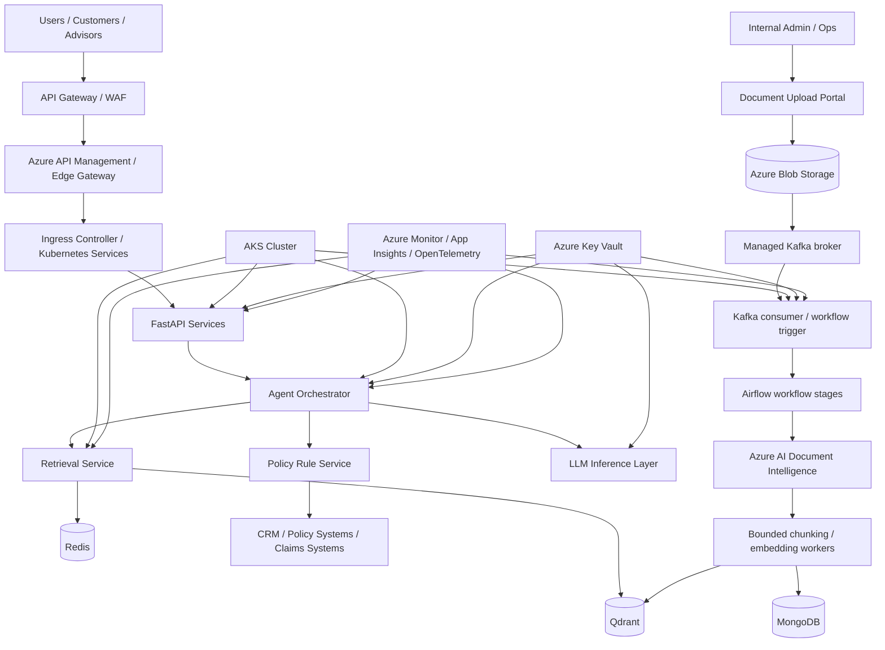
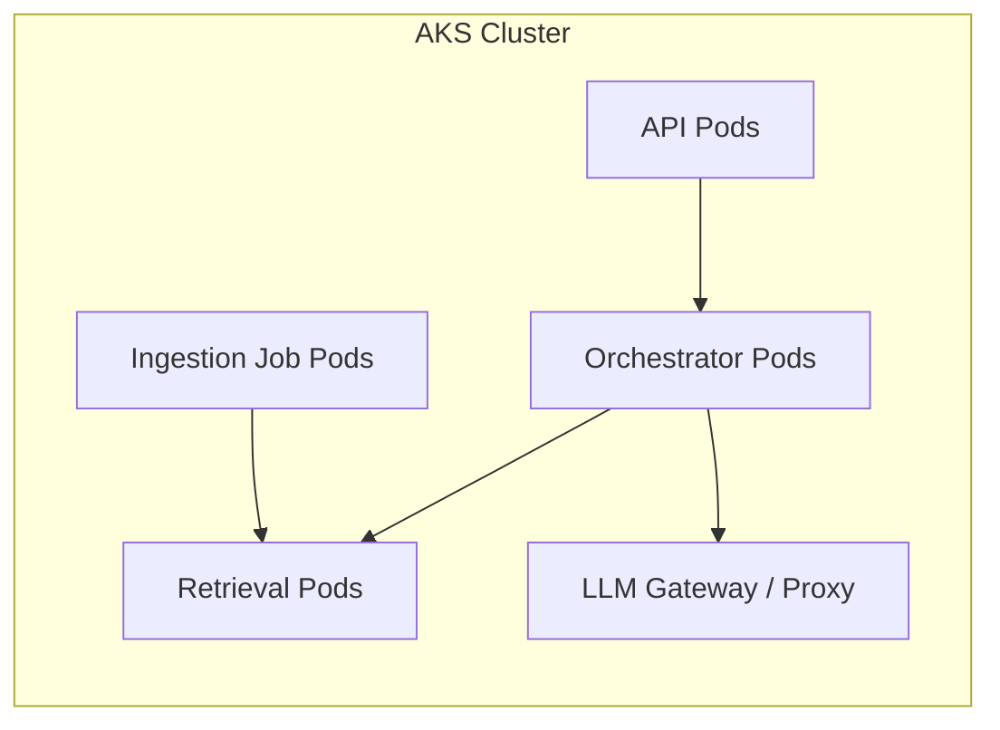
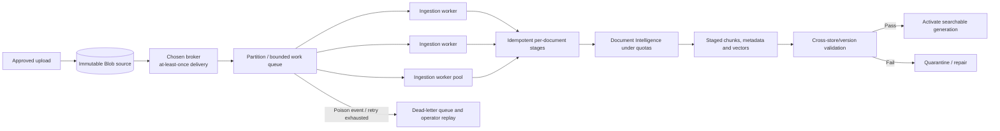
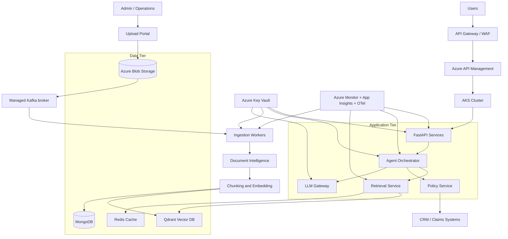
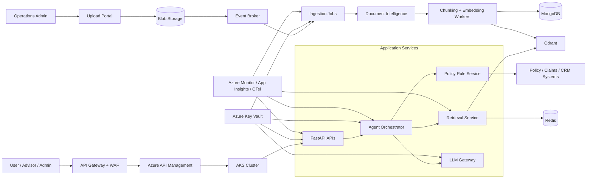
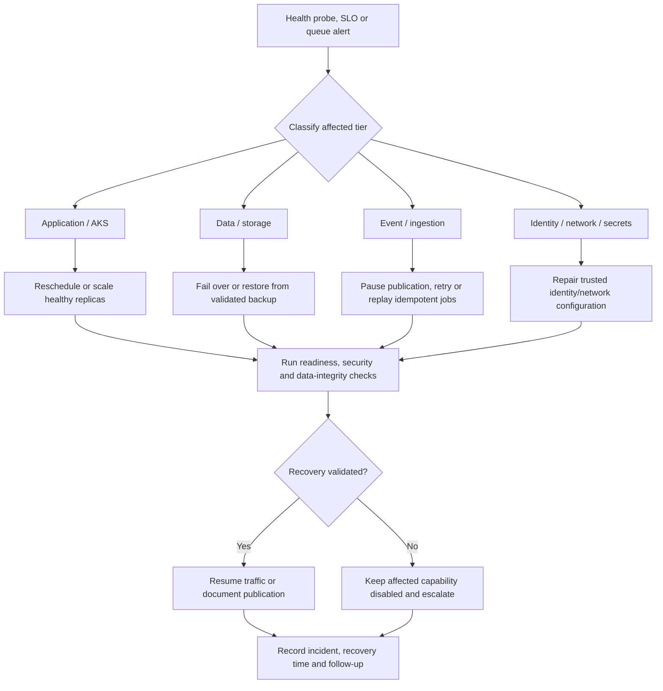

# Deployment Architecture for Insurance AI Assistant

## Overview

This document describes the deployment architecture for a production-grade insurance AI assistant. The design must balance:

- security
- high availability
- cost control
- operational simplicity
- scalability
- compliance and auditability

The recommended architecture is Azure-native, containerized, and designed for enterprise-grade deployment in a regulated insurance environment.

---

## 1. Deployment Goals

The deployment architecture must provide:

- secure API access for customers and internal users
- safe execution of AI, retrieval, and business logic services
- scalable handling of both user traffic and document ingestion workloads
- observability for applications, dependencies, and model workflows
- consistent deployments with CI/CD pipelines and rollback capability
- secure secret and configuration management
- production readiness under enterprise constraints

---

## 2. Recommended Production Stack

### Core deployment technologies

- Docker
- Kubernetes (AKS)
- Azure Container Registry (ACR)
- Azure Blob Storage
- Azure Key Vault
- Azure Monitor
- Application Insights
- Azure API Management or equivalent ingress gateway
- One managed Kafka broker for document-ingestion events; do not deploy a second broker for the same workflow
- Azure SQL / PostgreSQL only if a relational store is required for specific workflows

### Why this stack is appropriate

- cloud-native and mature for enterprise workloads
- strong integration with Azure security and monitoring capabilities
- supports container orchestration and autoscaling
- reduces operational burden versus self-managing VMs and infrastructure
- aligns with compliance expectations for large organizations

---

## 3. High-Level Deployment Topology

---

## 4. Deployment Layers

### 4.1 Edge layer

This layer sits at the boundary of the system and provides:

- TLS termination
- WAF / traffic filtering
- rate limiting
- request routing
- API gateway capabilities

This layer protects the internal application services and ensures even malicious traffic is filtered before it reaches the app tier.

### 4.2 Application layer

This contains:

- user API services
- auth and session services
- agent orchestration services
- customer context retrieval service
- retrieval service
- policy reasoning service
- document ingestion workers

The application layer runs in AKS as containerized microservices or service-oriented modules.

### 4.3 Data layer

This contains the storage systems:

- Qdrant for embeddings and retrieval
- MongoDB for metadata, versioning, and audit metadata
- Redis for optional scoped cache/session acceleration and rate limiting
- Azure Blob Storage for source and processed documents

### 4.4 Observability layer

This layer captures:

- metrics
- traces
- logs
- service health
- AI usage and latency
- ingestion job health
- per-stage retrieval and generation quality signals, including index freshness, no-hit/low-confidence, citation failures, and escalation rate
- offline evaluation artifacts and release comparisons, kept distinct from online service telemetry

### 4.5 Security layer

This contains:

- Azure Key Vault
- managed identity
- network gating and private endpoints
- WAF and DDoS protections
- access policies for service-to-service calls

---

## 5. Container and Kubernetes Model

### Recommended AKS structure

- one AKS cluster per environment (dev, test, prod) or a shared cluster with namespace isolation
- namespace separation for:
  - api
  - orchestration
  - retrieval
  - ingestion
  - observability
  - shared utilities

### Runtime patterns

- Deploy stateless services behind Kubernetes Deployments
- Use HPA/KEDA or equivalent scaling based on CPU/memory plus request concurrency, queue depth/age and worker lag where supported; keep explicit min/max replicas and per-dependency concurrency caps
- Use Jobs or CronJobs for asynchronous ingestion and document processing tasks
- Use Kubernetes Secrets for non-sensitive values if Key Vault integration is not yet fully available

### Example pod layout

---

## 6. Service-to-Service Communication

### Pattern recommendation

- External traffic: REST over HTTPS via API Gateway
- Internal services: REST or async event-driven comms
- Event broker for asynchronous ingestion workflows
- No direct exposure of internal services to the internet

### Selected ingestion event/orchestration path

Use **one managed Kafka broker** for document-ingestion events. Airflow coordinates durable, observable workflow stages; bounded Kafka consumer workers perform extraction, chunking, embedding and index writes. Airflow is not a broker or a substitute for worker-level idempotency. Event delivery is at-least-once; consumers use a stable key derived from tenant/source document ID/checksum/version/pipeline generation, commit/ack only after stage state is durable, and make each stage repeatable.

Partition by the stable document/job key to preserve ordering for a document version while allowing independent documents to process in parallel. Bound consumer concurrency by OCR/embedding/provider quotas and online capacity. Airflow owns bounded stage retry policy; Kafka provides at-least-once redelivery when a message is not durably acknowledged, not an additional application retry loop. Worker client retries must remain within the current task/request budget and honor provider throttling; do not stack independent retry policies. After exhaustion, route poison/non-retryable events to a DLQ with an assigned operator, replay runbook and audit trail. Publish a generation only after MongoDB/Qdrant reconciliation. The concrete managed Kafka offering, partitions, retention, consumer count, Airflow executor, per-stage retry limits and DLQ owner are deployment configuration values that must be recorded and load-tested before production; do not add Event Hubs as a second broker for this flow.

### Why this matters

A regulated enterprise system should keep service boundaries clear and limit blast radius. Internal services should not be publicly reachable.

---

## 7. Data Plane and Storage Deployment

### Azure Blob Storage
Used for:

- original uploaded documents
- OCR outputs
- extracted table data
- processed artifacts
- immutable source material

### MongoDB
Used for:

- document metadata
- chunk metadata
- processing status
- version history
- audit and lineage metadata

### Qdrant
Used for:

- vector storage
- retrieval metadata payloads
- dense approximate-nearest-neighbor search (HNSW is the intended index family; actual collection settings are not yet specified)
- metadata-filtered candidate retrieval

Qdrant is a derived index, not the policy source of truth. Keep its document/version/chunk IDs reconcilable with immutable Blob sources and MongoDB lineage. HNSW construction/search parameters, quantization, payload indexes, shard/replica topology, corpus capacity, and recall/latency targets require workload benchmarking; they are not established by this architecture document.

Alternatives such as Azure AI Search, pgvector, Weaviate, Milvus, or Pinecone should be compared only if managed-service fit, integrated lexical search, existing platform standard, transactional needs, or operational cost warrants it. Compare filter/ACL semantics, index freshness, backup/restore, tenant isolation, availability, p95 latency, and total cost before migration. No benchmark currently justifies replacing Qdrant.

### Redis
Used for:

- hot retrieval cache
- session state
- request throttling
- distributed lock coordination where needed

---

## 8. Azure Security Controls

### Identity and access

- managed identities for Kubernetes workloads
- Azure Key Vault secret retrieval from pods using managed identity
- no hardcoded credentials
- role-based access to storage, metadata, and AI services

### Network controls

- private endpoints for storage and database services
- VNet integration where required
- ingress-only public exposure through a controlled API gateway
- firewall restrictions where necessary

### Compliance and audit

- centralized access logs
- storage-level audit trails
- secrets rotation policy
- security review for all deployment changes

---

## 9. CI/CD Architecture

### Recommended pipeline structure

```mermaid
flowchart LR
    Dev[Developer Commit] --> PR[Pull Request Checks]
    PR --> Lint[Lint / Unit Tests]
    Lint --> Build[Build Docker Images]
    Build --> Scan[Security Scan]
    Scan --> DeployDev[Deploy to Dev]
    DeployDev --> Test[Integration Testing]
    Test --> DeployStaging[Deploy to Staging]
    DeployStaging --> Approval[Approval Gates]
    Approval --> DeployProd[Deploy to Production]
    DeployProd --> Monitor[Monitoring + Rollback]
```

### What gets automated

- unit tests
- linting and static validation
- dependency vulnerability scans
- container image build
- registry push
- staging deployment
- production deployment with gating
- automatic rollback for failed health checks

---

## 10. Observability and Monitoring

### Required signals

- response latency
- error rate
- pod health
- DB and vector performance
- ingestion job status
- token cost and LLM usage
- retrieval hit rate and ranking quality
- guardrail trigger counts
- business workflow health

### Monitoring stack

- Azure Monitor
- Application Insights
- OpenTelemetry instrumentation
- centralized logs and traces
- dashboards for API reliability and AI quality
- Ragas evaluation jobs run offline or asynchronously; evaluator/model calls do not run as synchronous request gates
- LangSmith is optional for LLM experiment/trace inspection and does not replace OTel/Azure production monitoring

For LangSmith or any external trace service, apply approved data residency, retention, access, sampling, and redaction rules. Prefer opaque references over raw customer conversations, PII, or full retrieved passages. Telemetry export failure must not affect serving.

### Production dashboards and alert ownership

Use a service-level dashboard for each user route (simple Q&A, follow-up/personalized Q&A, recommendation) and a dependency dashboard for each upstream/data/compute tier. Each route dashboard shows request rate, errors, in-flight work, end-to-end P50/P95/P99, saturation/admission rejects, and completed/clarification/abstention/escalation outcomes. Dependency views show per-stage latency/error/throttling and pool wait for auth/customer/catalog/rules, history, query embedding, Qdrant dense/lexical, fusion, BGE, LLM, guardrails/citation validation, MongoDB, Redis, Kafka/Airflow and OCR/embedding workers.

Track tokens, provider cost and retries per model/stage/route/outcome, retrieval candidate counts and scores, index freshness, citation rejection, route confusion, cache bypass/scope faults, queue age/lag/DLQ, and restore/test status. Use low-cardinality dimensions (route, model/config version, product family/jurisdiction only where approved); use opaque IDs in traces, not customer identifiers or raw prompt/passages in metric labels.

Every alert must have an owner, severity, runbook and safe user-impact action. Derive thresholds from approved SLO/error budgets, baseline distributions and critical business cases; do not page on raw metric changes without an actionable response or invent numeric cutoffs in architecture docs. Page for user-impacting SLO burn, cross-tenant/scope violation, critical citation/authorization failure, index-version inconsistency, or sustained dependency saturation; route cost, retry, freshness, quality and queue trends to the accountable operations/product team at agreed thresholds. Review alert noise and ownership during load/failure exercises. Monitoring/evaluator export outages do not gate user requests, but loss of required security or source-integrity signals must disable affected workflows.

### Example dashboard categories

- API latency and availability
- model inference latency and cost
- retrieval quality metrics
- ingestion throughput and failures
- safety/guardrail events
- route-level request rate, errors, in-flight requests, and P50/P95/P99
- per-dependency latency, timeout/429 rate, pool wait, circuit state, and saturation
- Kafka consumer lag/oldest-event age, Airflow queue/run duration, retries and DLQ
- Qdrant search/filter latency and index freshness; BGE queue wait/throughput
- MongoDB pool/slow-query metrics and Redis hit/eviction/invalidation metrics
- cache-scope/version validation failures and fallback/bypass rate

---

## 11. Failure Recovery Design

### Resilience patterns

- retries and backoff for transient failures
- queue-based async ingestion for non-critical workloads
- dead-letter queues for failed document jobs
- circuit breakers for downstream services
- graceful degradation for non-critical features

### Recovery strategy

- redeploy prior stable release if AI prompts or retrieval changes cause regressions
- restore vector index from latest known-good snapshot if corruption occurs
- reprocess ingestion jobs from blob-stored source artifacts
- use MongoDB version tracking to restore metadata if needed

---

## 12. Scalability Considerations

### Horizontal scaling

- scale API pods to meet demand
- scale retrieval and inference layers independently
- add ingestion workers during document batch updates

### Autoscaling triggers

- CPU and memory utilization
- request rate
- queue depth
- latency threshold breaches
- in-flight request count, queue age/consumer lag and worker utilization
- per-dependency saturation and throttling, while respecting provider quotas

### Scaling design principles

- stateless services where possible
- decouple ingestion from user traffic
- cache only measured immutable public/role-scoped retrieval outputs; personalized outputs remain uncached by default and all cache entries follow the cache-safety contract
- scale ingestion workers against broker lag and downstream provider quotas; partitioning/concurrency must preserve document-version publication gates
- size Qdrant from chunk/vector count, dimensions, payload indexes, filter selectivity, concurrency, and replicas—not document count alone
- thousands of source documents are an intended target, not a measured capacity claim; benchmark representative files, burst ingestion, re-index overlap, and recovery before committing throughput/latency SLOs

### Tier qualification and protective limits

Capacity tests must size each tier separately; a passing API-only test is not evidence that the complete workflow can meet its SLO.

| Tier | Qualification evidence | Runtime protection |
|---|---|---|
| FastAPI / gateway | Concurrent requests, event-loop lag, connection-pool wait, route-specific P50/P95/P99 and overload behavior | Async network I/O, bounded worker and outbound pools, request-size/rate limits, admission control |
| LangGraph | Node duration/errors, state size, fan-out, cancellation and per-route model/tool calls under concurrency | Request-scoped typed state, per-node/overall deadlines, bounded fan-out and semaphores, no shared mutable request state |
| Qdrant | Recall@K, memory, search/filter P50/P95/P99 under realistic vector count, payload filters, concurrency and index rebuild | Workload-derived HNSW/index/shard/replica config, payload indexes, bounded search concurrency, isolate or throttle re-index |
| MongoDB | Read/write latency, slow queries, pool wait, lineage reconciliation and retention load | Query-path indexes, bounded pools, capped connections and governed retention |
| Redis | Hit rate, avoided dependency latency, memory/eviction, invalidation delay and failover/bypass behavior | Optional cache only, TTL/eviction policy, scoped keys, bounded memory; fail through only after authorization |
| BGE | Batch throughput, queue wait, memory/CPU/GPU and reranking latency at configured candidate count | Bounded candidate top-N, batch size and concurrency; timeout and safe abstention path |
| Kafka/Airflow/workers | Ingestion throughput and freshness under bursts, replay, DLQ, OCR/embedding throttles and re-index concurrent with serving | Partition by stable document key, bounded consumers/workers, provider quota limits, bounded retry budget and backpressure |
| LLM/embedding/OCR/customer/catalog/rules APIs | Provider quotas, 429/timeouts, latency distribution, cost and degradation/fallback behavior | Per-provider concurrency limits, request deadlines, retry-after/jitter, online quota reservation and admission control |

Set pool sizes, worker counts, queue limits and autoscaling thresholds only from representative measurements and provider/service limits. Keep minimum operational capacity and maximum concurrency explicit. On saturation, reject or defer bounded work with a clear retryable status instead of allowing unbounded queueing or retry storms.

### Production capacity qualification

The 20,000–40,000 customer population is not a capacity input by itself. Before production, product/platform owners must define and approve:

- peak and burst arrival rates, concurrent sessions, request mix and expected response size for simple Q&A, follow-up/personalized Q&A, and recommendations;
- service-level objectives and budgets for P50/P95/P99 latency and availability by workflow;
- background upload, backfill and re-index volumes, plus allowed freshness lag;
- model, embedding, OCR, customer-data, catalog and rules API quotas and rate limits;
- acceptable cost per workflow and load-shed/admission-control behavior.

Run an end-to-end load test with representative documents, tenants/filters, token distributions, route mix and configured dependencies. Include peak plus business-approved headroom, burst traffic, ingestion concurrent with online traffic, throttling, slow dependencies, and recovery. Measure throughput, in-flight requests, queue age, per-stage and end-to-end P50/P95/P99, errors, token cost, and resource saturation. Do not publish capacity or SLO claims until results meet the approved targets. No assumed active-user percentage, request rate, latency target, or capacity figure is set by this document.

The qualification record must identify the tested software/configuration and dataset/workload profile, approved targets and provider quotas, observed limits/headroom, degraded-mode results, unresolved risks, and product/platform sign-off. Preserve the results with the release evidence; a customer-population estimate or isolated component benchmark is not a capacity approval.

Scale API/graph workers, BGE, Qdrant, MongoDB, Redis, and ingestion independently from observed bottlenecks. Bound outbound connection pools, graph fan-out, worker concurrency, retrieval candidates and per-provider concurrency; apply admission control and backpressure rather than unbounded queues/retries. Keep offline evaluation, ingestion and re-index work from consuming unreserved interactive model/provider quota.

### Production release evidence checklist

Before enabling a user-facing workflow, retain the evidence appropriate to that workflow:

- Approved route-specific P50/P95/P99 and availability objectives, with stage budgets, remaining-time propagation, cancellation and overload behavior demonstrated in end-to-end tests.
- Per-tier concurrency/saturation tests and configured pool, queue, worker and autoscaling limits; do not infer capacity from component-only benchmarks.
- One selected managed Kafka service and recorded partition, retention, consumer, Airflow retry, provider-quota and DLQ ownership settings; verify idempotent replay and re-index overlap.
- Versioned SME evaluation corpus, approved per-segment quality thresholds, deterministic critical-case test results, and release/canary owner sign-off.
- Published versioned recommendation OpenAPI contract and client compatibility tests before enabling the endpoint; until then, its default-off behavior remains in force.
- If caching is enabled, measured benefit plus authorization-scope, freshness/invalidation and outage-bypass test results; otherwise leave response caching disabled.
- For P2 optimization claims, retain retrieval comparisons against the semantic + BGE baseline, observed model/token/cost and per-route call counts, and deployed dashboard/alert exercise results. Leave hybrid retrieval, MMR, compression and response caching off when their benefit and safeguards are unproven.

These are deployment/release evidence requirements, not claims that the environment is already configured or has passed qualification.

Airflow coordinates durable, observable workflow stages; it is not a substitute for broker delivery semantics or worker-level idempotency. A production deployment must define the concrete broker, partition key, consumer concurrency, Airflow executor/scheduler capacity, provider quotas, retry limits, and DLQ replay ownership.

---

## 13. High Availability Model

### Production requirements

- redundancy across availability zones where supported
- at least one healthy replica of critical services
- vector and database backups
- disaster recovery plan for the data layer and application layer

### Availability patterns

- AKS multi-replica pod deployment
- stateful stores with redundancy and backup
- event-driven async processing decoupled from core API traffic

### Recovery objectives and restore gate

Business and regulatory owners must set RPO/RTO per workflow and data class; this architecture intentionally does not invent numeric objectives. Record the approved objectives, backup cadence/retention, regional recovery scope and named operators in the service runbook. Before production, exercise restoration of immutable Blob sources, MongoDB lineage, Qdrant snapshots/collections, and broker/job replay state. Reconcile source checksums, document/version/chunk manifests, ACL/effective-date metadata and active-generation markers before enabling retrieval. Rebuild Qdrant from approved source artifacts when integrity cannot be established; never treat a restored cache or vector index as authority.

Recovery sequence: establish trusted identity/network access; restore or verify source documents and metadata; restore/replay index and ingestion state; reconcile generations and run citation/access smoke tests; then enable workflows. If an authoritative dependency or version cannot be validated, keep affected personalized/policy workflows unavailable and route users to an explicit retry or human-support path. Record achieved restore times and data loss against the approved RPO/RTO; production approval requires a successful exercise.

---

## 14. Security-by-Design Deployment Checklist

- private endpoints enabled for database and storage services
- managed identity configured for all workloads
- Key Vault used for all secrets and service credentials
- approved data classes, external destinations and vendor processing terms recorded; approved PII/DLP control configured and tested before classified PII is sent to external model or trace services; NeMo is not a substitute
- WAF enabled at edge
- RBAC applied to every service and resource
- network segmentation between app, data, and ingestion layers
- no admin APIs exposed externally
- audit logs retained for compliance and investigations
- approved workflow-specific availability/latency and RPO/RTO objectives recorded and exercised
- recommendation endpoint release control defaults to disabled and is changed only after the documented integration, governance and test gate passes; disabled-path tests verify authentication/endpoint permission, generic unavailability, and no customer lookup or downstream calls

---

## 15. Recommended Final Deployment Model

The recommended deployment model is:

- Azure-native, containerized, and Kubernetes-based
- regulated security controls and managed identity throughout
- asynchronous ingestion and event-driven processing for document workflows
- service separation for API, orchestration, retrieval, and ingestion
- centralized observability and secure runtime configuration

This gives the best balance for production insurance AI workloads, where reliability, compliance, security, and cost discipline are essential.

---

## 16. Full Deployment Diagram

This deployment diagram reflects an enterprise-grade production setup where security, observability, and asynchronous processing remain separated but tightly connected for smooth operations.

## Component Interaction Diagram

This diagram illustrates the deployment dependencies, service interactions, and the operational separation between user-facing services and document ingestion workloads.

---

## 17. Edge Case & Failure Handling

Deployment recovery should preserve data integrity and security before availability. Recovery objectives (RTO/RPO), regional failover behavior, and backup retention must be set by business and regulatory requirements and validated through exercises.

### Scenario: Pod, node, or availability-zone disruption

- **Why it can happen:** Node failure, zone outage, memory pressure, bad health checks, or application crash.
- **How the architecture detects it:** Kubernetes liveness/readiness probes, pod restart events, node/zone health, error rates, and service-level latency/availability metrics.
- **How the system handles/recover from it:** Run multiple replicas across zones, reschedule workloads, use autoscaling within capacity limits, and drain unhealthy nodes; use disruption budgets for planned maintenance.
- **Fallback behavior:** Route traffic to healthy replicas. If the region or all replicas are unavailable, return a controlled service-unavailable response rather than routing around authorization or validation.
- **Impact on the user/system:** A brief increase in latency or request failures; ingestion jobs may pause and resume.
- **Monitoring/alerting required:** Alert on unavailable replicas, repeated restarts, node pressure, zone capacity, pod scheduling failures, and API SLO breaches.

### Scenario: Regional or stateful data-service outage

- **Why it can happen:** Cloud-region incident, storage/database outage, network partition, or corrupted/unavailable vector or metadata store.
- **How the architecture detects it:** Managed service health, connection and query failures, replication lag, storage health, and readiness checks from dependent services.
- **How the system handles/recover from it:** Use configured backups/replicas and documented regional recovery runbooks; restore services in dependency order; validate MongoDB/Qdrant consistency and document version state before reopening traffic.
- **Fallback behavior:** Do not serve customer-specific or policy answers if source metadata, authorization context, or retrieval correctness cannot be confirmed. Offer retry or human support.
- **Impact on the user/system:** Reduced or unavailable AI functionality during recovery; possible delayed ingestion. Data recovery time depends on the agreed RTO/RPO.
- **Monitoring/alerting required:** Alert on provider health, replication/backup failures, restore test results, data-service latency, and cross-store consistency.

### Scenario: Event broker backlog or ingestion worker failure

- **Why it can happen:** Upload burst, downstream Document Intelligence throttling, worker crash, malformed message, or poison event.
- **How the architecture detects it:** Queue depth and oldest-message age, consumer lag, worker error/retry counts, dead-letter volume, and ingestion completion SLOs.
- **How the system handles/recover from it:** Scale workers within quotas; use bounded retries with backoff; make handlers idempotent; isolate poison messages in a dead-letter queue for diagnosis; replay after correction.
- **Fallback behavior:** Keep source files durable in Blob Storage and mark affected versions as processing or failed, not searchable. Existing validated versions continue only if still effective.
- **Impact on the user/system:** New or revised documents become searchable later; existing approved content remains available when valid.
- **Monitoring/alerting required:** Alert on queue growth/age, dead-letter messages, worker saturation, repeated retries, and indexing freshness.

### Scenario: Key Vault, identity, DNS, or private-network path unavailable

- **Why it can happen:** Identity-provider issue, Key Vault throttling/outage, expired certificate, DNS failure, private endpoint/network misconfiguration, or firewall change.
- **How the architecture detects it:** Startup/readiness checks, credential acquisition errors, DNS/connectivity probes, TLS failures, and dependency timeouts.
- **How the system handles/recover from it:** Use managed identity and approved secret refresh/retry behavior; rotate or repair configuration through controlled deployment; do not cache credentials beyond their approved lifetime or bypass private-network controls.
- **Fallback behavior:** Fail closed for services that cannot establish identity or secure connectivity; keep unrelated healthy capabilities operating if isolation is safe.
- **Impact on the user/system:** Some or all APIs and ingestion workers may become unavailable until secure connectivity is restored.
- **Monitoring/alerting required:** Alert on token acquisition and Key Vault failures, certificate expiry, private endpoint health, DNS/TLS errors, and sudden auth failures.

### Scenario: Failed or harmful production deployment

- **Why it can happen:** Defective image, incompatible schema/configuration, broken readiness probe, infrastructure drift, or an application/prompt change that degrades safety or quality.
- **How the architecture detects it:** Deployment health gates, smoke/integration tests, canary metrics, error and latency regressions, RAG evaluation, and safety/validation rejection rates.
- **How the system handles/recover from it:** Halt progressive rollout; roll back the application/configuration to the last known-good version; use backward-compatible database changes and forward-fix data migrations under change control.
- **Fallback behavior:** Keep unaffected services and the last approved model/prompt configuration active; if safe behavior cannot be established, disable the affected workflow and direct users to human support.
- **Impact on the user/system:** A temporary feature outage or degraded experience; rollback limits blast radius and prevents unsafe answers.
- **Monitoring/alerting required:** Alert on rollout health gates, canary SLOs, rollback events, configuration drift, and AI quality/safety regressions.

### Scenario: Evaluation or observability platform backlog/outage

- **Why it can happen:** Ragas evaluation workers, telemetry ingestion, or optional LangSmith export are throttled, unavailable, misconfigured, or produce an unexpected data volume.
- **How the architecture detects it:** Queue age, dropped spans, export errors, evaluator job status, DLP/redaction findings, and ingestion-rate/cost metrics.
- **How the system handles/recover from it:** Buffer only within defined retention/capacity limits, sample or pause noncritical exports, retry background evaluation, and preserve essential OTel/Azure health metrics. Quarantine traces that fail privacy checks.
- **Fallback behavior:** Continue application serving with deterministic request-path controls; do not block a user request on evaluation or observability SaaS availability.
- **Impact on the user/system:** Reduced diagnostic detail or delayed release evidence; no direct response outage unless core Azure monitoring/security controls are themselves unavailable.
- **Monitoring/alerting required:** Alert on telemetry loss, evaluation backlog, cost/volume spikes, export failures, privacy filter errors, and missed critical service alerts.

### Deployment recovery flow

This flow makes recovery ownership explicit: classify the impacted tier, use tier-appropriate recovery, and restore traffic or publication only after health, security, and data-integrity checks pass.
