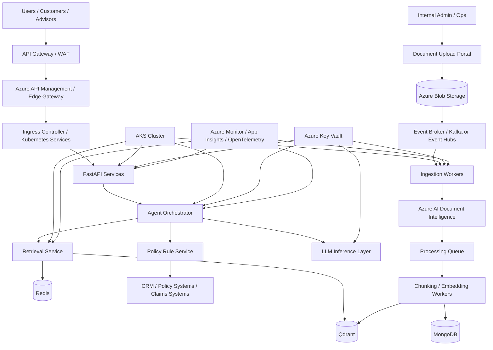
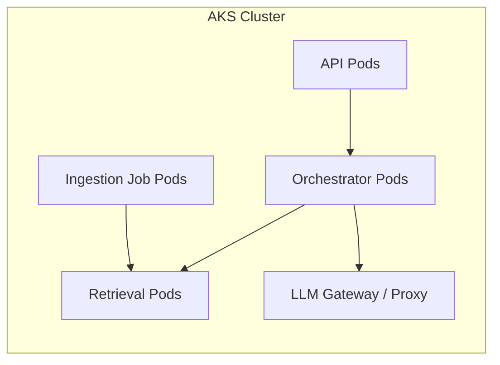
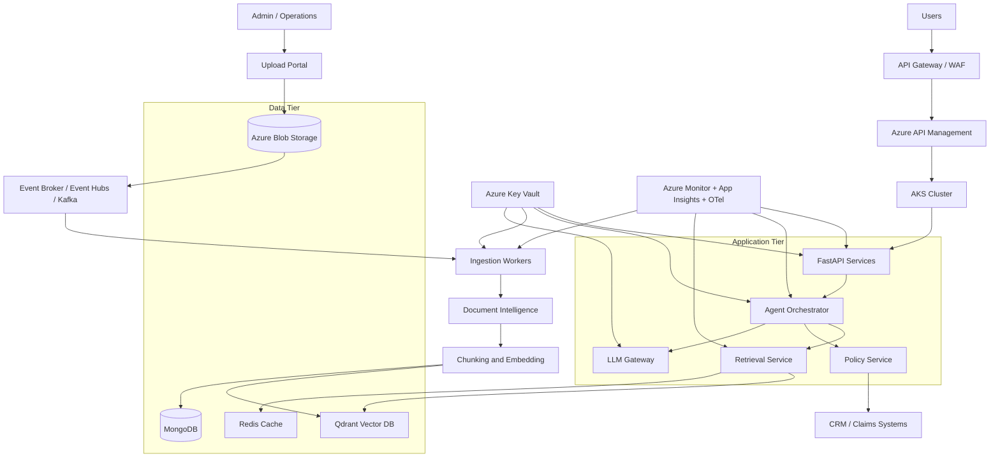
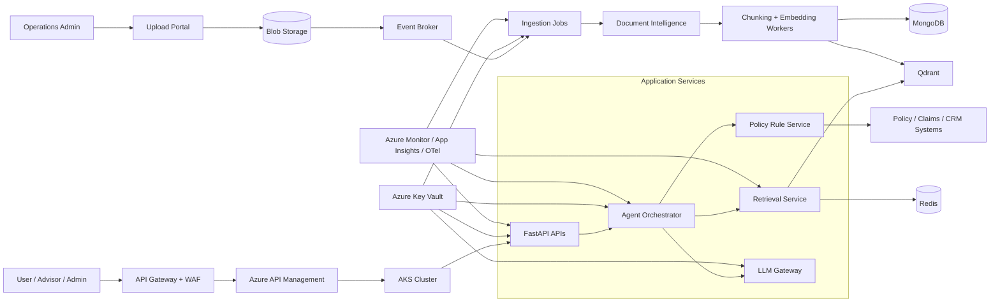

# Deployment Architecture for Insurance AI Assistant

## Overview

This document describes the deployment architecture for a production-grade insurance AI assistant. The design must balance:

- security
- high availability
- cost control
- operational simplicity
- scalability
- compliance and auditability

The recommended architecture is Azure-native, containerized, and designed for enterprise-grade deployment in a regulated insurance environment.

---

## 1. Deployment Goals

The deployment architecture must provide:

- secure API access for customers and internal users
- safe execution of AI, retrieval, and business logic services
- scalable handling of both user traffic and document ingestion workloads
- observability for applications, dependencies, and model workflows
- consistent deployments with CI/CD pipelines and rollback capability
- secure secret and configuration management
- production readiness under enterprise constraints

---

## 2. Recommended Production Stack

### Core deployment technologies

- Docker
- Kubernetes (AKS)
- Azure Container Registry (ACR)
- Azure Blob Storage
- Azure Key Vault
- Azure Monitor
- Application Insights
- Azure API Management or equivalent ingress gateway
- Managed Kafka / Event Hubs where needed
- Azure SQL / PostgreSQL only if a relational store is required for specific workflows

### Why this stack is appropriate

- cloud-native and mature for enterprise workloads
- strong integration with Azure security and monitoring capabilities
- supports container orchestration and autoscaling
- reduces operational burden versus self-managing VMs and infrastructure
- aligns with compliance expectations for large organizations

---

## 3. High-Level Deployment Topology

---

## 4. Deployment Layers

### 4.1 Edge layer

This layer sits at the boundary of the system and provides:

- TLS termination
- WAF / traffic filtering
- rate limiting
- request routing
- API gateway capabilities

This layer protects the internal application services and ensures even malicious traffic is filtered before it reaches the app tier.

### 4.2 Application layer

This contains:

- user API services
- auth and session services
- agent orchestration services
- customer context retrieval service
- retrieval service
- policy reasoning service
- document ingestion workers

The application layer runs in AKS as containerized microservices or service-oriented modules.

### 4.3 Data layer

This contains the storage systems:

- Qdrant for embeddings and retrieval
- MongoDB for metadata, versioning, and audit metadata
- Redis for hot cache and rate limiting
- Azure Blob Storage for source and processed documents

### 4.4 Observability layer

This layer captures:

- metrics
- traces
- logs
- service health
- AI usage and latency
- ingestion job health

### 4.5 Security layer

This contains:

- Azure Key Vault
- managed identity
- network gating and private endpoints
- WAF and DDoS protections
- access policies for service-to-service calls

---

## 5. Container and Kubernetes Model

### Recommended AKS structure

- one AKS cluster per environment (dev, test, prod) or a shared cluster with namespace isolation
- namespace separation for:
  - api
  - orchestration
  - retrieval
  - ingestion
  - observability
  - shared utilities

### Runtime patterns

- Deploy stateless services behind Kubernetes Deployments
- Use HPA (Horizontal Pod Autoscaler) based on CPU, memory, and request throughput
- Use Jobs or CronJobs for asynchronous ingestion and document processing tasks
- Use Kubernetes Secrets for non-sensitive values if Key Vault integration is not yet fully available

### Example pod layout

---

## 6. Service-to-Service Communication

### Pattern recommendation

- External traffic: REST over HTTPS via API Gateway
- Internal services: REST or async event-driven comms
- Event broker for asynchronous ingestion workflows
- No direct exposure of internal services to the internet

### Why this matters

A regulated enterprise system should keep service boundaries clear and limit blast radius. Internal services should not be publicly reachable.

---

## 7. Data Plane and Storage Deployment

### Azure Blob Storage
Used for:

- original uploaded documents
- OCR outputs
- extracted table data
- processed artifacts
- immutable source material

### MongoDB
Used for:

- document metadata
- chunk metadata
- processing status
- version history
- audit and lineage metadata

### Qdrant
Used for:

- vector storage
- retrieval metadata payloads
- similarity search

### Redis
Used for:

- hot retrieval cache
- session state
- request throttling
- distributed lock coordination where needed

---

## 8. Azure Security Controls

### Identity and access

- managed identities for Kubernetes workloads
- Azure Key Vault secret retrieval from pods using managed identity
- no hardcoded credentials
- role-based access to storage, metadata, and AI services

### Network controls

- private endpoints for storage and database services
- VNet integration where required
- ingress-only public exposure through a controlled API gateway
- firewall restrictions where necessary

### Compliance and audit

- centralized access logs
- storage-level audit trails
- secrets rotation policy
- security review for all deployment changes

---

## 9. CI/CD Architecture

### Recommended pipeline structure

```mermaid
flowchart LR
    Dev[Developer Commit] --> PR[Pull Request Checks]
    PR --> Lint[Lint / Unit Tests]
    Lint --> Build[Build Docker Images]
    Build --> Scan[Security Scan]
    Scan --> DeployDev[Deploy to Dev]
    DeployDev --> Test[Integration Testing]
    Test --> DeployStaging[Deploy to Staging]
    DeployStaging --> Approval[Approval Gates]
    Approval --> DeployProd[Deploy to Production]
    DeployProd --> Monitor[Monitoring + Rollback]
```

### What gets automated

- unit tests
- linting and static validation
- dependency vulnerability scans
- container image build
- registry push
- staging deployment
- production deployment with gating
- automatic rollback for failed health checks

---

## 10. Observability and Monitoring

### Required signals

- response latency
- error rate
- pod health
- DB and vector performance
- ingestion job status
- token cost and LLM usage
- retrieval hit rate and ranking quality
- guardrail trigger counts
- business workflow health

### Monitoring stack

- Azure Monitor
- Application Insights
- OpenTelemetry instrumentation
- centralized logs and traces
- dashboards for API reliability and AI quality

### Example dashboard categories

- API latency and availability
- model inference latency and cost
- retrieval quality metrics
- ingestion throughput and failures
- safety/guardrail events

---

## 11. Failure Recovery Design

### Resilience patterns

- retries and backoff for transient failures
- queue-based async ingestion for non-critical workloads
- dead-letter queues for failed document jobs
- circuit breakers for downstream services
- graceful degradation for non-critical features

### Recovery strategy

- redeploy prior stable release if AI prompts or retrieval changes cause regressions
- restore vector index from latest known-good snapshot if corruption occurs
- reprocess ingestion jobs from blob-stored source artifacts
- use MongoDB version tracking to restore metadata if needed

---

## 12. Scalability Considerations

### Horizontal scaling

- scale API pods to meet demand
- scale retrieval and inference layers independently
- add ingestion workers during document batch updates

### Autoscaling triggers

- CPU and memory utilization
- request rate
- queue depth
- latency threshold breaches

### Scaling design principles

- stateless services where possible
- decouple ingestion from user traffic
- cache common retrieval outputs to reduce compute load

---

## 13. High Availability Model

### Production requirements

- redundancy across availability zones where supported
- at least one healthy replica of critical services
- vector and database backups
- disaster recovery plan for the data layer and application layer

### Availability patterns

- AKS multi-replica pod deployment
- stateful stores with redundancy and backup
- event-driven async processing decoupled from core API traffic

---

## 14. Security-by-Design Deployment Checklist

- private endpoints enabled for database and storage services
- managed identity configured for all workloads
- Key Vault used for all secrets and service credentials
- WAF enabled at edge
- RBAC applied to every service and resource
- network segmentation between app, data, and ingestion layers
- no admin APIs exposed externally
- audit logs retained for compliance and investigations

---

## 15. Recommended Final Deployment Model

The recommended deployment model is:

- Azure-native, containerized, and Kubernetes-based
- regulated security controls and managed identity throughout
- asynchronous ingestion and event-driven processing for document workflows
- service separation for API, orchestration, retrieval, and ingestion
- centralized observability and secure runtime configuration

This gives the best balance for production insurance AI workloads, where reliability, compliance, security, and cost discipline are essential.

---

## 16. Full Deployment Diagram

This deployment diagram reflects an enterprise-grade production setup where security, observability, and asynchronous processing remain separated but tightly connected for smooth operations.

## Component Interaction Diagram

This diagram illustrates the deployment dependencies, service interactions, and the operational separation between user-facing services and document ingestion workloads.
