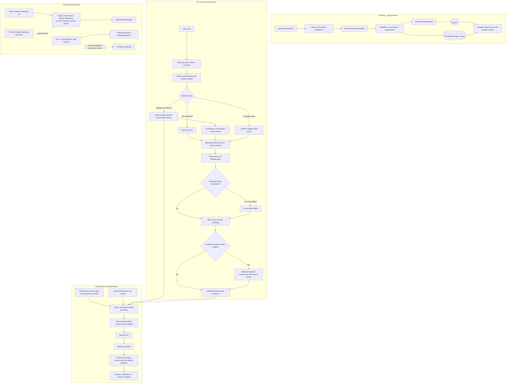

# RAG Enhancement Decisions

## Purpose and decision principles

This document evaluates proposed RAG enhancements against the existing enterprise Insurance AI Assistant architecture. The existing baseline is retained unless a capability demonstrates measurable value:

- Azure AI Document Intelligence for OCR, forms, tables, and layout-aware extraction
- insurance-aware chunking and metadata enrichment
- versioned document metadata in MongoDB and vectors in Qdrant
- metadata-filtered semantic retrieval with BGE cross-encoder re-ranking
- LangGraph for controlled orchestration
- conversation-aware query rewriting and bounded history, as defined in the RAG architecture
- OpenAI GPT generation, NeMo Guardrails, citation validation, OpenTelemetry, Azure Monitor, and Application Insights

**Decision meanings**

- **Recommended**: part of the target production architecture, subject to quality/security gates.
- **Optional**: enabled only for identified workflows and retained only if evaluation shows net benefit.
- **Not Recommended**: do not add as a default capability; the complexity, risk, or overlap exceeds likely value.

Latency and cost impacts below are relative estimates. They must be measured against representative insurance workloads; no throughput or price assumptions are implied.

## Enhancement decision matrix

| Enhancement | Decision | Architecture Location | Problem Solved | Why / Interaction with Existing Components | Latency Impact | Cost Impact | Failure Scenarios | Production Considerations |
|---|---|---|---|---|---|---|---|---|
| Ragas | **Recommended** | Offline evaluation pipeline; CI/release gates and scheduled evaluation | Repeatable measurement of retrieval and answer quality | Complements the existing gold-set strategy; it is an evaluation harness, not a replacement for Azure Monitor, OTel, or online safety checks. Use selected metrics rather than adopting every metric blindly. | No user-path impact when run offline; dataset runs take batch time. | Evaluation-model/API and compute cost per run; control with curated datasets and release cadence. | Evaluator/model outage, metric drift, prompt injection in test cases, or nondeterministic judge scores. | Pin versions/configuration, store dataset/model/metric versions, calibrate against insurance SMEs, protect PII, and gate on critical examples plus aggregate trends. Do not use a single score as an approval decision. |
| LangSmith | **Optional** | Development/staging tracing and experiment management; production only if approved | Prompt/model debugging, trace inspection, datasets, experiments | Overlaps with OTel + Application Insights for distributed traces and Azure Monitor for production telemetry. Use only if its LLM-specific trace UX is materially useful and vendor/data governance approves it. | None on the user path when export is asynchronous and non-blocking; offline trace inspection adds no request latency. | SaaS/license and trace-ingestion cost; redaction/storage/egress add operational cost. | Telemetry outage, sampling gaps, PII leakage, or trace export failure. | Never make user responses dependent on LangSmith. Redact/minimize prompts, retrieved chunks, and identifiers; assess residency, retention, access control, and contractual terms. Keep OTel as the portable operational source of truth. |
| Faithfulness | **Recommended** | Offline Ragas evaluation; sampled asynchronous online quality monitoring | Whether generated claims are supported by supplied context | Directly measures grounding, complementing deterministic citation-ID validation. It does not prove the source itself is correct or that authorization was correct. | Offline only: none; sampled online judge: asynchronous and non-blocking. | Offline judge-token cost; sampled online cost proportional to sample rate. | Judge false positives/negatives, model drift, or unsupported content missed by a judge. | Calibrate with policy experts and claim examples; pair with source/citation checks and human review for high-risk outputs. |
| Answer Relevancy | **Recommended** | Offline Ragas evaluation and sampled online quality dashboards | Whether the response addresses the user's question | Useful with policy Q&A and conversation-aware follow-ups; complements product feedback and task-completion measures rather than replacing them. | None on user path if offline/asynchronously sampled. | Evaluation-model calls and dataset maintenance. | A fluent but irrelevant response may score well; judge bias or ambiguous expected intent. | Evaluate by intent and customer/advisor channel; score refusal/clarification appropriateness separately. |
| Context Precision | **Recommended** | Offline retrieval evaluation; sampled online diagnostics | Whether retrieved context is relevant and ranked usefully | Measures retrieval/reranking quality and helps tune metadata filters, hybrid fusion, and BGE. It complements recall; optimizing precision alone could omit a critical exclusion. | None when offline; sampled production evaluation is asynchronous. | Evaluation calls and SME labeling effort. | Judge may not recognize a legally material but lexically distant clause; score instability. | Evaluate critical clauses and exclusions; report with recall and outcome-oriented measures, not in isolation. |
| Context Recall | **Recommended** | Offline retrieval evaluation and document/index quality checks | Whether the retrieval set contains the necessary source evidence | Important for insurance because a missed exclusion, waiting period, or condition can change the answer. Works with Context Precision and gold citations. | None in production when measured offline/asynchronously. | Curated reference evidence and evaluator cost. | Incomplete gold evidence or incomplete source corpus makes scores misleading. | Define reference evidence with domain experts; segment by product, jurisdiction, query type, and version. |
| Document ingestion and extraction | **Recommended; retain and harden** | Asynchronous ingestion pipeline using Azure AI Document Intelligence and existing orchestration | Reliably convert approved source documents into searchable, traceable content | Keep Document Intelligence for OCR, forms, tables, and layout; add explicit quality gates and idempotent processing rather than replacing the pipeline or adding a VLM by default. | Ingestion throughput may decrease due to validation; no query-path latency. | Extraction, validation, and quarantine/reprocessing costs. | OCR/layout failure, duplicate events, partial indexing, malformed tables, or unsupported file types. | Validate source type, extraction coverage/confidence, page/table integrity, provenance and metadata; quarantine failures; publish only staged, tested index versions. |
| Text splitting / structure-aware semantic chunking | **Recommended** | Ingestion after Document Intelligence normalization | Preserve clauses, definitions, tables, and document structure | Improves on arbitrary splitting while retaining Azure AI Document Intelligence, which supplies layout and table structure. Semantic boundaries should respect policy section/heading boundaries; embeddings do not determine legal meaning by themselves. | Ingestion-only compute; may add processing time. No direct query latency. | Moderate implementation/test cost; possible chunk-count/index-size change. | Oversized chunks, fragmented exclusions, table flattening, or nondeterministic boundaries. | Version the chunker; preserve page/section provenance; validate overlap, token-size distribution, tables, and retrieval quality before activation. |
| Metadata enrichment | **Recommended** | Ingestion and retrieval filter contract | Prevent cross-product, jurisdiction, effective-date, and access-scope confusion | Extends current metadata design. Metadata is also used for authorization filters and version selection, so schema quality is critical. | Low query overhead; usually reduces search work. | Ingestion validation and metadata storage cost. | Missing/wrong effective dates, product mapping, ACL attributes, or jurisdiction. | Validate required fields and controlled vocabularies; distinguish unknown from default; reject/quarantine incomplete restricted records. Do not rely on model-inferred ACL metadata. |
| Document versioning and staged publication | **Recommended** | MongoDB lineage + versioned Qdrant index/payload; ingestion publication gate | Prevent stale or partially indexed policies from becoming active | Existing metadata/version strategy should be made operationally atomic: stage, validate vector/metadata parity, then publish the approved version. Preserve effective-date semantics. | Ingestion activation may be delayed; no extra query step after activation. | Temporary storage for staged/previous versions and validation jobs. | Partial Qdrant/Mongo writes, rollback mismatch, overlapping effective dates. | Keep immutable sources; use idempotent writes; publish only validated versions; have rollback, expiry, and delete propagation procedures. |
| Chunk quality gates | **Recommended** | Ingestion before embedding/index activation | Prevent corrupt OCR, broken tables, and unusable chunks from reaching retrieval | Builds on Document Intelligence confidence and provenance. This is distinct from query-time relevance scoring. | Ingestion validation cost only. | QA/validation compute and exception review. | False quality rejection or bad extraction passing. | Check page coverage, extraction confidence, metadata completeness, chunk sizes, duplication, table integrity, and citation anchors; quarantine failures with visible status. |
| Embedding strategy/versioning | **Recommended** | Ingestion and Qdrant collection/index lifecycle | Ensure vectors are comparable, reproducible, and tied to source/chunker versions | Retain the selected OpenAI embedding model unless evaluations justify change. Record model/version, dimensions, normalization, language assumptions, chunker version, and source hash. | Embedding generation is ingestion-time; query embedding adds one model call unless batched/hosted. | Ingestion embedding calls and storage; re-embedding can be a major one-time cost. | Provider/model deprecation, dimension mismatch, partial re-embedding, or model drift. | Never mix incompatible embedding versions in one search space; stage/rebuild, validate, then switch traffic. Pin versions where supported and monitor deprecation notices. |
| Qdrant vector store | **Recommended** | Retrieval/index data plane | Scalable vector similarity search with metadata payload filtering | Retain Qdrant; no clear technical case to replace it. It does not alone provide lexical/BM25 search or prove correct source access. | Low-to-moderate query cost dependent on filters, corpus, and deployment. | Cluster, storage, backup, and index operations. | Outage, shard/replica issue, stale payload, or index corruption. | Private networking, scoped filters, backups/snapshots, version consistency checks, capacity planning, and restore drills. |
| Re-indexing | **Recommended** | Ingestion operations and change management | Propagate corrected documents, metadata, chunking, or embedding versions safely | Existing architecture already calls for reprocessing; make it controlled, idempotent, observable, and reversible rather than replacing stores. | Offline/batch; temporary query load if dual-index validation or migration occurs. | Re-extraction, embeddings, temporary duplicate index storage, and validation. | Partial migration, rollback failure, or mixed old/new versions. | Trigger by source, parser, chunker, metadata schema, or embedding changes; build staged version, compare gold metrics, then cut over; support rollback and audit. |
| Query rewriting using an LLM | **Recommended, conditional** | Pre-retrieval, after bounded history/context load and before search | Resolve ellipsis/pronouns and conversational follow-ups | Already designed for follow-ups. Do not call for every query: direct search handles self-contained questions; deterministic rewrite can handle simple references. LLM rewrite must not answer or widen authorization scope. | Adds one model round trip when triggered. | Small-model/API usage and monitoring. | Rewrite changes intent, wrong antecedent, prompt injection in history, timeout, or model unavailable. | Preserve original query; typed output with confidence and provenance; compare scope; low-confidence clarification; bounded timeout; evaluate by follow-up category. |
| Multi-query generation | **Optional** | Pre-retrieval for complex, multi-aspect or comparison questions | Improve recall for decomposable questions with distinct subquestions | Overlaps with query rewriting and hybrid retrieval. Use only when a query planner identifies multiple facets that a single query is unlikely to cover. Do not use for simple FAQs or as default “query expansion.” | Adds parallel search/merge latency; may increase rerank workload. | More search/rerank calls; possible LLM query-generation cost. | Query drift, duplicate/noisy candidates, result-set explosion, partial subquery failure. | Cap query count; preserve user scope/filters across all subqueries; deduplicate and merge with rank fusion; evaluate recall gain against precision and cost. |
| Domain-aware routing | **Recommended** | Pre-retrieval workflow routing | Send policy, claims, FAQ, or recommendation intents to the correct tools/corpus | Fits the existing query understanding/router and LangGraph; primarily deterministic classification/rules, with a low-cost classifier only for uncertain intents. Claims workflows should fetch claim state from claims systems and policy terms from RAG. | Negligible for deterministic routing; small model latency when uncertain. | Low; classifier cost only if invoked. | Misrouting, overlapping domains, classifier uncertainty, route to unauthorized corpus. | Attach confidence and scope; allow multi-domain calls only when justified; default ambiguous/high-risk requests to clarification or advisor, not broad corpus search. |
| MMR (Maximal Marginal Relevance) | **Optional** | Candidate selection before BGE reranking, only for duplicate-heavy results | Reduce near-duplicate chunks and increase evidence diversity | Partly overlaps with cross-encoder reranking, which scores query relevance but does not explicitly maximize diversity. Insurance answers may need several similar clauses together; use MMR only where duplicate retrieval is demonstrated. | Adds selection computation; typically small but can affect ranking quality. | Low compute; possible tuning/evaluation effort. | Removes complementary clauses, definitions, exceptions, or repeated-but-material evidence. | Use a conservative diversity setting and only after candidate retrieval; compare against BGE-only on critical multi-clause cases, exclusions, tables, and citation recall. |
| Hybrid retrieval (semantic + BM25/lexical) | **Recommended** | During retrieval, in parallel with Qdrant dense search | Retrieve exact terms and conceptual paraphrases | Strong insurance fit: clause labels, product names, claim codes, defined terms, and exact exclusions benefit from lexical matching. Qdrant remains the vector store; add lexical retrieval only through a fit-for-purpose index/service. | Parallel calls plus fusion; usually more work, may improve top-k and reduce downstream retries. | Additional index/operations/storage and query load. | Lexical index staleness, analyzer/tokenization errors, fusion bias, partial backend outage. | Use identical ACL/version filters, version synchronization, bounded candidate counts, rank fusion (e.g. RRF), and monitor each retriever separately. Do not assume Qdrant supplies BM25 unless deployed/configured to do so. |
| BGE cross-encoder re-ranking | **Recommended; retain** | During retrieval after candidate retrieval/fusion | Improve precision among retrieved candidates | Current component remains valuable after hybrid merge. It cannot recover documents not in the candidate pool and does not validate policy correctness. | Adds model inference latency; batch candidates and cap top-N. | Dedicated CPU/GPU or hosted inference cost. | Reranker unavailable/slow, model update drift, truncation of long chunks. | Pin model, batch safely, set timeout and no-unsafe fallback, monitor p95/throughput and evaluation metrics. On failure use filtered retrieval ranking only if quality thresholds allow; else abstain/review. |
| Contextual compression | **Optional** | After reranking and evidence selection, before context assembly | Reduce long/noisy chunks to relevant passages under prompt budget | BGE ranks chunks but does not shorten them. Compression is useful for long tables/clauses, but may remove qualifiers; it must not be relied on as evidence authority. | Adds extractive/model processing latency. | Additional inference/compute and validation. | Dropped exception/condition, altered number, loss of source offsets, compression hallucination. | Prefer extractive span selection with offsets and citations; retain original chunk; compare answer/citation quality and token savings. Never publish generated paraphrase as a source quote. |
| Prompt templating | **Recommended** | Augmentation / model gateway | Consistent instructions, structured inputs/outputs, and version control | Complements LangGraph and NeMo; templates must distinguish trusted instructions from untrusted history/documents and support policy-answer formats. | Small template assembly overhead. | Low engineering cost; evaluation required per change. | Template injection, incompatible variables, prompt regression, stale template. | Version, review, test, and roll back prompts; use typed context blocks, safe delimiters, minimal variables, and regression evaluations. |
| Answer grounding | **Recommended** | Generation and post-generation validation | Prevent unsupported insurance claims | Existing evidence-first generation, citations, and validation support it but do not alone guarantee factual correctness. Add claim-to-evidence validation and abstention gates; customer facts/rules need distinct provenance. | Validation adds latency; deterministic checks can be fast; model judge should be sampled/off-path where possible. | Validation and SME evaluation costs. | False acceptance/rejection, conflicting clauses, hallucinated inference. | Verify each material claim against cited evidence or authorized system/rule result; unresolved conflicts require clarification/review. |
| Context window optimization | **Recommended** | Prompt assembly | Keep critical context within model limits without truncating material qualifications | Enhances existing token-budget policy, conversation summarization, relevant history, and retrieval ranking. | Tokenization/selection overhead low; avoids model context overflow. | Lower generation tokens may reduce cost; engineering/evaluation cost. | Tokenizer mismatch, important exclusion trimmed, oversized output reservation. | Enforce model-specific hard limits; count before call; trim irrelevant history first, then redundant summary, then low-ranked evidence; never truncate mandatory instructions, current query, or clause qualifications. |
| Context prioritization and provenance separation | **Recommended** | Augmentation/prompt builder and answer contract | Prevent history or model text overriding authoritative data | Add explicit typed sections: system/security, current query, customer/system-of-record facts, rules, retrieved policy evidence, conversation context, output schema. Conflicts are surfaced, not silently resolved by prompt order. | Negligible assembly overhead. | Low. | Provenance label lost, conflicting sources, unauthorized context leakage. | Customer facts from enterprise systems; policy terms from approved versioned docs; rules from governed rule source; history used only for continuity. |
| Duplicate context removal | **Recommended** | Context assembly after candidate fusion/reranking | Reduce repeated chunks, repeated turns, and token waste | Complements hybrid merge and optional history retrieval; deduplicate by stable chunk/turn IDs and near-duplicate checks without removing materially different endorsements. | Low processing overhead; may reduce generation latency. | Low; small comparison compute. | Overaggressive dedup drops version-specific or exception language. | Keep source/version metadata and avoid merging across policy versions or distinct sections; track removed candidates and evaluate citation recall. |
| Conversation summarization and relevant-history retrieval | **Recommended** | Conversation service + pre-retrieval query rewriting | Maintain continuity in long conversations without passing full transcripts | Extends existing bounded-history design. History helps resolve references but is not customer truth or policy evidence. | Summary refresh can be async; history selection/rewrite adds small query latency. | History storage, summarization model, and retrieval cost. | Stale/incorrect summary, cross-session retrieval, prompt injection, retention mismatch. | Scope by tenant/user/conversation; provenance-label; retrieve bounded relevant turns; rebuild from canonical turns; clarify when ambiguous; enforce retention/deletion. |
| Long-term user memory | **Not Recommended** as default | None; use explicit, consented product preferences only if approved | Personalization across conversations | Risks storing sensitive insurance/customer facts and duplicates CRM/policy systems. Customer profile, policies, claims, eligibility must remain authoritative-system reads. | Cross-session lookup adds latency and stale-data risk. | Storage, lifecycle, consent, and governance burden. | Stale facts, unauthorized reuse, deletion gaps, cross-customer leakage. | If later justified for non-sensitive preferences, obtain explicit consent, expiry, source provenance, and user controls; never use it for coverage/eligibility. |
| Redis for session state/history cache | **Optional** | Backend cache/session tier | Low-latency ephemeral state and rate limiting | Complements but does not replace MongoDB or authoritative systems. Do not make Redis the sole durable source for conversation or customer facts. | Can reduce latency; cache misses/outages must be survivable. | Cache capacity/HA cost and invalidation complexity. | Stale permissions/policy data, eviction, outage, scope collision. | TTLs, scoped cache keys, invalidation, no sensitive raw text in keys, authorization recheck, source-of-truth fallback. |
| MongoDB for durable conversation metadata/history | **Optional, governance-dependent** | Conversation persistence | Durable, auditable conversation continuity | Existing MongoDB document metadata use does not automatically imply it should store all raw conversation turns. Use only after privacy/retention classification and workload validation. | Read/write overhead modest but adds persistence dependency. | Storage, backup, retention/deletion, indexing, access-control cost. | Retention/deletion failure, schema growth, sensitive data exposure, outage. | Separate collections/access roles from document metadata; encrypt, minimize, TTL/retention controls, subject deletion, legal holds, audit access. |
| Multimodal LLM/VLM RAG | **Optional; not default** | Exceptional ingestion/review path after Document Intelligence | Understand visual meaning not recoverable from OCR/layout extraction | Azure AI Document Intelligence already covers scanned text, tables, forms, and layout. A VLM is justified only for visual semantics (e.g. annotated damage photos, diagrams/charts where visual interpretation drives the answer). | High additional inference latency and possibly multi-image processing. | Higher model/token and image transport/storage cost. | Visual hallucination, OCR/VLM disagreement, unreadable image, privacy leakage. | Define a concrete workflow, permission and retention rules, visual evidence citations, quality benchmark, human review, and abstention. Do not enable for ordinary policy PDFs. |
| LangGraph controlled orchestration | **Recommended; retain** | Backend workflow/orchestration | Explicit, auditable state transitions and conditional tool invocation | Existing framework is suitable. Its graph nodes need not be independent autonomous agents; deterministic services/tools are preferred for auth, lookup, rules, retrieval, and validation. | Adds graph/state overhead, usually small relative to network/model calls. | Low-to-moderate engineering and state-store operations. | Bad transition, retry loop, checkpoint leakage, duplicate side effect. | Type state, bound loops/timeouts, make side effects idempotent, redact checkpoints, version graph/prompt, and test failure transitions. |
| Multiple named specialist agents | **Not Recommended** as default | Avoid separate autonomous agents for each listed role | Decompose work by domain | Query understanding, customer context, retrieval, eligibility, and validation are better implemented as typed deterministic components/tools. Policy reasoning/recommendation may use constrained LLM workflows under LangGraph. Many agents duplicate state, prompt, tool permissions, and latency. | Multiple model calls add serial/parallel latency. | Higher inference, evaluation, and maintenance cost. | Agent disagreement, tool misuse, loops, inconsistent context. | Add an autonomous specialist only for a measurable workflow that cannot be expressed reliably as a deterministic node; define permissions, budgets, and human approval. |
| Query Understanding Agent | **Optional** as a model-backed classifier; **not** an autonomous agent | Pre-retrieval router | Classify FAQ/policy/claims/recommendation intent | Existing query understanding is required; use deterministic rules or small classifier. LLM only for uncertain/ambiguous requests. | Low deterministic; extra model call if uncertain. | Low if conditional. | Misclassification/route drift. | Confidence thresholds, fallback and intent-specific evaluation. |
| Customer Context Agent | **Not Recommended** as an autonomous agent; service is **Recommended** | Authorized customer context service/tool | Retrieve current customer, policy and claim facts | Existing system-of-record APIs and authorization should be deterministic, auditable service calls, not agent memory or free-form tool selection. | API/network latency, no additional LLM call. | Existing integration costs. | Timeout, stale data, authorization error. | Schema/freshness checks, per-field provenance, fail-closed customer-specific paths. |
| Retrieval Agent | **Not Recommended** as autonomous; retrieval service is **Recommended** | Retrieval component/tool | Search approved index with filters and ranking | Existing retrieval component already performs controlled filtering/search/rerank. Agentic discretion must not remove ACL/version filters. | Deterministic retrieval has bounded latency; agent adds model overhead. | Agent token cost without clear benefit. | Filter omission, broad retrieval, tool loop. | Expose constrained typed retrieval API to LangGraph instead. |
| Policy Reasoning Agent | **Optional** constrained LLM node | Post-retrieval reasoning in LangGraph | Explain or reconcile retrieved clauses | LLM may synthesize evidence but cannot establish contractual truth or override source/rule conflict. Existing policy rules and evidence checks remain. | Adds one generation call if separated. | Token/inference cost. | Contradictory terms, unsupported interpretation. | Require citations per material statement; abstain/escalate legal ambiguity; test with SMEs. |
| Eligibility Agent | **Not Recommended** as autonomous; deterministic rules/service **Recommended** | Policy/eligibility rules service | Apply eligibility criteria consistently | Insurance eligibility can have material outcomes. Deterministic versioned rules plus authorized facts are more reproducible; LLM may explain, not decide. | Rules call low latency. | Rule authoring/validation instead of agent inference. | Rule/data mismatch, missing input, rule version incorrect. | Rules governance, effective dates, explainable reason codes, maker-checker approval, human review. |
| Recommendation Agent | **Optional** constrained workflow | Recommendation flow using approved suitability rules | Produce product/coverage suggestions | Justified only if approved customer-needs inputs and suitability constraints exist; must not invent eligibility or promise coverage. | Extra reasoning may increase latency. | Evaluation and review costs. | Biased/inappropriate recommendation, missing needs, conflict of interest. | Compliance-approved rules, disclosure, suitability logging, human review as required. |
| Response Generation Agent | **Not Recommended** as separate autonomous agent | Existing LLM generation stage | Generate answer | This is already the LLM generation component; wrapping it as another agent duplicates call and state. | Additional call if separate. | Additional tokens. | Agent adds unsupported claims or alters citations. | Keep one generation step with structured schema and validated context. |
| Guardrail/Validation Agent | **Not Recommended** as sole control; deterministic checks **Recommended** | NeMo/app guardrails + validators | Detect unsafe or ungrounded answers | Existing NeMo Guardrails plus code-based access, schema, policy and citation validators is more reliable than an unconstrained judge agent. | Guardrail runtime cost; external judge adds latency. | Moderate if extra model judge per request. | False negatives, unavailable guardrails, overblocking. | Fail closed for sensitive answer types; judge metrics offline/sampled; monitor false-positive/negative review. |
| NeMo Guardrails | **Recommended; retain with layered controls** | Input/output policy layer | Enforce dialogue and safety constraints | Useful but not sufficient for access control, policy correctness, citation validity, PII protection, or deterministic eligibility. | Adds guardrail evaluation overhead. | Runtime and rule maintenance cost. | Guardrail bypass, false block, version/config regression. | Defense in depth: auth before retrieval, prompt-injection handling, PII controls, schema/citation/grounding checks, risk-based human review. |
| Microsoft Presidio or equivalent PII/DLP | **Optional implementation; PII control required when classification/policy requires it** | Before model and external trace boundaries, after data minimization | Detect and optionally mask sensitive identifiers in text | Complementary to NeMo, not a replacement: PII recognition/anonymization differs from dialogue/prompt guardrails. Presidio is not currently selected/deployed; an approved enterprise DLP service may already meet the requirement. | Adds local/service processing latency; measure by payload size. | Deployment, recognizer tuning, maintenance, and any service cost. | False negatives leak PII; false positives remove useful context; regional identifiers may be missed. | Define PII classes and masking/restoration policy; test regional insurance identifiers; fail closed when masking is mandated but unavailable; redact trace exports too. |
| Citation generation/validation | **Recommended** | Generation contract + server-side post-validation | Trace answer claims to source | Model may emit citation IDs from provided evidence; server resolves and validates those IDs, versions, pages, and authorization. | Small validation latency. | Low. | Fabricated citation, stale page mapping, quote mismatch. | Fail answer validation on invalid citations; cite source and effective date; audit evidence IDs. |
| Online Ragas evaluation on every request | **Not Recommended** | Do not place synchronous Ragas judges in request path | Assess answer quality continuously | Overlaps with application validation and adds nondeterministic model judges to latency-sensitive path. | High and unpredictable. | High recurring model cost. | Evaluator outage blocks user answers; judge false confidence. | Keep Ragas primarily offline; use asynchronous sampled production scoring with separate budget and no response dependency. |

## Evaluation and observability model

### Offline evaluation

Use a versioned, SME-reviewed evaluation set for retrieval and generated answers. Run Ragas metrics such as **Faithfulness**, **Answer Relevancy**, **Context Precision**, and **Context Recall** against changes to parser/chunker, metadata, embeddings, hybrid fusion, MMR settings, BGE, prompts, model versions, and history rewriting. Keep deterministic checks (citation-ID validity, schema, access-scope, effective-date) alongside model-judged metrics. Results are release evidence, not a substitute for compliance approval.

Ragas belongs in offline evaluation jobs and controlled CI/staging or scheduled runs. LangSmith is optional for LLM-specific trace inspection and dataset experiments; OTel/Azure Monitor remain the production operations system. If LangSmith is adopted, send only redacted, policy-approved traces and do not block production answers on trace export.

### Online / production monitoring

The synchronous request path should enforce deterministic safety and correctness gates:

- identity/authorization and tenant filters
- source version/effective-date and provenance validation
- structured response schema
- citation IDs resolve to retrieved, authorized evidence
- policy/rule version and required disclosures
- hard token, timeout, and retry budgets

Use Azure Monitor/Application Insights and OpenTelemetry for latency, errors, dependency health, cost, routing, retrieval scores, cache behavior, and trace correlation. Track no-hit/low-confidence, clarification, escalation, guardrail, citation rejection, and user feedback rates. Run model-judged Faithfulness/Answer Relevancy asynchronously on a risk-based or statistical sample; store results separately and alert on calibrated trends. Sampling must be privacy-reviewed, and online evaluation failure must never block or fabricate the user response.

### Metric interpretation

- **Faithfulness:** Are answer claims supported by supplied evidence? Pair with deterministic citation checks; it cannot establish that evidence is authoritative.
- **Answer Relevancy:** Does the response answer the user’s actual question? It can reward a relevant-sounding but incomplete response, so evaluate per intent and include appropriate clarification/refusal examples.
- **Context Precision:** Are retrieved chunks relevant and useful? Pair with recall so the system does not optimize away exceptions or qualifications.
- **Context Recall:** Was the required reference evidence retrieved? Requires complete, SME-labeled expected evidence and current document versions.

All LLM-judge metrics are estimates. Calibrate against human-reviewed insurance examples, track evaluator/model versions, and investigate shifts rather than treating thresholds as proof of correctness.

## Final recommended RAG architecture

### Recommended execution policy

1. **Indexing:** Keep Azure AI Document Intelligence, add structure-aware chunking, required metadata/quality gates, versioned embeddings, and staged Qdrant activation/re-index rollback.
2. **Pre-retrieval:** Always authorize and classify. Use direct retrieval for self-contained questions, conditional query rewriting for ambiguous/follow-up questions, and capped multi-query only for decomposable complex questions. Route claims and policy subqueries to their respective data/services.
3. **Retrieval:** Apply ACL/version metadata filters with dense Qdrant plus lexical/BM25 where deployed; merge/deduplicate; use optional conservative MMR only when duplicate-heavy; retain BGE reranking. Apply extractive compression only when long evidence materially exceeds budget.
4. **Augmentation:** Keep instructions, current query, customer facts, rules, policy evidence, history, and output contract in separate typed blocks. System/security instructions and authorization are immutable; current systems-of-record facts and current policy evidence determine facts; governed rules determine eligibility results; conversation history resolves references only. Conflicts trigger clarification/review.
5. **Generation:** Generate structured responses with provenance classes distinguishing **retrieved policy facts**, **customer-specific facts**, **business-rule results**, and **model-generated explanations/recommendations**. The model can only cite supplied evidence IDs; a server-side validator resolves and verifies each citation. NeMo is one layer, not the whole safety boundary.
6. **Evaluation:** Run Ragas and all four metrics offline on curated datasets; use OTel/Azure Monitor online for deterministic controls and operational telemetry. LangSmith remains optional and non-blocking.

## Principal Architect Review

### Definitely add or formalize

- Structure-aware chunking, chunk quality gates, metadata validation, immutable provenance, versioned embedding/chunker metadata, staged index activation, and controlled re-index/rollback.
- Hybrid dense + lexical retrieval for exact policy terminology, codes, and names, with shared ACL/version filters, rank fusion, and retriever-specific observability.
- Conditional query rewriting and deterministic-first domain routing; no default LLM call for simple self-contained FAQs.
- Ragas offline evaluation using SME-reviewed Faithfulness, Answer Relevancy, Context Precision, and Context Recall datasets.
- Explicit source/provenance-separated context and answer response contract, with server-side citation validation and risk-based abstention/human review.
- Keep OTel/Azure production monitoring and LangGraph controlled workflows; treat customer data and eligibility as authoritative system/rule calls.

### Keep optional and gate with evidence

- Multi-query generation for complex, decomposable questions only.
- MMR for duplicate-heavy result sets after confirming no loss of complementary clauses.
- Extractive contextual compression for long chunks when token savings outweigh latency and omission risk.
- LangSmith after security, privacy, residency, cost, and trace-overlap review.
- VLM/multimodal interpretation only for a concrete workflow not adequately served by Document Intelligence.
- Redis as an ephemeral cache; MongoDB conversation history only under approved privacy/retention design.
- Constrained recommendation and policy-reasoning model nodes only where business/compliance requirements and evaluation justify them.

### Do not add by default

- Full-conversation prompt stuffing or LLM rewriting for every query.
- Always-on multi-query, MMR, and compression in every retrieval request.
- A separate autonomous agent for each backend responsibility; deterministic services/tools are clearer and safer.
- Long-term LLM memory as a source of customer, policy, claims, or eligibility truth.
- Synchronous Ragas/LangSmith/model-judge calls as production response gates.
- Multimodal LLM processing for ordinary scanned/table-rich PDFs already handled by Document Intelligence.

### Existing components to change or clarify

- Clarify that Qdrant is vector retrieval and add a lexical/BM25 service only if needed; do not label semantic-only retrieval as hybrid.
- Promote ingestion quality gates and staged activation from guidance to required release controls.
- Expand RAG evaluation beyond general answer quality into the four named metrics plus deterministic citations/authorization checks.
- Treat NeMo as a guardrail layer within defense in depth, not as proof of factuality or access control.
- Make the component taxonomy explicit: LangGraph workflow nodes/tools are not necessarily autonomous agents.
- Distinguish Redis ephemeral session/cache state, optional MongoDB conversation persistence, and systems of record for customer facts.

### New failure scenarios introduced

- Hybrid index synchronization/fusion inconsistency; MMR removes complementary clauses; compression omits a qualifier.
- Rewrite/multi-query changes user intent, multiplies scope, or expands query cost; router sends claims to the wrong domain.
- Evaluator drift or Ragas/LLM judge false confidence; LangSmith/trace export leaks regulated content.
- Embedding/chunker/model version mismatch during reindexing; staged-index cutover or rollback is partial.
- Summary/history staleness, cross-session/tenant history retrieval, and retention/deletion inconsistency.
- Multimodal extractor disagreement or VLM interpretation hallucination if that optional path is enabled.

### Additional monitoring/evaluation required

- Per-stage latency/error/cost: rewrite, routing, dense/lexical retrieval, fusion, MMR, reranking, compression, generation, guardrails, and citation validation.
- Retrieval quality by domain/product/version: hit/no-hit, Context Precision/Recall, score distributions, duplicate rate, MMR/compression effect, and index freshness.
- Conversational quality: rewrite intent preservation, antecedent confidence, clarification rate, summary age/failure, history retrieval precision, context tokens and truncation/trim counts.
- Safety/grounding: unsupported-claim review, citation validity, guardrail pass/reject, abstention/escalation, and cross-tenant access tests.
- Offline evaluation by model, prompt, parser/chunker, embedding, retrieval configuration, and dataset version; alerts based on calibrated deltas, not isolated judge scores.
- Privacy-safe telemetry: redact/minimize content, use opaque IDs, define access/retention, and sample asynchronous evaluators within explicit budgets.

### Latency and cost impact

- Conditional LLM rewrite adds one model round trip only on ambiguous/follow-up queries; deterministic simple queries remain unchanged.
- Multi-query and optional LLM compression add calls and are therefore bounded to complex/long-context cases.
- Hybrid retrieval increases parallel query and index-operation cost, but can reduce misses and improve exact-term recall; measure end-to-end p95.
- BGE remains a per-query inference cost; batching and candidate limits are important.
- Ragas adds offline evaluation compute/model cost; asynchronous sampled production evaluation adds bounded background cost without user-path latency.
- LangSmith, VLMs, long-term memory, and unnecessary autonomous agents can add significant governance, storage, latency, and inference cost without guaranteed quality gain.

The architecture should be optimized against measured answer/citation quality, reliability, p95 latency, cost per successful task, and operational complexity—not the number of RAG techniques deployed.
