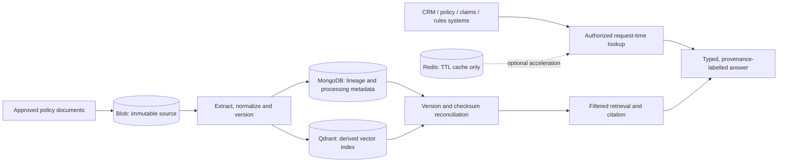
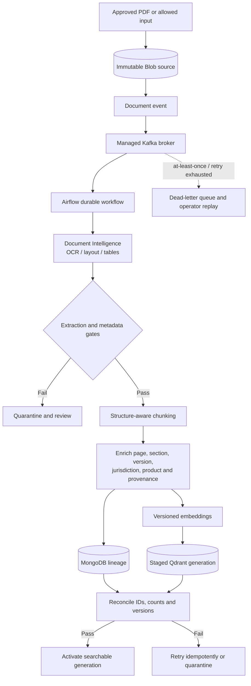
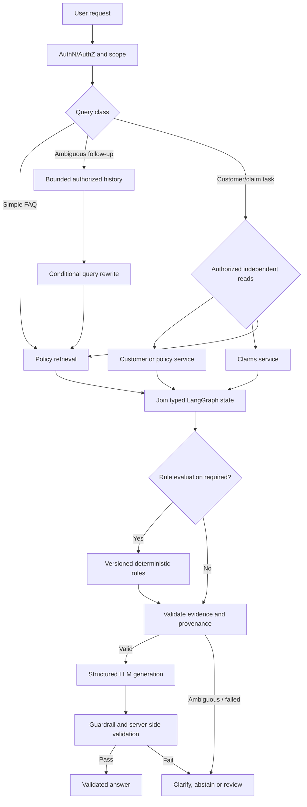
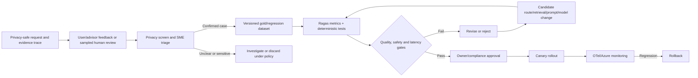

# Enterprise Architecture Interview Readiness

## Purpose and evidence boundary

This document gives concise, technically defensible answers about the documented Insurance AI Assistant architecture. **Current design** describes documented choices; **gap / decision required** identifies capabilities or production settings that have not been selected, implemented, or measured. A diagram is a target design, not evidence of a running deployment.

Detailed references: [parent architecture](../../README.md), [RAG architecture](../../rag-architecture.md), [backend architecture](../../backend-architecture.md), [deployment architecture](../../deployment-architecture.md), and [RAG enhancement decisions](./24-rag-enhancement-decisions.md).

## 1. Data Sources and Stores

**What:** The system combines unstructured insurance evidence, structured enterprise records, and derived retrieval/session stores.

| Data | Source of truth | Store/use in the assistant |
|---|---|---|
| Approved policy, claims-procedure, brochure and FAQ documents | Approved document repository; immutable retained copy in Azure Blob Storage | Extracted, versioned evidence is chunked and indexed |
| Customer, policy lifecycle, claims status and eligibility inputs | CRM, policy-administration, claims and governed rules systems | Authorized request-time service calls; not inferred from memory |
| Document/chunk metadata, versions, job status and lineage | MongoDB is the application metadata/lineage store; original documents remain in Blob | Reconciliation, filters, processing state and citation mapping |
| Embeddings and retrieval payloads | No independent business truth; derived from approved sources | Qdrant ANN retrieval index |
| Session/cache/rate-limit data | Ephemeral, non-authoritative | Redis with scoped keys and TTL; bypass or reconstruct on failure |

**Why:** This separates contractual evidence and live customer facts from caches and indexes, permits audit/rebuild, and reduces stale or cross-tenant answers.

**How:** Resolve identity and customer scope first; fetch structured facts from their systems of record; retrieve only approved document versions; cite the exact document/chunk/page. Validate MongoDB metadata and Qdrant vectors against the same source/version before publication.

**Trade-offs:** Multiple systems add integration, consistency, and operational burden. MongoDB/Qdrant are derived stores and must be reconciled; Redis improves latency but requires invalidation. Conversation persistence in MongoDB is conditional on retention/privacy approval.

**Failure handling:** If an authoritative customer API is unavailable, do not produce personalized coverage/eligibility claims. If source/index lineage or ACL scope is uncertain, fail closed, return a general answer only when safe, or escalate. Redis failure must not change correctness.

## 2. Document Processing

**What:** An asynchronous pipeline retains approved source files, extracts text/layout, applies quality gates, chunks and enriches content, embeds it, then stages and validates a searchable index generation.

**Why:** Scanned policies, tables, forms, clause hierarchies, and page references lose meaning under naïve text extraction or arbitrary splitting. Azure AI Document Intelligence is selected for OCR plus layout/table/form extraction; it is not a general visual-reasoning guarantee.

**How:** Target text PDFs, scanned PDFs, and table/form-heavy documents. Use deterministic structure-aware chunks from headings, clauses, tables, and page boundaries; use semantic boundaries only where structure is absent/unreliable. Preserve page, section/clause, source offsets, document/version IDs, effective dates, jurisdiction, product and provenance. Validate page coverage, OCR confidence, table integrity, chunk sizes, duplicates and mandatory metadata before embedding. Quarantine failures.

**Supported-format boundary:** The architecture intends to handle text/scanned PDFs and extracted tables/forms. Image inputs or embedded visuals are handled only when the selected Document Intelligence model and configured input path support them. Charts, handwriting, embedded photos and visual damage interpretation are not guaranteed. The exact MIME/size/language/encryption allowlist and quality thresholds are not specified.

**Trade-offs:** Structure-aware chunking and richer metadata improve retrievability and citations but increase pipeline complexity, extraction/QA work, and potentially chunk/index count. Document Intelligence adds service latency, quota and per-page processing cost.

**Failure handling:** Retry transient extraction/API failures with bounded backoff; reject or quarantine unsupported/corrupt/low-confidence extraction; retain the last approved version only if its effective period still applies. Never publish partial extraction as complete policy evidence.

## 3. Scale, Versioning, References and Citations

**What:** The design uses event-driven ingestion and staged, versioned indexing. Thousands of source documents are an intended target, not a capacity result.

**Why:** Upload bursts and policy updates should not block online queries, and a partially indexed or superseded policy must not become active.

**How:** One managed Kafka broker decouples arrivals; Airflow coordinates durable pipeline stages; bounded Kafka consumers/workers process independent document jobs subject to Document Intelligence/model quotas. Partition by stable document/job key; treat events as at-least-once. Derive idempotency keys from source identity, checksum, version and pipeline generation; persist stage state before ack; make extraction/chunk/embedding/metadata writes repeatable. Publish only after MongoDB/Qdrant reconciliation. Store effective dates and select evidence valid for the request date/jurisdiction.

For references across clauses/documents, preserve the reference text and page/section anchors. Follow a reference only when the target is resolved to an approved version and passes the same ACL/effective-date filters. Cite each retrieved target independently. Automated cross-document reference resolution is **not yet specified**.

**Trade-offs:** More concurrency increases throughput but can hit provider quotas and amplify retry load. Staged generations consume temporary storage. Cross-document resolution improves completeness but creates ACL, version and citation complexity.

**Failure handling:** Duplicate/replayed events become idempotent no-ops; conflicting checksums go to review; poison events go to a DLQ. Keep the old active generation if valid, otherwise abstain/escalate. Recovery requires validated Blob sources, Qdrant snapshots/backups, MongoDB backups and cross-store reconciliation.

**Capacity gap:** No throughput, p95, corpus/chunk-count, concurrency, extraction quota, re-index overlap, RTO or RPO benchmark is documented. Set targets only after representative load, burst, failover and restore tests.

## 4. Qdrant

**What:** Qdrant is the selected vector store for dense semantic retrieval and payload filters. HNSW is the intended approximate-nearest-neighbor index family; hybrid BM25/lexical retrieval may use a separate synchronized index.

**Why:** It serves vector search and payload filtering without turning the vector index into the authority for source documents or customer facts.

**How:** Keep stable document/chunk/version IDs and validated metadata payloads. Build ACL, jurisdiction, product, effective-date and version filters from authenticated/trusted services. Index only filter fields actually used. Retrieve candidates, fuse lexical results if deployed, rerank with BGE, then validate provenance and citations.

HNSW trades exhaustive exact search for approximate search with tunable recall, latency, memory and build costs. The settings (`m`, `ef_construct`, query `ef`, quantization, payload indexes, shard/replica topology) are **not selected or benchmarked**. Tune against recall@k, p95 latency, memory and filter selectivity; do not claim specific values.

**Alternatives:** Azure AI Search may suit integrated managed lexical/vector search; pgvector may suit smaller workloads with strong relational joins; Weaviate, Milvus or Pinecone may fit an existing platform/managed-operations standard. Compare ACL/filter semantics, tenant isolation, freshness, backup/restore, availability, p95 and total cost. No evidence currently justifies replacing Qdrant.

**Trade-offs:** A dedicated vector store gives focused retrieval operations but adds another stateful dependency and consistency/backup burden. A separate lexical index adds synchronization and fusion work.

**Failure handling:** Retry transient queries within the request deadline and open a circuit on sustained failure. Use a validated replica/index only if configured; do not fabricate a policy answer from no evidence. Restore snapshots and verify version/chunk parity before reopening traffic.

## 5. Multi-Agent Architecture and LangGraph

**What:** The current design is a **controlled multi-step LangGraph workflow**, not a fleet of autonomous specialist agents. Components/nodes may include routing, conversation-aware rewrite, customer context, retrieval, deterministic rules, constrained generation, and validation.

**Why:** LangGraph provides explicit conditional transitions and workflow state for multi-step requests. The word “multi-agent” should not imply independent agents that choose tools or redefine access scope; many responsibilities are safer as deterministic services.

**How:** Authorize first. Route simple FAQs directly; rewrite only ambiguous follow-ups; retrieve claim status from claims systems; call policy retrieval for document evidence. Independent authorized customer lookups and retrieval may run in parallel, then join before rule evaluation/generation. Use sequential execution where a later decision depends on validated prior output. Eligibility remains a versioned deterministic rules call; LLM nodes handle language interpretation or constrained explanation only.

LangGraph shared state should be a typed, request-scoped object containing authorized scope, route, correlation/idempotency ID, validated evidence references, rule results, deadline and terminal status. It must not be global cross-request memory. Checkpoint persistence and retention are not selected.

**Trade-offs:** Conditional/parallel graphs reduce unnecessary model calls and latency, but introduce join, cancellation, partial-result, and replay complexity. More autonomous agents add tool-permission surface, serial model latency, cost, and disagreement risk.

**Failure handling:** Bound every node with deadlines; retry only transient, idempotent operations; cancel sibling work when no longer useful. On low-confidence routing, clarify or escalate. Replayed nodes must not duplicate side effects; model outputs themselves are not deterministic/idempotent.

## 6. Failure, Retry and Idempotency

**What:** The architecture applies bounded resilience across graph nodes, LLM/API providers, retrieval stores, customer systems, broker consumers and indexing jobs.

**Why:** Unbounded retries create cost/latency cascades; duplicate side effects corrupt indexes or enterprise workflows; success-shaped fallbacks can make unsafe insurance claims.

**How:** Set per-dependency timeouts plus an overall request deadline, capped exponential backoff with jitter, admission control/backpressure, and circuit breakers. Retry transient provider errors only within budget; do not retry authorization denials, invalid inputs, or deterministic validation failures. A fallback model is allowed only after privacy, quality, and operational qualification. Otherwise return retry-later, clarification, abstention or human handoff.

Use at-least-once Kafka semantics with stable job keys and idempotent ingestion stages. On graph replay, pass idempotency keys to side-effecting tools and reconcile operation status before retry. A generation retry may vary and incur another charge; preserve attempt/trace IDs and never treat it as exactly-once.

**Trade-offs:** Resilience controls improve safety and availability but require timeout budgets, DLQ operations, idempotency ledgers/keys, and tested replay/restore procedures.

**Failure handling:** Retrieval/authoritative-data unavailability blocks the dependent answer category; stale index versions are not used outside their valid period; DLQ items require operator diagnosis before replay. Alert on deadline exhaustion, circuit state, retry volume, duplicate no-ops, worker lag, DLQ age and partial cross-store writes.

## 7. Security: Input, PII and Prompt Injection

**What:** Defense in depth comprises API schema/size/rate checks, identity and authorization, scoped retrieval, data minimization, PII controls where classification requires them, prompt-injection controls, NeMo/application guardrails, and deterministic output/citation validation.

**Why:** Insurance prompts and retrieved documents can contain sensitive identifiers and untrusted instructions. Guardrails do not establish authorization or policy truth.

**How:** Authenticate and authorize before customer/history retrieval. Treat user text, retrieved documents and conversation summaries as untrusted data, not instructions. Minimize fields before model calls. When classified PII may cross an external model/trace boundary, use Microsoft Presidio as the reference detection/masking implementation or an approved equivalent DLP service; redact trace/output separately. NeMo Guardrails checks dialogue/input/output policy and configured safety rails. They are complementary, not interchangeable. Do not restore masked identifiers in model context; fail closed if the required detector is unavailable. The documentation does not prove production configuration or effectiveness.

Validate output schema, evidence IDs, citation source/version/authorization, required disclosures, and customer/rule provenance in application code. Do not log raw conversations or retrieved passages by default. Define trace and audit access, retention, deletion, residency and redaction rules.

**Trade-offs:** PII detection has false positives/negatives and may remove useful context; model guardrails add latency and can overblock or miss attacks. Additional security services add operating burden. Data minimization and deterministic controls remain primary.

**Failure handling:** If auth, masking required by policy, or citation validation is unavailable, fail closed for sensitive outputs. If a prompt/document injection signal is uncertain, ignore the embedded instruction and continue only with safe evidence, or abstain/review. Security tooling outages must not cause a bypass.

**Gap:** The target control is defined, but PII classes, approved model/trace destinations, recognizer configuration and regional tests, trace retention/deletion, and actual Presidio/DLP deployment remain release gates. Prompt-injection evaluation coverage and measured security-control latency are also not evidenced.

## 8. Agent Quality, Evaluation and Improvement

**What:** Quality combines deterministic request-path checks, offline Ragas evaluation, optional LangSmith experiment/trace UX, production OTel/Azure monitoring, SME review and controlled user/advisor feedback.

**Why:** No single LLM judge or observability tool can detect all wrong routes, missed clauses, unsupported answers, stale sources, or unsafe customer-specific claims.

**How:** Record privacy-safe traces with request/route/model/prompt/retrieval configuration IDs, stage latency/cost, source versions and opaque evidence IDs. Track routing confusion/clarification, no-hit/low-confidence, citation rejection, abstention, escalation and human-review outcomes.

Run Ragas on versioned, SME-reviewed examples for:

- **Faithfulness:** answer claims supported by supplied context (not proof that context is authoritative).
- **Answer Relevancy:** response addresses the true intent, including appropriate clarification/refusal.
- **Context Precision:** retrieved/ranked chunks are relevant.
- **Context Recall:** required SME-labeled evidence is present; essential to measure alongside precision for exceptions and exclusions.

LangSmith is optional for LLM trace inspection and experiments after privacy, residency, retention, access and vendor review. OTel/Azure Monitor remains the operational source of truth. Do not make online responses depend on Ragas/LangSmith.

**Feedback loop:** Triage feedback with human review and privacy screening; add confirmed cases to a versioned gold/regression set; evaluate candidate prompt, route, chunker, retrieval or model changes; require quality/safety/latency gates and owner approval; canary and monitor; rollback on regression. Thumbs-up/down are not automatic labels, and feedback does not automatically train or mutate production models.

**Trade-offs:** SME-labeled data and async judges cost time and money, but create a defensible release process. Automated metrics can drift or score confidently wrong; calibrate judges against human review and inspect critical cases, not just aggregates.

**Failure handling:** Evaluator or LangSmith outage does not affect serving; pause evaluation/release promotion and alert on missing data. Quality regressions block rollout or trigger rollback. Track evaluator/model/dataset versions and sampling/redaction failures.

## Principal Architect Review

### Defensible conclusions

- Source-of-truth separation is sound: Blob for immutable documents; enterprise services for customer/policy/claims facts; MongoDB for lineage metadata; Qdrant for derived vectors; Redis for ephemeral acceleration.
- Keep Azure AI Document Intelligence for OCR/layout/table extraction and structure-aware chunking. Do not equate it with general image/chart understanding.
- Keep Qdrant and BGE as documented choices; hybrid lexical retrieval remains conditional on a synchronized, ACL-equivalent lexical index. HNSW settings and capacity claims must await benchmark evidence.
- Describe LangGraph as a conditional, typed workflow with selected LLM nodes—not a set of autonomous agents. Use deterministic services for customer access and eligibility.
- Presidio is the reference PII detector/masking implementation when classified PII may cross external boundaries; an approved enterprise DLP equivalent is acceptable. NeMo is complementary and is not a PII or authorization control.
- Use Ragas offline for the named metrics and optional privacy-reviewed LangSmith for experiment UX; keep OTel/Azure monitoring operational. Feed confirmed failures into regression tests with human approval.

### Gaps and contradictions to resolve before production

1. **Format contract:** Exact supported MIME types, file/page/size limits, encrypted-file handling, languages, OCR confidence thresholds, and image/table acceptance tests are unspecified.
2. **Capacity and SLOs:** No workload model or load benchmark for route mix, peak concurrency/RPS, thousands of files, chunk/vector count, ingestion parallelism, retrieval p95/p99, extraction/model quotas, re-index overlap, or cost per successful task. Customer count alone is not capacity.
3. **Broker/orchestrator topology:** The target architecture selects one managed Kafka broker, with Airflow coordinating stages and bounded Kafka consumers doing parallel work. The managed Kafka offering, partition/retention configuration, consumer concurrency, Airflow executor, quotas, retry budget, DLQ owner and replay runbook still require deployment configuration and load-test evidence.
4. **Qdrant production settings and recovery:** HNSW, payload indexes, quantization, shard/replica counts, backup frequency, business-approved RPO/RTO, failover and restore drills are not configured/documented as measured values. Restore and cross-store reconciliation must pass before retrieval is re-enabled.
5. **Cross-document references:** Source offsets/citations exist, but automated link/reference extraction, target resolution and completeness evaluation are not specified.
6. **Graph state:** Typed request-scoped state is a design recommendation; checkpoint storage, encryption, retention, replay and deletion are unselected.
7. **PII controls:** Presidio is the reference detector/masking implementation when classified PII may cross an external boundary; an approved DLP equivalent is acceptable. Selection/configuration, recognizers, false-negative testing, trace redaction/retention and deployment evidence remain outstanding before external model/trace use.
8. **Feedback product surface:** The human-reviewed loop is an operating design; feedback capture, consent, case triage ownership and SLA are not specified.
9. **Quality gates:** The RAG design now defines required stratification, deterministic hard gates and SME approval of per-segment thresholds. The actual gold set, numeric thresholds, owners and passing test evidence remain release requirements; aggregate Ragas scores alone are insufficient for exclusions and eligibility.
10. **Framework verification:** NeMo is the documented guardrail baseline, but its runtime configuration, test coverage and operational ownership are not evidenced here. Verify deployment and controls. LangSmith remains optional and is never the production telemetry authority.

### Unnecessary or conditional technologies

- Do not add Event Hubs as a second broker for the document-ingestion flow; maintain the single Kafka event path.
- Do not add multiple specialist autonomous agents, always-on multi-query, MMR, compression, a VLM, or long-term sensitive customer memory by default.
- Do not make both MongoDB and Redis durable conversation authorities. Redis is ephemeral; MongoDB persistence requires governance approval.
- Do not add a relational store, LangChain, or a separate lexical index without a demonstrated requirement and operational owner.
- Keep LangSmith optional; it overlaps operational tracing. Do not run NeMo and a second overlapping guardrail framework without a gap analysis; require deterministic safety/application controls regardless.

### Required production controls

Before production sign-off, name owners and thresholds for authorization and citation tests, idempotency/replay, dependency deadlines/circuit breakers, queue/DLQ operations, source/index consistency, data retention/redaction, HNSW/capacity tuning, backup/restore RTO/RPO, gold-set coverage, canary/rollback, and incident escalation. None of those targets should be presented as already achieved without test evidence.
