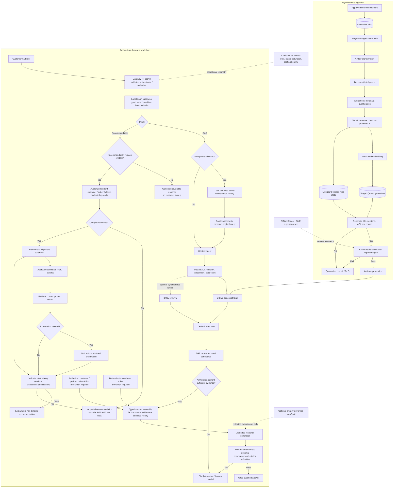

# Final Architecture Review — Insurance AI Assistant

## Review scope and evidence boundary

This review covers the current [RAG architecture](../../rag-architecture.md), [backend architecture](../../backend-architecture.md), [deployment architecture](../../deployment-architecture.md), and [parent README](../../README.md).

The stated target is **20,000–40,000 registered customers**, conversational Q&A, and personalized product recommendations. The reviewed material is architecture documentation, not evidence of a deployed or load-tested system. No production configuration, workload trace, measured RPS/concurrency, P50/P95/P99 results, provider quota commitments, successful recovery exercise, or business-approved SLO/RPO/RTO was provided. Capacity and readiness conclusions below are therefore limited to design plausibility.

## 1. Production readiness verdict

- **Verdict: Needs Changes**
- **Architecture direction:** Sound and appropriately conservative for an insurance assistant. No wholesale redesign is justified.
- **Production readiness:** Not demonstrated. The architecture defines sound boundaries and release gates, but the evidence to close those gates is absent.
- **Customer scale:** 20k–40k registered customers is not an estimate of concurrent users, RPS, or supported capacity. Do not make a capacity or latency commitment from the customer count.

Strengths include authoritative-source separation, versioned and staged indexing, filtered Qdrant retrieval, BGE reranking, deterministic eligibility, bounded LangGraph workflows, optional rather than mandatory retrieval features, server-side citation validation, safe abstention, and offline evaluation.

## 2. Critical issues

These are release gates, not documentation-only tasks:

1. **Capacity is unqualified.** The approved request mix, peak/burst workload, SLOs, quotas, and full-stack load/failure results are not evidenced.
2. **Recommendations must remain disabled until governed dependencies are real.** Customer/policy/claims, catalog, and deterministic rule integrations, freshness contracts, business/compliance approvals, and failure-path tests are not evidenced. The documented default-off behavior is appropriate.
3. **Sensitive-data controls are not evidenced as deployed or approved.** Data classes, model/trace destinations and terms, PII/DLP configuration, trace redaction/retention, and security tests remain release requirements.
4. **Recovery is not qualified.** Owners have not supplied approved RPO/RTO, backup configuration, or successful restore/replay/reconciliation evidence.

### P0 closure evidence

| Gate | Required evidence before claiming closure |
|---|---|
| Capacity | Approved workload/SLO/quota envelope; end-to-end normal, burst, ingestion-overlap, throttling and failure tests meeting targets with agreed headroom |
| Recommendation safety | Implemented and approved authoritative integrations and versioned API contract; passing eligibility, freshness, authorization and failure tests—or leave endpoint disabled |
| Privacy/security | Approved data classes/destinations/vendor terms; deployed and tested PII/DLP and independent trace redaction; retention/deletion approval |
| Recovery | Approved workflow-specific RPO/RTO; configured backup/retention and named operators; successful restore, replay and cross-store reconciliation exercise |

## 3. Recommended optimizations

All recommendations use **Problem → Impact → Recommendation → Trade-off**. Items already described in the architecture are not claimed as implemented or measured.

### P0 — Critical

#### P0.1 — Qualify workload and capacity

- **Problem:** Registered customer count does not define active concurrency, route mix, arrival bursts, request duration, token distribution, ingestion load, or provider limits.
- **Impact:** API workers, Qdrant, BGE, enterprise APIs, or model quotas may saturate; queues and retries can amplify tail latency and cost.
- **Recommendation:** Owners approve peak/burst workload and route mix for simple Q&A, follow-ups/personalized Q&A, and recommendations, including ingestion/re-index overlap, tokens, expected quotas, route SLOs, and headroom. Run full-chain load and degradation tests; preserve test configuration, measurements, risks, and sign-off in release evidence. Set resource/pool/queue/autoscaling values from those measurements.
- **Trade-off:** Testing and quota commitments take time and budget, but replace unsupported capacity assumptions with an auditable limit and scaling plan.

#### P0.2 — Gate personalized recommendations

- **Problem:** Catalog, customer/policy/claims and deterministic eligibility/suitability integrations and their governance are not evidenced.
- **Impact:** An LLM or stale/missing source could produce unsupported, ineligible, or unauditable recommendations.
- **Recommendation:** Keep `POST /api/v1/recommendations` disabled until authoritative integrations, data freshness/version checks, deterministic rules, ranking ownership, consent/purpose, disclosures, idempotency, API contract, and critical failure tests are approved and pass. While disabled, authenticate and verify endpoint permission, then return the generic unavailable response before customer lookup; do not fall back to conversational Q&A or return partial candidates.
- **Trade-off:** The feature remains unavailable until integrations and governance are complete, preserving customer safety and auditability.

#### P0.3 — Approve sensitive-data boundaries

- **Problem:** PII/DLP and external model/trace processing policy is specified as a target control but not evidenced as deployed, configured, or approved.
- **Impact:** PII or policy identifiers may cross an unapproved boundary; over-masking may also make responses unusable.
- **Recommendation:** Approve data classification, model/trace destinations and vendor terms; minimize data; deploy Presidio or approved equivalent DLP when required; redact traces independently; test regional identifiers, false negatives/positives, output handling, retention/deletion, and fail-closed behavior. Keep NeMo complementary; it is not PII detection or authorization.
- **Trade-off:** Detection and redaction add latency and tuning effort, but reduce exposure risk. Minimize first and apply controls at actual external boundaries.

#### P0.4 — Exercise recovery and consistency

- **Problem:** RPO/RTO, backup/retention settings, named operators, and restore/replay results are not evidenced.
- **Impact:** Recovery can leave policy evidence stale or MongoDB lineage and Qdrant active generations inconsistent.
- **Recommendation:** Business/regulatory owners approve workflow-specific objectives. Exercise Blob/source, MongoDB, Qdrant, and broker/job-state recovery; reconcile source/version/chunk/ACL/effective-date manifests and active-generation markers before reopening affected reads. Rebuild Qdrant from approved artifacts if integrity is uncertain; keep workflows unavailable if sources cannot be validated.
- **Trade-off:** Backups, retention, and drills add operational cost, but prevent recovery from serving inconsistent derived data as authoritative.

### P1 — Important

#### P1.1 — Enforce route budgets and dependency deadlines

- **Problem:** Numeric route objectives and measured stage budgets are not approved.
- **Impact:** Slow LLM, BGE, Qdrant, or customer/catalog/rules dependencies can hold API workers and raise P95/P99.
- **Recommendation:** Set route-specific P50/P95/P99 and availability objectives; propagate one end-to-end deadline, use async I/O, bounded pools/semaphores, bulkheads, cancellation, and capped transient retries. Parallelize only independent authorized reads and join before rules/generation. Keep ingestion, Ragas, trace export, and nonessential summary refresh outside the interactive path.
- **Trade-off:** Deadline allocation and cancellation add implementation/testing work; they bound resource use and failure propagation.

#### P1.2 — Qualify each scaling tier

- **Problem:** FastAPI, LangGraph, Qdrant, MongoDB, Redis, and BGE settings are not backed by target-workload benchmarks.
- **Impact:** CPU-only autoscaling or unbounded graph fan-out/candidates can miss pool, queue, provider, memory, or filter bottlenecks.
- **Recommendation:** Benchmark each tier and the end-to-end route; bound concurrency, queues, connection pools, retrieval candidates, and BGE batches. Derive Qdrant HNSW/payload-index/shard/replica settings from recall, memory, filtering and latency tests; benchmark MongoDB access paths/pools. Scale on saturation/queue age and dependency quotas as well as CPU/memory.
- **Trade-off:** Per-tier qualification adds setup work but avoids uniform overprovisioning and production bottleneck discovery.

#### P1.3 — Operationalize the single ingestion event path

- **Problem:** The architecture specifies one managed Kafka path, but broker settings, Airflow capacity, quotas, retry ownership, and DLQ replay operations are not selected/evidenced.
- **Impact:** Duplicate retry loops, hot partitions, poison messages, or provider throttling can delay indexing or create partial versions.
- **Recommendation:** Select and configure one managed broker; record stable partition/idempotency key, acknowledgements, retention, bounded consumer/worker concurrency, Airflow stage retry policy, per-provider quotas, DLQ owner/runbook, and index freshness monitoring. Test duplicate/replay, burst, backfill and re-index overlap; preserve staged publication and cross-store reconciliation.
- **Trade-off:** A concrete topology reduces flexibility, but avoids duplicate brokers and overlapping retry/orchestration mechanisms.

#### P1.4 — Populate quality gates with SME evidence

- **Problem:** Evaluation methodology exists, but populated SME datasets, approved segment thresholds and passing baselines are not evidenced.
- **Impact:** Aggregate scores can hide missed exclusions, waiting periods, version errors, or incorrect recommendations.
- **Recommendation:** Maintain versioned evaluation sets segmented by product, jurisdiction, workflow and policy version. SMEs approve per-segment thresholds; deterministic hard gates cover authorization, version selection, citations, schema/disclosures and rule outcomes. Ragas runs offline/asynchronously; it is not an online truth oracle.
- **Trade-off:** SME annotation and maintenance cost are ongoing, but make release decisions defensible for material insurance cases.

#### P1.5 — Publish the recommendation API contract before enablement

- **Problem:** The API is a target contract; a published versioned OpenAPI schema and client compatibility evidence are not present.
- **Impact:** Clients can mishandle no-match, insufficient-data, review, stale-source, or dependency-failure outcomes and may retry unsafely.
- **Recommendation:** Publish/approve the versioned schema, authorization/consent behavior, idempotency, stable outcomes/errors, timestamps, rule/catalog versions, citations, disclosures, rate limits, and no-partial-result semantics. Keep route disabled until compatible implementation and tests pass.
- **Trade-off:** Contract governance slows initial iteration but reduces client ambiguity and coupling.

### P2 — Optimization

#### P2.1 — Tune retrieval without adding techniques by default

- **Problem:** Candidate K, lexical fusion, MMR and compression involve recall/latency/cost trade-offs and have no reported benchmark.
- **Impact:** Too many candidates increase reranking and prompt cost; aggressive diversity/compression may drop qualifications or exceptions.
- **Recommendation:** Establish semantic + BGE as baseline. Compare changes against the same versioned SME corpus for Recall@K, Context Precision/Recall, clause/citation integrity, latency and cost. Enable hybrid only with synchronized ACL/version/date filters and measured benefit; leave MMR and extractive compression off unless separately evaluated and promoted.
- **Trade-off:** Offline evaluation takes time; optional index/compute complexity is incurred only when it proves value.

#### P2.2 — Control model calls and token/cost spend

- **Problem:** Conditional calls and token budgets are designed, but actual call/token/cost distributions are not evidenced.
- **Impact:** Rewrite, planning, retries, generation and ingestion can multiply provider usage and degrade throughput.
- **Recommendation:** Record every attempt by route/stage/model/configuration, including tokens, latency, retries and outcome. Keep deterministic routing for common queries; rewrite only ambiguous follow-ups; avoid a separate policy-reasoning/judge call; use one grounded generation call where possible. Bound per-request tokens/fan-out, separate background and interactive quotas, and batch/reuse embeddings only for exact version/config matches.
- **Trade-off:** Hard budgets may skip optional planning/explanations or return clarification/abstention under pressure, but prevent unbounded latency and spend.

#### P2.3 — Verify operational observability and cache value

- **Problem:** Dashboards, alerts, and caching benefit are not evidenced in the target environment.
- **Impact:** Tail latency, saturation, citation failures, stale indexes, or retry/cost amplification can go unnoticed; unsafe caches risk stale/cross-scope results.
- **Recommendation:** Deploy route/dependency dashboards for rate/errors/duration, P50/P95/P99, saturation, queue age, provider throttles, tokens/cost, retrieval/citation and business outcomes. Set actionable thresholds with owners/runbooks and exercise alerts/load shedding. Keep response caching disabled unless a measured hot path justifies it; if enabled, test authorization scope, version/freshness invalidation and outage bypass. Keep Redis non-authoritative.
- **Trade-off:** Telemetry and testing cost resources; cache adds invalidation and governance burden. Both should be proportional to demonstrated operational benefit.

## 4. Scalability assessment: 20k–40k customers

**Assessment: plausible target design, capacity unproven.** No numeric RPS, concurrency, latency, corpus capacity, or provider capacity is claimed.

| Component | Scaling assessment and material bottleneck | Required evidence/control |
|---|---|---|
| FastAPI / gateway | Horizontally scalable if stateless and async; event-loop blocking, in-flight requests, outbound pools and rate limits can dominate | Concurrent route tests, event-loop and pool-wait metrics, admission limits, P50/P95/P99 |
| LangGraph | Controlled workflow fits conditional routes; sequential model/tool calls, state/checkpoint I/O and fan-out can increase latency | Request-scoped typed state, per-node/overall deadlines, bounded fan-out, call ledger, cancellation tests |
| Qdrant | Design uses filtered dense ANN; capacity depends on vectors/chunks, dimensions, payload indexes, selectivity, HNSW configuration and concurrent rebuilds | Recall/memory/search-filter tests on representative corpus; isolate or throttle re-index |
| MongoDB | Suitable for lineage/job state and conditionally governed conversation data; indexes, pool contention, retention and document growth need qualification | Query-path indexes, bounded pools, retention policy and reconciliation/write-load tests |
| Redis | Optional acceleration/session/rate-limit role; not an authority; adds invalidation and failover concerns | Keep cache off until measured; scoped keys, TTL, authorization recheck and tested bypass if enabled |
| Kafka / Airflow / workers | Async ingestion isolates user path; throughput depends on partitions, scheduler/workers, OCR/embedding quotas and DLQ operations | One broker path, bounded idempotent consumers, backpressure, replay/DLQ ownership and burst/re-index tests |
| LLM / embedding / OCR APIs | Provider RPM/TPM quotas, concurrency, token size, retries and generation time are likely shared constraints | Verify quotas, reserve interactive capacity, apply deadlines/admission control, measure per-route cost and throttling |
| BGE reranker | Bounded cross-encoder is appropriate; candidate count and compute/queue saturation affect tail latency | Batch/cap candidates, measure throughput/queue/P95/P99, safe abstention if unavailable |
| Customer/catalog/rules APIs | Recommendation path depends on current authoritative data; downstream quotas/freshness may dominate | Contract/freshness checks, bounded pools/deadlines, no stale eligibility fallback |

Workload, route mix, concurrency, RPS, document/chunk count, ingestion bursts, and provider quotas must be measured separately. Registered-customer population alone supports no throughput inference.

## 5. Final recommended architecture

The diagram is a target flow, not deployment evidence. Hybrid retrieval is conditional on a synchronized ACL/version-equivalent lexical index. MMR, compression, and response caching stay off until evaluated. Product recommendation remains disabled until its launch gate passes.

## Final assessment

Retain the current architecture and close the evidence gates; do not add agents, stores, retrieval algorithms, or model calls for their own sake. The design is defensible for an enterprise insurance RAG target, but **not yet demonstrated ready for production or for 20k–40k customer capacity**. Promotion requires owner-approved workload/SLOs, end-to-end load and failure results, privacy/security approval, successful recovery exercises, populated SME release gates, and a disabled recommendation route until its authoritative integrations and contract pass.
