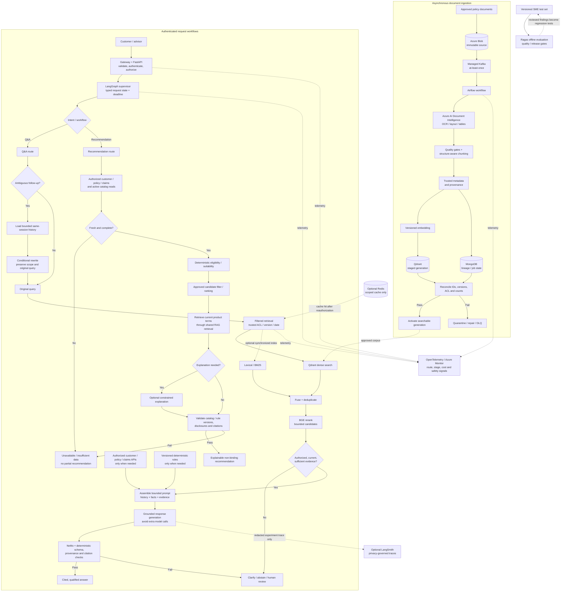

# Final Architecture Review — Insurance AI Assistant

## Review scope and evidence boundary

Reviewed [RAG architecture](../../rag-architecture.md), [parent README](../../README.md), [backend architecture](../../backend-architecture.md), [deployment architecture](../../deployment-architecture.md), [RAG enhancement decisions](./24-rag-enhancement-decisions.md), and [interview readiness review](./25-architecture-interview-readiness.md).

The target is 20,000–40,000 registered customers with conversational Q&A and product recommendations. This count alone does not define concurrency, throughput, latency, capacity or cost. The documentation is an architecture design; it contains no test results, production configuration evidence, workload trace, or signed SLOs. This review therefore distinguishes sound design choices from production readiness evidence.

## Executive Verdict

- **Production readiness: Needs Changes**
- **Overall assessment:** The target architecture is coherent and appropriately conservative for insurance: immutable source documents, authoritative enterprise customer data, versioned evidence, filtered Qdrant retrieval, optional hybrid search, BGE reranking, provenance-aware prompts, deterministic eligibility rules, server-side citation validation, conditional LangGraph routing, and offline Ragas evaluation. No wholesale redesign is justified.
- **Why it is not yet production-ready:** The architecture documents now define workload and recovery qualification gates, a recommendation launch contract, and a PII-control boundary. They do not prove these controls are implemented, approved, or tested. Capacity/load results, route-specific SLOs, provider quotas, actual recommendation integrations, selected/configured PII/DLP, and business-approved RPO/RTO remain unverified.
- **Scale conclusion:** 20k–40k registered customers is a reasonable design target, not proof of capacity. Suitability depends on peak active users, request mix, request duration, token usage, upstream quotas, document/chunk count and filtering, plus recovery requirements. Production approval requires representative load, failure, security and restore tests.

## Critical Issues / Launch Gates (Not Yet Verified)

These items are now specified as architecture requirements below, but remain launch blockers until implemented and supported by approval or test evidence:

1. **Capacity and latency are unproven.** The workload inputs and test method are defined in [deployment architecture](../../deployment-architecture.md), but product/platform owners must still approve the workload envelope, SLOs, quotas and cost limits; full-stack load/failure tests have not been evidenced. Do not infer service capacity from customer count.
2. **Recommendation integrations and governance are not implemented/evidenced.** The target API and explicit launch gate are defined in [RAG architecture](../../rag-architecture.md), but the customer/policy/claims, catalog and deterministic rule interfaces, freshness contracts and compliance approvals are not established here. Keep personalized recommendations disabled until the gate passes.
3. **Sensitive-data controls are not deployed/evidenced.** Presidio is the reference implementation (or an approved equivalent DLP); NeMo is complementary, not a PII control. Data classes, vendor processing approvals, detector configuration, trace redaction/retention and tests must be completed before classified data crosses external boundaries.
4. **Recovery objectives and exercises remain outstanding.** The [deployment recovery gate](../../deployment-architecture.md) defines restore order and consistency checks, but business/regulatory owners must set RPO/RTO and successful backup, restore, replay and reconciliation exercises must be recorded.

### P0 closure status

Documentation-level controls are now explicit; this does **not** close the production gates. No measured test results, integration evidence, approvals, or recovery-exercise records were provided, so none of the four P0 items can be represented as production-verified.

| P0 | Architecture control documented | Evidence still required to close |
|---|---|---|
| Capacity qualification | Deployment architecture defines workload inputs, tier tests, protections and required qualification record | Approved workload/SLO/quota envelope and passing end-to-end measurements with agreed headroom |
| Recommendation safety | Recommendation route is disabled by default; while off, it verifies caller endpoint permission and returns generic `503 recommendation_unavailable` before customer lookup; conversational Q&A cannot substitute | Implemented authoritative integrations, API/owner approvals, and passing rule, freshness, security and failure-path tests |
| PII/privacy | Presidio or approved equivalent DLP, minimization, independent trace redaction and fail-closed behavior are defined | Approved data classes/destinations and vendor terms; deployed, tested control and approved retention/deletion |
| Recovery | Dependency-ordered restore, reconciliation and workflow-disable behavior are defined | Approved RPO/RTO, configured backup/retention, named operators and successful restore/replay evidence |

## Recommended Optimizations

### P0 — Critical

#### P0.1 — Establish workload envelope and qualify capacity

- **Problem:** 20k–40k customers are specified, but active concurrency, peak request mix, session behavior, p95/p99 objectives, and upstream model/rules/catalog quotas are not.
- **Impact:** FastAPI, model providers, customer APIs, Qdrant, or BGE may saturate during bursts; queueing raises tail latency and cost, while retries can create a cascade.
- **Recommendation:** Define a measured workload model for Q&A and recommendations, including peak and burst traffic, streaming/think time, average and maximum prompt/output tokens, conditional rewrite rate, model calls per route, retrieval candidate counts, and ingestion/re-index load. Load-test the full dependency chain and failover at expected peak plus an agreed headroom. Secure provider quota commitments or an explicit admission-control policy.
- **Why:** Registered customers do not map directly to simultaneous requests. Capacity is bounded by the slowest/most quota-constrained synchronous dependency and by acceptable queueing latency.
- **Trade-off:** Load tests and reserved quota cost time and budget; they prevent unsupported capacity promises and expose the actual horizontal/vertical scaling need.
- **Architecture update:** The deployment document requires route-level workload inputs, approved targets/quotas, full-stack load/failure tests, and a retained qualification record containing configuration, workload, measured limits/headroom and sign-off. No assumed active-user percentage, RPS, latency, or capacity is set.
- **Evidence still required:** Approved workload/SLO/quotas and passing measurements with agreed headroom; until then, capacity remains unqualified.

#### P0.2 — Gate recommendation launch on authoritative integrations

- **Problem:** The recommendation endpoint is still a target contract, and the product catalog/rules integrations are not evidenced as selected or implemented.
- **Impact:** A recommendation could be stale, ineligible, unsuitable, unsupported, or impossible to audit if candidate data/rules are guessed or supplied by the LLM.
- **Recommendation:** Before launch, define authenticated APIs and schemas for profile, existing policies/coverage, claims as permitted, current catalog, and versioned eligibility/suitability rules; specify freshness, consent/purpose, reason codes, ranking ownership, disclosures, and human review. Keep eligibility/candidate filtering deterministic. Test no-match, insufficient-data, stale-source and rule/catalog mismatch paths.
- **Why:** RAG supplies evidence about product wording; it does not establish current catalog availability or customer eligibility.
- **Trade-off:** Integration and compliance work delays the endpoint, but avoids binding product decisions being inferred from language-model output.
- **Architecture update:** The route is disabled by default until integrations and the versioned API/error/audit contract are approved and tested. While disabled it authenticates and verifies endpoint permission, returns generic `503 recommendation_unavailable` before customer lookup/downstream calls, and cannot fall back to conversational generation. Once enabled, subject authorization and consent/purpose are checked before customer data reads.
- **Evidence still required:** Implemented OpenAPI contract, service ownership, test results and approval of ranking, disclosures, consent/purpose and retention.

#### P0.3 — Approve and verify sensitive-data processing controls

- **Problem:** Presidio is the documented reference implementation, but data classes, model-provider terms, selected deployment/equivalent, masking behavior, trace export, retention and detector-failure behavior are not approved or verified.
- **Impact:** PII or policy identifiers may be exposed to an unapproved model/trace boundary, or over-masking may make evidence unusable.
- **Recommendation:** Complete data classification and threat review; deploy Microsoft Presidio as the reference PII detector/masking layer or use an approved equivalent DLP; minimize fields before model calls; test regional insurance identifiers and false-negative behavior; configure NeMo for dialogue safety; enforce authZ, provenance and citation controls in deterministic code; redact traces and logs independently. Fail closed when a required control is unavailable.
- **Why:** NeMo is not a PII detector or authorization boundary, and a privacy control is only effective when configured and tested against the actual data and vendor path.
- **Trade-off:** Detection adds latency and operational tuning and can remove useful context; minimizing data and using workflow-specific checks limits that cost.
- **Architecture update:** The RAG/backend security sections now establish a reference control, equivalent-service criteria, masking boundary, independent trace redaction, no in-model restoration, and fail-closed behavior.
- **Evidence still required:** Approved data classes/destinations, vendor terms, selected deployed control, recognizer and redaction tests, and retention/deletion approval.

#### P0.4 — Set and exercise data/service recovery objectives

- **Problem:** RPO/RTO, backup cadence/retention, replica topology, regional failover and restore drills are not specified or evidenced.
- **Impact:** A stateful-store or regional incident can cause extended outage, stale policy evidence, or inconsistent MongoDB/Qdrant state.
- **Recommendation:** Define workflow-specific RPO/RTO and owners; test restore of Blob source, MongoDB lineage, Qdrant vectors/snapshots and broker state; reconcile source/version/chunk IDs and active-generation pointers before enabling retrieval. Document safe behavior when only one store is restored. Exercise recovery and record achieved times.
- **Why:** Availability alone is not correctness; a restored vector index must be consistent with approved source versions and access metadata.
- **Trade-off:** Replication, backups and drills add storage/operations cost, but materially reduce data-loss and unsafe stale-answer risk.
- **Architecture update:** The deployment document now defines dependency-ordered recovery, cross-store reconciliation, Qdrant rebuild from approved sources when integrity is uncertain, and keeping affected workflows disabled until validation.
- **Evidence still required:** Business/regulatory-approved numeric RPO/RTO, backup/retention configuration, named operators, and successful restore/replay exercise results.

### P1 — Important

#### P1.1 — Define route-specific P50/P95/P99 budgets and async dependency behavior

- **Problem:** No approved numeric latency SLOs or measured per-route budgets exist. User requests wait for retrieval, customer APIs as required, reranking, model generation, guardrails and validation.
- **Impact:** Tail latency from an LLM, BGE, CRM or catalog dependency can dominate the entire request; uncontrolled waits/retries increase concurrent connections and cause timeouts upstream.
- **Recommendation:** Set end-to-end and per-stage P50/P95/P99 objectives separately for simple Q&A, follow-up Q&A, personalized Q&A and recommendations. Use async HTTP/database clients, bounded connection pools, per-dependency deadlines, an overall deadline, bulkheads, rate limits and cancellation. Run only independent authorized reads in parallel; join before rules/generation. Stream responses only if product/security requirements allow and never stream unvalidated factual claims as final.
- **Why:** Stage histograms identify the actual bottleneck; parallelism reduces critical path only for independent work, while deadlines protect the whole service from slow dependencies.
- **Trade-off:** More detailed budgets and cancellation paths increase implementation complexity; they improve predictable latency and protect capacity during incidents.
- **Architecture update:** Backend/deployment docs now require per-route budget allocation, remaining-time propagation, async I/O, bounded connection pools/semaphores, bulkheads, shared retry budgets, cancellation, and asynchronous ingestion/evaluation/trace work.
- **Evidence still required:** Product owners must set numeric SLOs; load tests must demonstrate budgets under normal, burst and degraded dependency conditions.

#### P1.2 — Size and protect each stateful/compute tier from measured load

- **Problem:** FastAPI autoscaling, LangGraph worker limits, Qdrant HNSW/shards/replicas, MongoDB connection/index settings, Redis capacity, and BGE compute are not benchmarked for the target workload.
- **Impact:** CPU-only autoscaling may miss queue/connection/provider saturation; unbounded graph fan-out or BGE candidates can exhaust workers; poorly indexed metadata filters or MongoDB hot collections can increase tail latency.
- **Recommendation:** Test API concurrency and event-loop blocking; set worker/pod concurrency and admission limits; size Qdrant by chunk/vector count, dimensions, payload indexes, filter selectivity and replica count; benchmark recall@k, memory and P95/P99; index MongoDB access paths and bound pool sizes; keep Redis evictable/non-authoritative with scoped TTLs; profile BGE batching and GPU/CPU saturation. Use queue depth/age and dependency saturation in autoscaling decisions, not CPU alone.
- **Why:** The architecture already separates these services; independent scaling and backpressure preserve that advantage.
- **Trade-off:** Benchmarking and service-specific metrics add setup work and may require reserved resources; it avoids overprovisioning every tier equally or finding bottlenecks in production.
- **Architecture update:** Deployment guidance now has per-tier qualification/protection criteria for FastAPI, LangGraph, Qdrant, MongoDB, Redis, BGE, Kafka/Airflow/workers and upstream APIs, plus saturation-aware autoscaling and admission control.
- **Evidence still required:** Resource counts, pool sizes, HNSW/shard/replica values and autoscaling thresholds must be derived from the approved workload and verified in load tests; none are asserted as measured.

#### P1.3 — Operationalize the selected Kafka ingestion path

- **Problem:** The logical architecture needs one event path, and deployment-specific partitions, concurrency, provider quotas, retry ownership and DLQ replay still require configuration.
- **Impact:** Duplicate retry loops, hot partitions, Airflow scheduler bottlenecks, poison events or embedding/OCR throttles can stall index freshness and create partial versions.
- **Recommendation:** Use the selected single managed Kafka broker; configure partition/idempotency key, acknowledgement semantics, worker concurrency, Airflow executor/scheduler sizing, per-stage rate limits, bounded retries, DLQ owner/replay runbook and freshness alert. Load-test normal upload bursts and full re-indexing while serving queries. Keep activation gated by cross-store reconciliation.
- **Why:** At-least-once processing and idempotency are documented, but operational ownership and throughput controls determine whether they work at scale.
- **Trade-off:** A deliberate topology decision reduces optionality and needs platform ownership; it avoids operating two brokers or overlapping retry/orchestration mechanisms unnecessarily.
- **Architecture update:** README, RAG, backend, deployment and interview docs now agree on a single managed Kafka event path; Airflow coordinates stages, bounded consumers/workers execute them, Airflow owns stage retries, Kafka redelivers unacknowledged events, and poison events go to an owned DLQ.
- **Evidence still required:** Select the managed Kafka offering and record partition/retention/consumer settings, Airflow capacity, quota and retry values, DLQ operations owner, and load-test results before production.

#### P1.4 — Populate and calibrate quality gates by workflow

- **Problem:** The RAG document now defines the quality-gate method, but the SME-owned datasets, numeric segment thresholds, owners and passing baselines have not been populated or evidenced. Ragas remains an estimate, not an online truth oracle.
- **Impact:** A system may return unsupported policy answers or miss exclusions while aggregate evaluation looks acceptable; conversely, overly strict thresholds may block useful answers.
- **Recommendation:** Populate and maintain the test sets by product, jurisdiction, query intent, policy version and Q&A/recommendation workflow. Have SMEs approve segment thresholds for Context Recall/Precision and answer quality; require deterministic critical-case gates for citation correctness, authorization, current-version filters, rules and reason codes. Monitor no-hit, abstention, correction and escalation rates. Keep deterministic checks on-path and use Ragas/LLM judges offline or sampled asynchronously.
- **Why:** Insurance risk is concentrated in material clauses, exclusions, waiting periods and customer-specific determinations, not a single aggregate score.
- **Trade-off:** SME labeling and ongoing maintenance cost; it provides meaningful regression control and supports explainable release decisions.
- **Architecture update:** RAG documentation now defines required stratification, per-segment SME-approved metric thresholds, deterministic hard gates, critical-case regression handling, and online monitoring signals; no universal score threshold is invented.
- **Evidence still required:** Populate and version the SME-owned dataset, numeric thresholds, owners and release outcomes; demonstrate test results for each supported workflow/product/jurisdiction.

#### P1.5 — Publish and implement the recommendation API contract

- **Problem:** The target contract and failure semantics are documented, but no published OpenAPI schema or implementation is evidenced.
- **Impact:** Clients may interpret “no match”, “ineligible”, “insufficient data”, source outage or human review inconsistently; retries could duplicate expensive work.
- **Recommendation:** Publish a versioned OpenAPI contract; define authorization/consent, request idempotency, validation errors, partial dependency behavior, `insufficient_data`/no-match/review outcomes, freshness timestamps, rule/catalog versions, citation shape, disclosures and audit references. Add endpoint-specific rate limits and load tests.
- **Why:** Recommendation has more dependencies and higher business impact than generic Q&A.
- **Trade-off:** Contract governance slows initial iteration but reduces client coupling and ambiguous fallback behavior.
- **Architecture update:** RAG/backend docs specify a bounded synchronous target, versioned OpenAPI requirement, scoped idempotency semantics, stable outcomes/errors, HTTP mappings, timestamps, versions, disclosures and no-partial-results behavior.
- **Evidence still required:** Approve and publish the actual schema/OpenAPI contract, route limits, idempotency retention, dependency integrations and client compatibility tests.

#### P1.6 — Enable caching only as a measured optimization

- **Problem:** Redis caching remains optional and has no measured workload benefit; unsafe cache scope or invalidation could return stale or cross-user results.
- **Impact:** A cache key omission or stale entry can create cross-user leakage or outdated policy/customer facts.
- **Recommendation:** Keep caching disabled until a measured benefit is established. If enabled, restrict initial use to public/role-scoped FAQ evidence or immutable retrieval results. Personalized outputs require explicit approval and tenant/user/customer, authorization scope, jurisdiction, effective date, source/index generation and prompt/config version in the cache identity; enforce approved TTL, invalidation and authorization recheck. Never cache eligibility as authoritative.
- **Why:** Redis failure must affect latency only, not correctness; scoped cache semantics must be testable.
- **Trade-off:** Safer cache keys lower hit rate and invalidation is operational work; avoid this entire complexity if measured benefit is low.
- **Architecture update:** RAG/backend/deployment docs now disable personalized-response caching by default; restrict initial caching to measured immutable public/role-scoped evidence; specify scope/version keys, reauthorization, invalidation, approved TTL, bypass behavior, and prohibit authoritative customer/rule caching.
- **Evidence still required:** If caching is enabled, demonstrate key isolation, freshness/invalidation and outage-bypass tests; otherwise keep Redis caching disabled and use it only for approved session/rate-limit functions.

### P1 closure status

The architecture controls for the six P1 items are documented in the relevant design sections. **P1 is not operationally closed**: no deployed configuration, approved SLO/threshold values, load-test results, published OpenAPI artifact, populated SME evaluation results, or cache test evidence were provided. The [deployment release-evidence checklist](../../deployment-architecture.md) groups the required proof without repeating the detailed design.

| P1 | Documentation/design control | Required closure evidence |
|---|---|---|
| Route latency and dependency behavior | Per-route/stage budgets, remaining-deadline propagation, async I/O, bounded pools, bulkheads, cancellation and bounded retries | Owner-approved route SLOs and end-to-end normal, burst and degraded-dependency test results |
| Tier scaling/protection | Independent tier qualification, bounded concurrency, saturation-aware scaling and admission control | Measured per-tier and end-to-end results; deployed limits/configuration derived from workload |
| Ingestion path | One managed Kafka path; Airflow stage coordination; bounded/idempotent workers, retries, reconciliation and DLQ | Selected broker settings and owners; replay, DLQ, burst/backfill and re-index-overlap tests |
| Quality gates | SME-owned versioned sets, per-segment thresholds and deterministic critical-case gates | Populated corpus, approved thresholds/owners and passing release regression results |
| Recommendation API | Target schemas, stable outcomes/errors, idempotency and default-off control | Published versioned OpenAPI contract, implemented integrations and client/security/failure tests before enablement |
| Caching | Redis optional, response caching disabled by default, scoped keys and safe bypass | Measured benefit and passing scope/freshness/invalidation/outage tests if enabled |

Do not mark these items complete based only on this documentation update; retain evidence with the release record and leave unqualified or unapproved capabilities disabled.

### P2 — Optimization

#### P2.1 — Tune retrieval and compression from end-to-end evidence

- **Problem:** Top-K, BGE input count, hybrid fusion, MMR and compression add recall/latency/cost trade-offs; settings have not been measured.
- **Impact:** Excessive candidates increase reranker time and token cost; aggressive filtering/MMR/compression can omit a material exception or condition.
- **Recommendation:** Establish semantic-only baseline; measure hybrid gains before deploying the lexical index; cap and tune dense/lexical candidate K and BGE top-N against recall@k, Context Precision/Recall and clause-level critical cases. Keep MMR and extractive compression opt-in and enable only when duplicate/context-size metrics demonstrate net benefit without citation/qualifier loss.
- **Why:** Existing design correctly retains BGE while making MMR/compression optional; evaluation should decide activation and parameters.
- **Trade-off:** More offline experiments and index-operation cost for hybrid retrieval; potential query-time savings or evidence recall improvement only if proven.
- **Architecture update:** [RAG retrieval guidance](../../rag-architecture.md) now defines a frozen semantic+BGE baseline, per-change promotion, clause-focused Recall@K/Context Recall, ranking metrics, citation/qualifier integrity, P50/P95/P99 and cost measurements. Hybrid search requires a measured gain; MMR and extractive compression remain disabled absent evidence.
- **Evidence still required:** Populate and run the versioned SME test corpus and approve thresholds; no candidate K/top-N or optional feature is asserted as benchmarked.

#### P2.2 — Control model and embedding spend through route budgets and batching

- **Problem:** The architecture recommends conditional rewrites and model selection but has no measured call distribution, token budget/cost envelope, or provider batch/limit settings.
- **Impact:** Model/embedding quotas and token spend can become the throughput ceiling; multi-query, retry and re-index work can multiply calls.
- **Recommendation:** Instrument calls/tokens/cost by route and stage (query embedding, rewrite, final generation, recommendation explanation, Ragas sample); set per-request token/call/fan-out ceilings and monthly budgets. Batch ingestion embeddings where provider limits permit; process query embeddings online only as needed; reserve output tokens; use cheaper models for bounded tasks only after quality/privacy regression checks.
- **Why:** Cost optimization is route-specific; one average token metric hides expensive retries, recommendations and re-index jobs.
- **Trade-off:** Budget caps may convert overload into throttling/abstention; that is safer than unbounded cost and latency.
- **Architecture update:** [RAG token/cost controls](../../rag-architecture.md) now require per-stage/provider/model attribution, call ledger, model-specific token ceilings, retry/fan-out caps, approved spend budgets, provider quota separation, safe embedding reuse and bounded background batching.
- **Evidence still required:** Finance/platform owners must set numeric request/monthly budgets and provider quotas from measurements; model choice, batching and cache/call limits require workload and quality tests.

#### P2.3 — Avoid repeated or redundant generation in LangGraph

- **Problem:** The graph uses bounded language tasks, but implementation could still call an LLM for classification, rewriting, policy reasoning, and response generation on the same request.
- **Impact:** Serial calls inflate P95/P99, token use, provider dependency count and failure probability.
- **Recommendation:** Keep deterministic intent routing for common cases; run rewriting only on ambiguous follow-ups; do not run a separate policy-reasoning call if one structured final generation can explain validated evidence; recommendation explanation is optional and only after rule/candidate validation. Track LLM calls per workflow and enforce a target call budget.
- **Why:** The workflow gives conditionality/control value; it need not imply more model invocations.
- **Trade-off:** A combined final prompt may be more complex to validate and needs a strict structured output contract; fewer serial calls generally improve latency and cost.
- **Architecture update:** [RAG LangGraph design](../../rag-architecture.md) now specifies expected per-route call maxima: no planning call for simple queries, one conditional planning/rewrite call for ambiguous/complex queries plus at most one final response call, and zero/one optional recommendation explanation only after deterministic validation. Separate policy reasoning and online judge calls are excluded by default.
- **Evidence still required:** Instrument the implemented graph’s actual calls/attempts per route and confirm the output contract/regression tests before release; model/fan-out budgets require approved numeric configuration.

#### P2.4 — Instrument tail latency, saturation and business outcomes

- **Problem:** OTel/Azure, stage latency, token cost and quality signals are documented, but actual dashboards, alert thresholds, load-shed behavior and per-route P50/P95/P99 objectives are not evidenced.
- **Impact:** Mean latency can hide timeouts and small but critical cohorts (e.g. a jurisdiction/product); dependency degradation can remain unnoticed until customer impact.
- **Recommendation:** Publish RED metrics per route and dependency (rate, errors, duration), P50/P95/P99, in-flight requests, connection-pool wait, event-loop lag, queue age/lag, provider 429/timeout, Qdrant filter/search latency, MongoDB pool/slow query, Redis hit/eviction, BGE saturation, token/cost, citation reject, rule/catalog failures and business escalation/no-match rates. Set actionable SLO-based alerts and on-call ownership.
- **Why:** These metrics map directly to the stated scaling and quality risks and retain OTel/Azure as operational source of truth.
- **Trade-off:** More cardinality and telemetry cost; use low-cardinality dimensions, sampling/redaction and separate opaque trace identifiers.
- **Architecture update:** [Deployment observability](../../deployment-architecture.md) now defines route/dependency dashboards, metrics to segment, low-cardinality/privacy requirements, alert ownership/runbooks and SLO-/business-baseline-derived thresholds.
- **Evidence still required:** Configure dashboards, alerts, on-call owners and runbooks in the target Azure environment; exercise alerting and safe load-shed behavior. No numerical alert threshold is invented.

### P2 closure status

P2 design guidance is documented; **operational optimization is not verified** because no retrieval benchmark, call/token/cost ledger, deployed route dashboards, or alert exercise results were provided. These are optimization and rollout controls, not a reason to add more architecture components.

| P2 | Documented design | Evidence to close |
|---|---|---|
| Retrieval/compression | Semantic + BGE baseline; optional hybrid/MMR/compression only after controlled evaluation | Versioned corpus/config results versus baseline for recall, critical clauses/citations, latency and cost; leave unproven options off |
| Model/embedding spend | Per-route call ledger, token limits, background/interactive quota separation, conditional model calls and safe embedding reuse | Observed calls/tokens/cost per route and stage; approved budget/quota settings; verified batching/reuse behavior |
| LangGraph call reduction | Deterministic common routing, conditional rewrite/planning, one final answer call where possible, optional post-validation recommendation explanation | Graph traces confirm actual calls/retries per route and tests show skipped optional calls preserve behavior |
| Tail latency/operations | Route/dependency RED and percentile dashboards, low-cardinality telemetry and owned alerts | Dashboards/runbooks deployed; alert and overload exercises demonstrate actionable detection and safe response |

Do not enable optional retrieval or caching features, assert cost/latency savings, or mark P2 closed without the corresponding measurements. Keep semantic retrieval plus BGE as the default, and preserve the existing safe abstention behavior when a budget is exhausted.

### P3 — Optional

#### P3.1 — Add LangSmith only for a demonstrable experiment/trace gap

- **Problem:** LangSmith overlaps OTel/Azure distributed tracing and creates another data-export boundary.
- **Impact:** Duplicate trace cost and potential regulated-data exposure if raw prompts/passages are exported.
- **Recommendation:** Keep it optional for prompt/LLM experiment UX only when it materially improves developer workflow; export redacted/minimized data with approved residency, access, retention and outage controls. Keep OTel/Azure authoritative operational monitoring.
- **Why:** Ragas plus SME datasets and OTel/Azure already cover evaluation/operations at the architecture level.
- **Trade-off:** Without LangSmith, LLM-specific trace UX may be less convenient; with it, governance and duplication costs increase.

#### P3.2 — Retain Redis only for measured hot paths

- **Problem:** Cache infrastructure adds invalidation, memory, HA and security-scope operations.
- **Impact:** Low-value caches can add complexity and still miss often; unsafe caches can leak or stale data.
- **Recommendation:** Benchmark cache hit rate and avoided dependency/model latency; retain only high-value, non-authoritative caches with TTL/invalidation and clear owner. Do not add Redis persistence or a second source of truth.
- **Why:** Existing documents already label Redis optional and non-authoritative.
- **Trade-off:** Removing or bypassing it increases backend calls and latency but simplifies consistency.

## Detailed Review by Area

### Enterprise RAG and evidence quality

The flow from immutable Blob source through Document Intelligence, structure-aware chunking, metadata/provenance, versioned embeddings, staged Qdrant publication, filtered retrieval, optional lexical fusion, BGE, bounded context, generation and server-side citation validation is sound for the stated insurance use case. The design correctly treats Qdrant as a derived index, not a source of policy truth.

Material validation still required: extraction quality thresholds for tables/scanned documents; chunking/retrieval regression sets covering qualifiers and exclusions; synchronized lexical-index ACL/version behavior if hybrid retrieval is enabled; citation resolution against the exact source version/page/offset; and index-freshness SLOs. Cross-document reference resolution remains explicitly unimplemented and must not be implied by citation support.

### Capacity and bottleneck assessment

Customer count alone is not capacity. **The reviewed documents contain no measured RPS, concurrency, P50/P95/P99, Qdrant capacity/recall, ingestion throughput, provider quota, or cost-per-workflow results.** Accordingly, the following are bottleneck hypotheses to test, not measured findings: model concurrency and quota may constrain generation-heavy traffic; customer/catalog/rules APIs may dominate personalized routes; BGE may saturate if top-N or concurrency is unbounded; ingestion bursts may compete for OCR/embedding quotas unless isolated.

The 20k–40k figure is registered customer population only. Do not infer supported concurrency, RPS, or an SLA from it. A valid capacity claim requires an approved active-traffic/request-mix model, representative document/chunk and filtering distributions, provider quotas, end-to-end peak/burst tests with ingestion overlap, and agreed headroom.

| Tier | Likely bottleneck | Required qualification/scaling |
|---|---|---|
| FastAPI/API gateway | In-flight request count, event-loop blocking, outbound sockets, request size and rate limits | Async I/O for network operations; bound connection pools, worker concurrency and queues; horizontal replicas; test event-loop lag and p95/p99 under streamed and non-streamed use |
| LangGraph/API orchestration | State/checkpoint I/O, parallel fan-out, slow sequential model/tool nodes, retries | Keep request-scoped state small; avoid persistent checkpoints unless governed; cap graph/node concurrency, per-node deadlines, fan-out and calls/request; parallelize independent authorized reads; test replay/cancel behavior |
| Qdrant | Chunk/vector count, HNSW memory/recall, metadata filter selectivity, concurrent searches and index rebuilds | Benchmark realistic chunk count and tenant/product filters; set payload indexes, HNSW parameters, shard/replica and resource limits from tests; isolate re-index load or apply QoS |
| MongoDB | Metadata/lineage query indexes, conversation/audit write volume, pool contention and document growth | Define collections/retention boundaries; index actual reads; bound pools; load-test version reconciliation and concurrent conversation access; keep raw audit content only when approved |
| Redis | Hot-key contention, memory/eviction, failover and invalidation | Optional cache; TTL and scoped keys, bounded memory/eviction policy, HA if required; bypass safely on outage; never use as customer/eligibility authority |
| Managed Kafka + Airflow/workers | Consumer lag, partition skew, scheduler/executor capacity, OCR/embedding provider quotas, DLQ/replay | Single Kafka event path; partition by stable document key; Airflow owns bounded stage retries and workflow state, consumers/workers are bounded and idempotent; isolate ingestion from online quotas; test backfill/re-index bursts |
| LLM/embedding APIs | Provider RPM/TPM quotas, 429/timeouts, concurrency and generation duration | Negotiate/verify quotas; cap calls and tokens; apply admission control, deadlines and jitter; batch ingestion embeddings if API supports; reserve online capacity and isolate background jobs |
| BGE cross-encoder | Candidate count, CPU/GPU memory/throughput and queueing | Batch and cap top-N; benchmark concurrency/P95/P99; autoscale/queue with deadline; on failure use only evaluated safe fallback or abstain |
| Customer/catalog/rules services | API quotas, freshness, connection pools, correlated outage | Parallelize independent reads after authorization; use contract/freshness validation, deadlines and circuit breakers; do not stale-fallback for eligibility absent explicit policy |

Use a scenario matrix (normal peak, short burst, ingestion backfill/re-index, provider throttle, one dependency outage) and measure end-to-end behavior. Scale users, request arrivals, RPS, concurrency and documents/chunks separately.

### Performance and latency

The critical path is not fully numeric in the documentation. For a simple Q&A, expect request validation/auth → query embedding/retrieval → BGE → context assembly → generation → guardrail/validation/citation resolution. Follow-up rewriting adds a conditional model call; recommendations add current customer/catalog/rule reads and product evidence retrieval, with optional explanation generation. Async work should not enter the user path: Ragas, trace export, ingestion, re-indexing and summary refresh should be background operations unless a bounded summary is needed to resolve the current query.

Set stage histograms and budgets for auth, history, customer/catalog/rules, query embedding, dense/lexical search, fusion, BGE, context build, LLM time-to-first-token/total generation, guardrails, citations and serialization. Report P50/P95/P99 per route and dependency, not just a system-wide mean. No numeric latency target is asserted in this review because product SLA, provider region, model, workload and human-escalation requirements are unspecified.

### Reliability, security and controls

Documented strengths: scoped authentication/authorization before customer/history access; filters built from trusted metadata; conversation memory is not authoritative; at-least-once broker processing with idempotency/DLQ; bounded retries/deadlines/circuit breakers; no-answer and escalation paths; secret management via Key Vault/managed identity; privacy-minimized traces; citation and schema validation.

Before release, verify configuration and tests—not only prose—for tenant isolation/cache-key scope, prompt injection from user/history/documents, PII leakage to model/trace paths, stale policy handling, broker duplicate/replay, provider 429/timeout, graph cancellation, Qdrant/MongoDB restore consistency, and Redis fail-open/bypass behavior. Audit records should default to opaque IDs and provenance; raw prompt/evidence retention requires explicit purpose, access and deletion controls.

### Q&A and recommendation boundary

Conversational Q&A is well-defined: conditional history resolution, current customer context only when needed, filtered policy evidence, reranking, grounded generation, safety and validated citations. Recommendation is correctly separated and requires authoritative profile/policy/claims/catalog/rules, eligibility before candidate selection, RAG to support product claims, and optional non-binding LLM explanation. The latter is not launch-ready until its proposed endpoint and catalog/rule integrations are real, governed and tested.

### Observability and evaluation

The roles are appropriately separated: OTel/Azure Monitor/Application Insights for operational telemetry; optional LangSmith for redacted LLM experiment UX; Ragas for offline Faithfulness, Answer Relevancy, Context Precision and Context Recall on SME-reviewed sets. Add retrieval Recall@K/Precision@K/nDCG/MRR, route confusion, evidence-version freshness, citation invalidation, and recommendation rule outcome tests. Do not use an LLM judge as an online response gate or substitute for deterministic eligibility/access checks.

### Diagram and document consistency

The RAG diagrams represent the documented target: ingestion publication gates, query routes, optional components and failure paths. The multi-agent diagram correctly uses deterministic rules/services and conditional subgraphs rather than nine autonomous agents. The Q&A/recommendation diagrams are consistent with the source-of-truth table.

Remaining documentation caveats: diagrams are target designs, not deployment proof; the high-level diagram is intentionally simplified; “selected” technologies (LLM provider, embedding model, Qdrant, MongoDB, Redis, Azure stack) still need contract/configuration verification. README and deployment documents now state that SLOs/workload inputs require owner approval and end-to-end testing; no measurement is claimed. Treat the “not measured” statements as authoritative until test evidence is attached. Avoid describing Redis as a cache for customer facts unless the stricter scope/version/TTL rules in the RAG design are applied.

## Sign-off Conditions

Do not state “production-ready for 20k–40k customers” until all four P0 conditions above have evidence:

1. Approved peak/burst workload, route mix, capacity headroom, provider quotas and route-specific P50/P95/P99 SLOs, with end-to-end load and degradation tests.
2. Implemented and compliance-approved recommendation catalog/rule/customer integrations, endpoint contract, deterministic eligibility tests and failure handling—or recommendation remains disabled.
3. Approved data classification, model/vendor processing terms, PII/DLP and trace redaction/retention policy, with adversarial/security tests.
4. Tested backup/restore, broker replay and cross-store consistency with documented RPO/RTO and incident owners.

Quality evaluation is an additional P1 release gate: before promoting a model, retrieval, prompt or workflow change, require SME-approved segment thresholds and passing critical-case regressions for exclusions, waiting periods, jurisdiction/version selection, citations and recommendation outcomes. Do not treat this P1 item as a fifth P0 or as a substitute for any P0 evidence.

## Final Recommended Architecture

This is the recommended **target** flow, not proof that services are deployed or capacity measured. Keep hybrid lexical retrieval conditional on an ACL/version-equivalent index; keep MMR and extractive compression off unless evaluation shows a net benefit. Redis caching is optional and non-authoritative. Ragas is offline/asynchronous; LangSmith is optional and privacy-governed; OTel/Azure Monitor is operational telemetry.

### Final assessment

**Architecture direction: sound and enterprise-oriented. Production readiness: not yet demonstrated.** The strongest choices are authoritative customer/rule boundaries, staged document publication, filtered retrieval, conditional workflow execution, deterministic recommendation eligibility, server-side citation checks, bounded retries/deadlines, and separation of evaluation from the request path. Do not add more agents, retrieval techniques, stores, or model calls by default. Close the launch gates, establish SME quality baselines, configure the selected services, and produce end-to-end load, security, and recovery evidence before making a 20k–40k customer capacity commitment.
