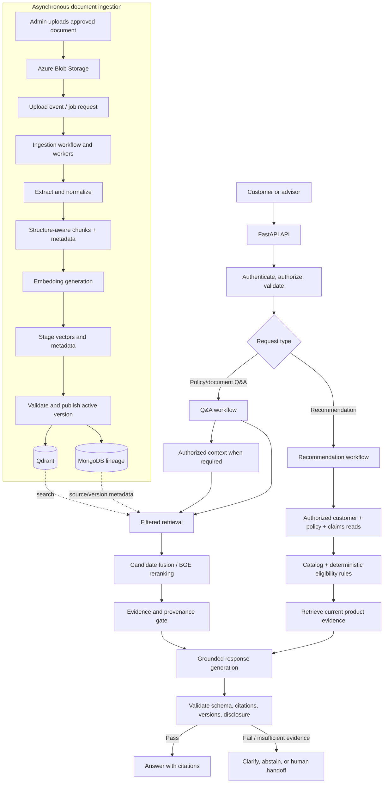
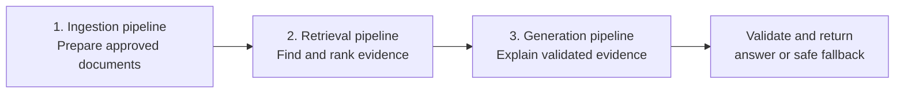
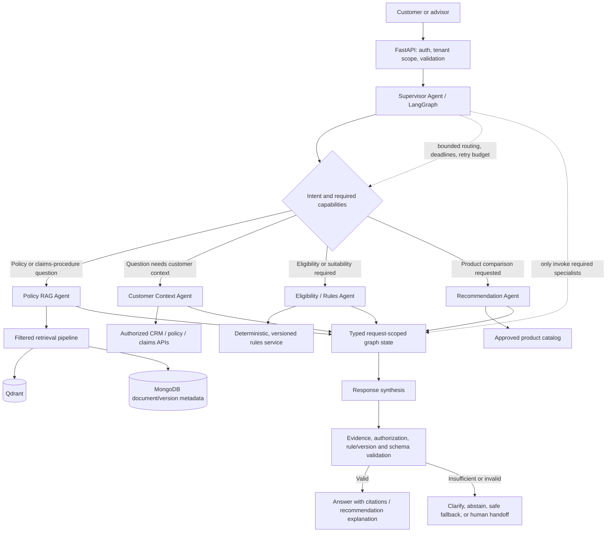
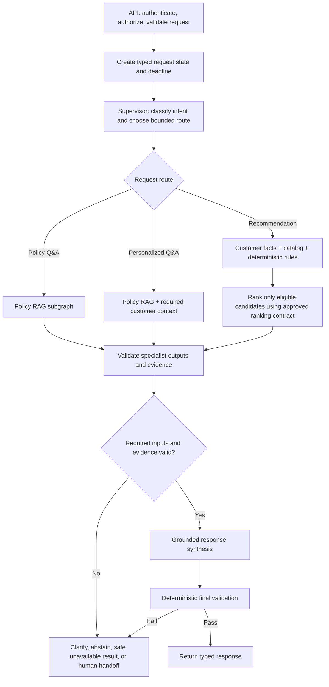
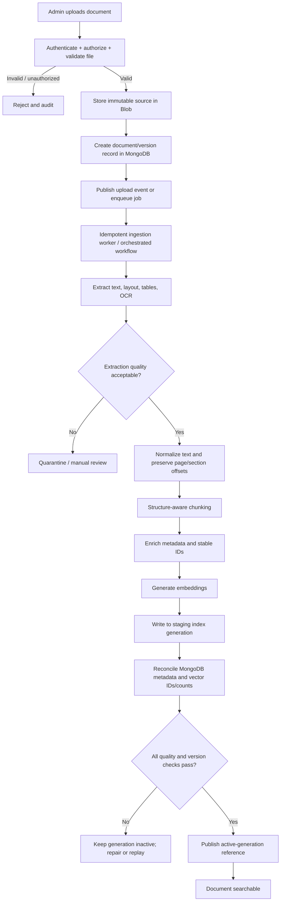
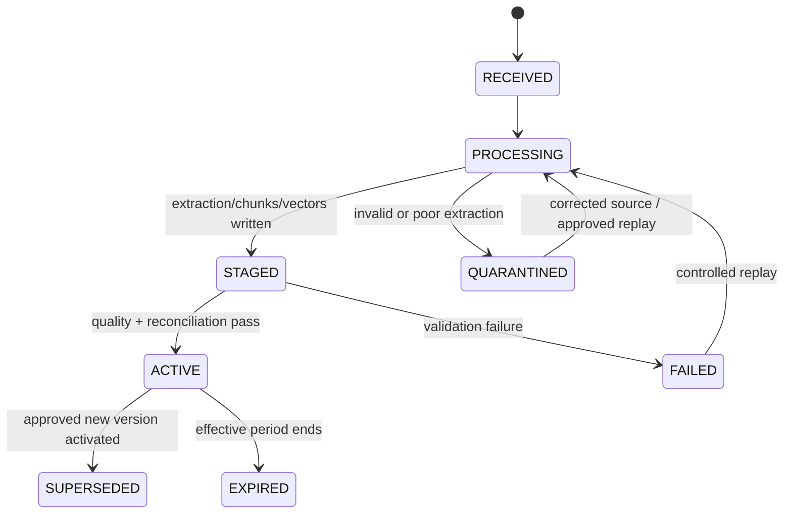
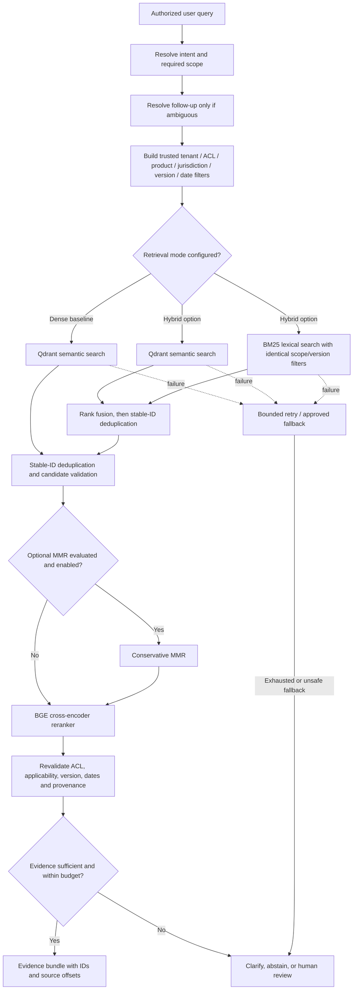
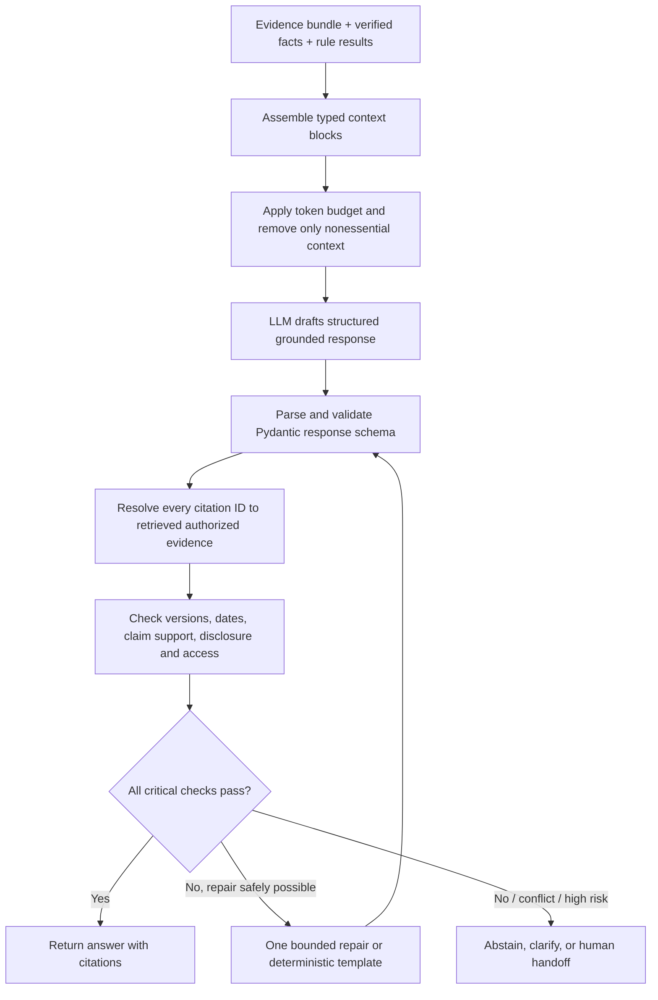
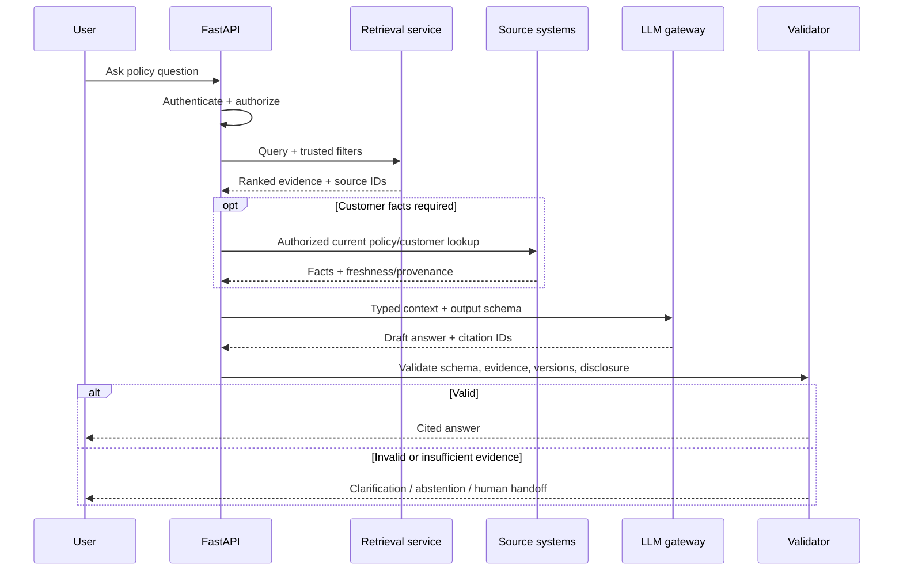
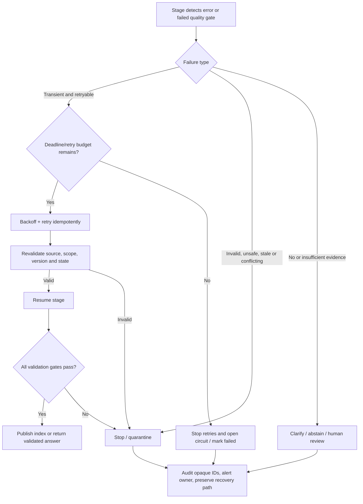

# RAG Architecture for the Insurance AI Assistant

> **Document purpose:** Explain the target RAG design from high-level architecture (HLD) to implementation-level detail (LLD), covering ingestion, retrieval, and generation.
>
> **Architecture status:** This is a proposed design, not proof that every integration is implemented or production-approved. Items that depend on enterprise systems, workload benchmarks, or governance decisions are called out explicitly.

## 1. Scope and business outcomes

The RAG (Retrieval-Augmented Generation) system helps customers and advisors ask questions about approved insurance documents and receive answers grounded in source evidence.

It supports two related but distinct workflows:

- **Policy Q&A:** explain approved policy wording, definitions, coverage, exclusions, waiting periods, claims procedures, and product documents with citations.
- **Product recommendation:** explain candidate products only after authorized customer data, current product-catalog information, and deterministic eligibility/suitability rules have produced validated candidates. A recommendation is not a binding coverage or claims decision.

The LLM explains validated information. It is **not** the source of truth for customer records, policy status, eligibility, suitability, or product availability. If authorization, source freshness, evidence, or rule outcomes cannot be verified, the system should clarify, abstain, return a safe unavailable result, or route to an authorized human.

### 1.1 Terminology used in this document

- **RAG:** a pattern that retrieves relevant source material and supplies it to an LLM so the answer can be grounded in evidence.
- **Chunk:** a small, traceable section of a source document, such as a clause, paragraph, or table row group.
- **Embedding:** a numerical representation of text used to find semantically similar content.
- **HNSW:** an approximate-nearest-neighbor index family used by vector databases to search vectors efficiently. Actual Qdrant index settings still require benchmarking.
- **BM25:** a lexical ranking algorithm that matches query terms to document terms; it complements semantic search for exact clause numbers and product names.
- **Reranking:** a second-stage ranking step that evaluates a smaller candidate set more precisely against the user query.
- **Provenance:** traceable source details such as document ID, version, section, page, and evidence/chunk ID.
- **ACL (access-control list):** rules defining which user, role, tenant, or advisor may access a document or record.
- **DAG (directed acyclic graph):** in Airflow, a defined set of workflow tasks and dependencies. Airflow is optional unless the ingestion workflow needs its orchestration features.

## 2. High-Level Design (HLD)

### 2.1 System responsibilities and trust boundaries

| Component | Plain-language responsibility | **Why use it** | **Alternative available** |
|---|---|---|---|
| FastAPI backend | Receives requests, validates input, authenticates the caller, and returns a typed response | Chosen because it fits the Python AI stack, supports asynchronous APIs, and provides request validation and OpenAPI documentation. | Django REST Framework, Flask, Litestar, or an organization-standard API gateway/backend platform. |
| LangGraph supervisor-orchestrated multi-agent workflow | Routes a request to the right specialist agents, manages handoffs, and enforces bounded workflow transitions | Chosen for explicit conditional routing and typed request-scoped state while keeping specialist responsibilities, retries, and validation visible and testable. | Direct Python functions for a small fixed flow; Temporal or Azure Durable Functions for durable distributed workflows; another graph/orchestration framework if it meets governance and operational requirements. Keep the multi-agent design even if agents are initially implemented as modules in one service. |
| Azure Blob Storage | Keeps original approved files and extracted artifacts | Chosen for durable, cost-effective object storage and retention of original source documents and processing artifacts. | Amazon S3, Google Cloud Storage, or an approved enterprise document/object-storage platform. |
| Azure AI Document Intelligence | Extracts text, layout, tables, and OCR from supported documents | Chosen because insurance PDFs may contain scanned pages, tables, and layout-dependent content that plain text extraction can lose. | Apache Tika, PyMuPDF, pdfplumber, Azure AI Search document parsing, or other OCR/document-processing services; validate extraction quality on real documents. |
| MongoDB metadata store | Tracks document versions, processing state, chunk lineage, and source references | Chosen for a flexible metadata model that can represent document lifecycle state, provenance, and chunk relationships. | PostgreSQL or another relational database when strong relational constraints, joins, transactions, or existing enterprise standards are a better fit. |
| Qdrant | Stores embeddings and payload metadata for dense vector retrieval | Chosen as a focused vector database with metadata filtering and support for a self-managed or managed deployment model. | Azure AI Search, Elasticsearch/OpenSearch, Weaviate, Pinecone, or PostgreSQL with pgvector; select based on operational standards, filtering, hybrid-search needs, scale, and cost. |
| BM25 lexical index (optional) | Finds exact words, identifiers, and clause numbers | Included as an optional complement to semantic search when exact policy clause numbers, product names, or defined terms matter. | Dense retrieval alone if evaluation supports it; alternatively use BM25 in Elasticsearch/OpenSearch or Azure AI Search lexical search, keeping access/version filters synchronized. |
| BGE cross-encoder reranker | Reorders retrieved candidates by query-to-chunk relevance | Chosen to score query–passage relevance more precisely after first-stage retrieval and improve the ordering of evidence candidates. | A hosted reranking API, another cross-encoder model, or no reranker if offline evaluation shows insufficient quality gain for its latency and compute cost. |
| Redis (optional) | Provides short-lived cache/session acceleration | Considered for reducing repeated retrieval or session-state work when measured traffic and latency justify caching. | No cache for the initial release; use an existing managed cache such as Azure Managed Redis or an approved distributed cache. |
| LLM provider/gateway | Rewrites ambiguous queries when needed and drafts grounded explanations | Chosen for language understanding and evidence-grounded synthesis; provider access should be centralized for policy, timeout, retry, and observability controls. | Another approved hosted model provider, Azure-hosted model endpoint, or a self-hosted open-weight model; deterministic rules/templates remain preferable for exact calculations and eligibility decisions. |
| NeMo Guardrails / application controls | Applies configured conversational safety policies | Chosen as an additional dialogue-policy layer, backed by deterministic application validation for authorization, PII/DLP, business rules, and citations. | Application-level policy/validation alone, or another approved guardrails framework; no guardrails product replaces security and business-rule enforcement. |
| OpenTelemetry + Azure Monitor/Application Insights | Captures operational logs, metrics, and traces | Chosen to standardize telemetry and integrate with the Azure operational environment for monitoring and incident investigation. | Prometheus/Grafana, Datadog, New Relic, or another organization-standard observability platform; LangSmith is an optional addition for LLM tracing if privacy/residency controls permit it. |
| Ragas (offline) | Evaluates retrieval/answer quality against a reviewed test set | Chosen for repeatable, dataset-based evaluation of retrieval and generated-answer quality during development and regression testing. | Custom evaluation harnesses, DeepEval, promptfoo, or another evaluation framework; insurance SME review and security tests are still required. |

### 2.2 Source-of-truth rules

| Information | Authoritative source | RAG system's role |
|---|---|---|
| Policy wording, brochures, FAQs, claim procedures | Approved document repository | Keep an immutable copy, index derived chunks, retrieve evidence, and cite the exact source version |
| Customer profile | CRM/customer system | Fetch through an authorized API only when needed |
| Active policy, coverage, effective dates | Policy administration system | Fetch current facts; do not infer them from vector search or conversation history |
| Claim status/history | Claims system | Fetch current authorized status; use RAG only for procedure/terms |
| Eligibility and suitability | Governed deterministic rule service | Execute rules and preserve rule version/reason codes; the LLM may explain results but must not decide them |
| Product attributes and availability | Approved product catalog | Fetch active catalog/version before recommendation |
| Document/chunk lineage and processing status | MongoDB metadata records tied to source identity | Track ingestion and citation provenance |
| Embeddings and retrieval payloads | Derived from approved document versions | Store in Qdrant; rebuildable index, not policy truth |
| Conversation continuity/cache | Approved conversation store and/or short-lived Redis | Resolve references only; never override current authorization or source-of-truth data |

### 2.2.1 Authorization enforcement contract

Authentication establishes the caller identity; authorization is enforced by application code and the services that own the data. The supervisor and LLM are never authorization authorities.

- The API establishes trusted subject, tenant, roles, jurisdiction, and request scope before graph execution. The selected identity provider/token-validation mechanism remains an enterprise integration decision if not yet approved.
- Tool adapters expose narrow, typed operations. The application does not expose unrestricted database access or arbitrary tool selection to agents.
- Enterprise services enforce their own authorization requirements on each read. Retrieval filters are built from trusted request scope and trusted document metadata, not from model-generated filters or arbitrary user parameters.
- Candidate evidence is rechecked for scope, applicability, and provenance before it enters synthesis. Missing or inconsistent access metadata excludes the affected content.
- Cache keys and reads must preserve tenant and authorization scope. Trace/log export uses approved redaction and retention rules.

### 2.3 HLD overview diagram



### 2.4 Three major pipelines



- **Ingestion is asynchronous:** it runs when documents are uploaded, revised, or reindexed. It is not repeated for every user question.
- **Retrieval is request-time:** it finds current, authorized evidence for a particular query.
- **Generation is request-time:** it combines evidence with authorized structured facts and produces a response that must pass server-side validation.
- **Multi-agent orchestration is the decision/control layer above these pipelines:** the supervisor selects and coordinates specialist capabilities. It does not replace ingestion, retrieval, generation, identity checks, authoritative enterprise APIs, or deterministic business rules.

### 2.5 Multi-Agent Architecture — Supervisor-Orchestrated

The target design is a **multi-agent architecture orchestrated by a supervisor using LangGraph**. The agents are bounded specialists with explicit responsibilities and typed inputs/outputs. The supervisor routes work based on intent and available evidence, and the graph controls the order of execution, handoffs, deadlines, retries, and safe termination.

The word *agent* describes a reasoning/orchestration role; it does **not** mean that every agent is an independent microservice or that an LLM is allowed to make authoritative decisions. Start with separate modules/nodes in the same deployable service unless independent scaling, isolation, ownership, or release cadence justifies service separation.

#### Multi-agent HLD diagram



#### Specialist responsibilities and boundaries

| Agent / component | Responsibility | Inputs and outputs | Hard boundary |
|---|---|---|---|
| **Supervisor Agent** | Classifies the task, selects required specialists, manages dependencies and handoffs, and decides whether enough validated information exists to proceed | Input: normalized request, caller scope, conversation reference. Output: a bounded execution plan and next graph node | Must use an allowlisted route/tool set, a maximum step count, a deadline, and a retry budget. It cannot grant permissions or override a failed validation. |
| **Policy RAG Agent** | Finds relevant clauses, definitions, exclusions, limits, waiting periods, and procedures in approved documents | Input: query, jurisdiction/product context, authorization filters, active document generation. Output: evidence passages with source/version/page/section identifiers and retrieval scores | It may only return evidence visible under server-enforced filters. Retrieved document text is untrusted data, not instructions. |
| **Customer Context Agent** | Reads the minimum required customer, policy, and claims facts from authoritative enterprise APIs | Input: authenticated subject/tenant and explicit data requirements. Output: typed facts with source, freshness timestamp, and access/audit metadata | No customer facts are inferred from embeddings, conversation history, or another agent's unsupported claims. Authorization is checked by the API/service on every read. |
| **Eligibility / Rules Agent** | Coordinates eligibility/suitability evaluation and translates rule results into structured explanations | Input: validated customer facts, active catalog data, jurisdiction, rule-set version. Output: deterministic rule result, reason codes, and rule version | The actual decision is made by the deterministic, governed rules service—not by free-form LLM reasoning. Missing required inputs produce an `INDETERMINATE`/needs-information outcome, not a guess. |
| **Recommendation Agent** | Compares only validated eligible candidates against the user's stated needs and explains trade-offs using approved catalog attributes | Input: user requirements, authorized facts, catalog snapshot/version, deterministic eligibility results. Output: ranked eligible candidates with grounded reasons and limitations | Cannot create products, invent prices/benefits, bypass eligibility, or turn a recommendation into a binding coverage/claims decision. |
| **Response Synthesis** | Produces a user-friendly response from validated evidence and structured facts | Input: specialist outputs with provenance. Output: typed answer, citations, caveats, or clarification request | It must not silently fill evidence gaps or convert a missing/failed specialist result into a positive claim. |
| **Deterministic validators and policy controls** | Check authorization, schema, citation membership, source versions, disclosure rules, PII/DLP policy, and business constraints | Input: candidate response plus trusted request/evidence state. Output: pass/fail and actionable reason codes | These are application controls, not optional agents. A model-generated statement that validation passed is not proof that it passed. |

#### Agent, graph-node, and service classification

The term *agent* identifies a bounded specialist responsibility; it does not require every responsibility to be an independent LLM loop or deployable microservice. For the initial design, keep the specialists as independently testable LangGraph nodes/modules in one service unless a measured scaling, security-isolation, ownership, or release requirement justifies separation.

| Capability | Initial responsibility type | LLM use | Authoritative boundary |
|---|---|---|---|
| Supervisor | Routing/planning node | Use a model for intent/planning only when deterministic routing is insufficient; otherwise use deterministic routing | Cannot grant permissions or override a failed gate |
| Policy RAG | Retrieval capability/node | Optional bounded query rewrite for ambiguous requests; retrieval itself is a service operation | Retrieval service and source metadata determine accessible evidence |
| Customer context | Typed enterprise-tool adapter | No LLM required to fetch facts | Enterprise APIs and their authorization rules own customer facts |
| Eligibility/rules | Coordinator around a rules-service call | No LLM decides the result | Governed deterministic rules service owns outcome and reason codes |
| Recommendation | Candidate-comparison capability | LLM may explain validated candidates; ranking policy must be approved separately | Approved catalog, eligibility result, and ranking contract constrain candidates/order |
| Response synthesis | Generation node | Yes, for grounded natural-language explanation | Deterministic validators approve/reject the result |
| Validation | Application code | No model-generated validation verdict is trusted | Application checks are authoritative |

#### LLM usage and model deployment strategy

Use these classifications as the default design. They describe logical LLM usage, not a commitment to a specific provider, model ID, or separate deployment.

| Component | LLM classification | Default implementation |
|---|---|---|
| Response Synthesis | **Required for generative answers** | Use an approved LLM to explain validated evidence and structured facts. Deterministic fallback messages may be returned without an LLM when generation is unavailable or unsafe. |
| Supervisor | **Conditional** | Use an LLM for intent classification or planning only when deterministic routing is insufficient; otherwise route with deterministic logic. |
| Policy RAG | **Conditional** | Query rewriting may use an LLM for ambiguous queries. Embedding, retrieval, filtering, and reranking do not require a generative LLM at request time. |
| Recommendation | **Conditional** | An LLM may explain trade-offs among already-validated eligible candidates. It must not decide eligibility or override the approved ranking contract. |
| Customer Context | **Not required** | Fetch typed facts through authorized enterprise APIs; do not use an LLM to invent, infer, or authorize customer facts. |
| Eligibility / Rules | **Not used for the decision** | A governed deterministic rules service produces eligibility/suitability outcomes and reason codes. An LLM may explain a validated result only if needed. |
| Validation and policy controls | **Not used for authoritative checks** | Application code validates authorization, schemas, evidence provenance, versions, disclosures, and business constraints. |

**Deployment default:** share one approved LLM deployment among the components that need generative capabilities. Do not create a separate deployment for each agent by default. Introduce a separate deployment only when evaluation or a documented requirement justifies different model capability, security isolation, latency, capacity/scaling, or governance. Configure model IDs, versions, limits, and routing centrally; the exact model assignment remains an explicit deployment/configuration decision and is not specified by this architecture document.

#### Canonical request orchestration graph

The system HLD shows deployment and trust boundaries; the following graph is the canonical request-time control flow. Ingestion remains a separate asynchronous workflow and is not run by the supervisor for each user request.



**Subgraph mapping:** the Policy RAG subgraph uses the retrieval pipeline in Section 4; the synthesis node uses the generation pipeline in Section 5; customer-context and recommendation routes use authorized enterprise APIs and deterministic rules. These are graph paths in the same supervisor-controlled workflow, not a second orchestration system. Mandatory dependencies must succeed before synthesis; an optional specialist may be skipped only when the response contract remains valid without it.

#### LangGraph state and handoff contract

Use a **request-scoped typed state** (for example, Pydantic models) rather than passing unrestricted conversation text between every agent. Keep only fields needed for the current request:

- `request_id`, `tenant_id`, authenticated subject/roles, jurisdiction, locale, and correlation/trace identifiers.
- Normalized user intent, explicit user requirements, resolved references, and only the minimum relevant conversation summary.
- Required specialist tasks, completed/failed nodes, remaining step budget, retry counters, request deadline, and cancellation state.
- Retrieved evidence references and provenance: document ID/version, chunk ID, page/section, effective date, and applicable access/filter context.
- Structured customer/policy/claims facts with source and freshness metadata; catalog snapshot/version; deterministic rule version and reason codes.
- Typed specialist results, validation findings, and final response schema.

**State rules:** keep raw PII out of prompts, logs, and traces unless explicitly approved and necessary; avoid duplicating full documents or entire customer records in graph state; do not allow an agent to overwrite trusted identity, authorization, catalog, or rule-version fields. Treat specialist outputs as untrusted until validated. Persist graph checkpoints only after retention, encryption, access-control, replay, and deletion policies have been approved; otherwise use request-local in-memory state.

#### Routing and execution policy

1. Authenticate and authorize the request before any agent or tool call. Establish tenant, jurisdiction, data-access scope, deadline, and model-call budget.
2. The supervisor classifies intent and creates a bounded plan. Route to only the specialists needed for that request; do not invoke all agents by default.
3. Run independent, read-only work in parallel only when dependencies and service limits permit it. For example, policy-document retrieval and an authorized customer-context read may run concurrently for a question that needs both. Eligibility must wait for the required facts and catalog inputs.
4. Validate every specialist result against its output schema, access scope, freshness requirements, and provenance contract before adding it to trusted graph state.
5. If evidence or required inputs are missing, allow a bounded retrieval/refinement or clarification step. Do not create open-ended agent-to-agent conversations or uncontrolled self-reflection loops.
6. Synthesize the answer only when required outputs are present. Run deterministic final validation before returning it to the caller.
7. On a timeout, denied access, stale source, unavailable dependency, or validation failure, follow the route-specific safe fallback. Never turn a partial recommendation into a complete one.

#### Example workflow A — Policy question with a follow-up

1. A user asks, “Does this policy cover a hospital stay?” The API authenticates the user and establishes the applicable policy/document scope.
2. The supervisor routes to the Policy RAG Agent. The agent retrieves current approved coverage clauses and relevant exclusions, then returns citations and version metadata.
3. If the question depends on the user's actual active policy, the supervisor invokes the Customer Context Agent to read that policy from the policy administration API. The RAG result alone is not proof that the customer holds the product.
4. Synthesis explains what the document says and distinguishes general policy wording from customer-specific facts. The final validator checks citation membership, source version, authorization, and response schema.
5. If the user follows up with “What about the first 30 days?”, the supervisor resolves the reference from the bounded conversation context and retrieves the waiting-period clause. If the reference is ambiguous or no authoritative clause is found, it asks a clarifying question or abstains.

#### Example workflow B — Product recommendation

1. The supervisor identifies a recommendation request and collects explicit requirements. The API determines which customer data may be accessed; the agent does not choose its own permissions.
2. The Customer Context Agent reads only required, authorized facts. The approved catalog service supplies active product attributes and version metadata.
3. The Eligibility / Rules Agent calls the deterministic, versioned rules service. It returns eligible/ineligible/indeterminate outcomes with reason codes.
4. The Recommendation Agent compares only eligible candidates and uses approved catalog attributes to explain fit, limitations, and trade-offs. It does not change rule outcomes.
5. The Policy RAG Agent may retrieve current product terms when explanations require evidence about exclusions, waiting periods, or benefits.
6. Synthesis and deterministic validators verify candidate membership, rule/catalog versions, evidence citations, disclosures, and schema. If eligibility is indeterminate or a dependency is unavailable, return the missing information or safe unavailable state rather than recommending speculatively.

#### Reliability, security, and operational controls

- **Bounded execution:** configure per-route node/step limits, a request deadline, per-provider timeout, a total model-call/token budget, and a bounded retry policy. Retries must be idempotent where possible and use backoff for transient failures only.
- **Failure isolation:** a failed optional specialist may be skipped only if the response contract remains valid without it. A failed mandatory customer, policy, catalog, rules, or evidence dependency must trigger clarification, abstention, a safe unavailable response, or human handoff.
- **Least privilege:** expose narrow, typed tools to each agent. The Policy RAG Agent should not receive customer-write tools; the Customer Context Agent should not receive document-publishing tools; no agent should be able to modify authorization decisions or rule outcomes.
- **Prompt-injection resistance:** treat user messages, retrieved clauses, PDFs, and tool outputs as data. Do not follow instructions found inside retrieved documents. Enforce tool allowlists and authorization in application code, not in prompts alone.
- **PII and observability:** apply approved PII/DLP controls before sending data to external model endpoints and before exporting traces. Record request/agent/node timings, selected route, retrieval IDs, model/version, token/cost usage, retry counts, validation reason codes, and outcome. Redact sensitive payloads by default.
- **Auditability:** preserve enough provenance to explain which approved document version, structured facts, catalog snapshot, and rule version contributed to a response. Do not rely on hidden chain-of-thought as an audit record; log structured decisions and evidence references.
- **Evaluation:** test each agent contract independently and evaluate full graph paths using reviewed insurance scenarios. Include unsupported questions, conflicting clauses, stale documents, cross-tenant access attempts, prompt injection, missing facts, rules-service outages, timeouts, and citation failures. Track answer correctness, retrieval recall, citation precision, safe-abstention behavior, latency, and cost.
- **Deployment:** multi-agent does not require a separate deployment per agent. Begin with independently testable modules/nodes in one service; split a specialist into a service only when load, security isolation, ownership, or release requirements justify the added network and operational complexity.

---

## 3. Low-Level Design (LLD)

# Part 1 — Document Ingestion Pipeline

## 3.1 Purpose

Convert an approved source document into versioned, searchable chunks while preserving the connection back to the original page, section, and version.

### Why an ingestion pipeline?

- **What it does:** separates expensive extraction/indexing work from user-facing requests.
- **Why choose it:** a staged pipeline supports retries, quality checks, reprocessing, and version control; extracting documents during every question would increase latency and cost and make failures harder to isolate.

## 3.2 Ingestion technology choices

### Azure Blob Storage

- **Introduction:** object storage for original PDFs and derived artifacts such as OCR output.
- **Why chosen:** keeps source files durable and independently recoverable; preferable to storing large binary files in MongoDB or Qdrant.

### Azure AI Document Intelligence

- **Introduction:** a document extraction service that can recognize text and layout, including supported tables and scanned content.
- **Why chosen:** insurance documents often contain headings, clauses, tables, and scanned pages; a basic PDF text parser may lose structure. For clean digital PDFs, a simpler parser can be evaluated for cost and speed.

**Initial-release decision:** the initial upload-to-worker mechanism must be explicitly selected before implementation. Unless workload or platform requirements justify Kafka, a Blob event or approved queue feeding idempotent workers is a reasonable simpler starting option; this is a recommendation, not a statement that a particular queue has already been selected. Document which component owns job state, retry scheduling, poison-message handling, and replay. Kafka is an event-streaming option, not a substitute for idempotent worker logic.

### Kafka or another event/job mechanism

- **Introduction:** Kafka carries events such as `DOCUMENT_UPLOADED` between services without requiring the uploader to wait for processing.
- **Why chosen:** useful for high event volume, multiple consumers, buffering, and replay. For a modest single-consumer workload, Blob events plus a queue/worker may be simpler. Do not add Kafka solely to make the architecture look more advanced.

### Airflow (conditional)

- **Introduction:** Airflow schedules and orchestrates dependent tasks, retries, and workflow runs.
- **Why chosen:** useful when ingestion is a multi-stage data pipeline that needs visibility, reruns, scheduling, and backfills. For a small event-triggered workflow, a queue-triggered worker or cloud workflow service may be operationally simpler. Airflow is not a message broker and does not replace idempotent workers.

### Embedding model

- **Introduction:** converts each chunk into a vector representing its semantic content.
- **Why chosen:** enables meaning-based search even when the user phrases a question differently from the source. Select a model based on insurance-domain retrieval evaluation, language support, cost, privacy, and dimension compatibility—not model size alone.

## 3.3 Ingestion flow diagram



## 3.4 Implementation steps

### Step 1 — Validate and store the source

- Authenticate the uploader and check role/tenant permissions.
- Validate file extension, MIME/content signature, file size, page limits, malware scanning requirements, and supported language/type.
- Assign a stable `document_id`, source checksum, tenant/access metadata, and proposed version.
- Store the original in Blob with encryption and least-privilege access.
- Create a MongoDB ingestion record with status such as `RECEIVED`.

**Why:** the original must remain available for audit, reprocessing, citation display, and recovery.

### Step 2 — Start asynchronous processing

- Emit an event or enqueue a job containing a document ID, version, source reference, checksum, and pipeline generation.
- Avoid placing raw PDF content or sensitive extracted text in the event.
- Assume at-least-once event delivery. Duplicate events must be safe.
- Derive an idempotency key from tenant/source document/version/checksum/pipeline generation.
- If Kafka is selected, acknowledge/commit only after the relevant stage state is durable. A dead-letter queue/topic must have an owner and replay procedure.

**Why:** asynchronous processing keeps the upload API responsive and prevents large document jobs from exhausting request workers.

### Step 3 — Extract text and layout

- Use Azure AI Document Intelligence where OCR, tables, forms, or layout matter.
- Keep page number, heading/section information, table structure, and character/span offsets where available.
- Store extraction output as a derived artifact linked to the source checksum and extractor/model version.
- Check for empty pages, unreadable scans, extraction errors, unsupported languages, and suspiciously low text yield.
- Quarantine documents that fail quality checks instead of indexing incomplete text as if it were complete.

### Step 4 — Normalize and chunk

**Structure-aware chunking**

- Split by policy hierarchy where possible: document → section → clause → paragraph/table.
- Keep exclusions, exceptions, definitions, waiting periods, and qualifying conditions attached to the clause they modify.
- Use token limits as a guardrail, not the only splitting rule.
- Add overlap only where it preserves context; excessive overlap increases duplicate retrieval.
- Treat tables as structured units and preserve row/column labels. Do not flatten a table in a way that detaches a value from its condition.

**Why choose structure-aware chunking?**

- It preserves legal and policy relationships better than fixed-size-only splitting.
- Fixed-size splitting is simpler and can work for prose, but may cut a clause, table, or exception in the wrong place.

### Step 5 — Enrich metadata and stable identifiers

Recommended metadata per chunk:

```json
{
  "tenant_id": "tenant-reference",
  "document_id": "document-reference",
  "document_version": "version-reference",
  "chunk_id": "stable-chunk-reference",
  "product_id": "product-reference",
  "document_type": "policy-wording",
  "jurisdiction": "approved-jurisdiction",
  "section_path": ["Benefits", "Waiting Period"],
  "page_start": 12,
  "page_end": 13,
  "effective_from": "YYYY-MM-DD",
  "effective_to": null,
  "access_tags": ["authorized-role-or-scope"],
  "source_checksum": "sha256-reference",
  "pipeline_version": "pipeline-version",
  "embedding_model": "embedding-model-version"
}
```

The values above are illustrative placeholders. Define field constraints and access semantics with document owners. Metadata filters must be built from authenticated scope and trusted document metadata—not arbitrary user-supplied filters.

### Step 6 — Generate embeddings and index in staging

- Batch embedding requests within provider limits; use bounded concurrency, timeouts, and retry/backoff for transient failures.
- Record model/version and vector dimension for every index generation.
- Write vectors with stable chunk IDs and the payload required for authorization, effective-date, product, jurisdiction, and version filters.
- Keep the new generation non-searchable until all writes and metadata reconciliation complete.
- Avoid mixing vectors generated by incompatible embedding models or dimensions in the same active generation.

### Step 7 — Validate and publish

Before publication, verify:

- expected chunk count and IDs match indexed records;
- required metadata and access fields exist;
- embeddings have the expected dimension and model version;
- sample queries retrieve expected sections and page citations;
- active-version/effective-date rules are correct;
- MongoDB lineage and Qdrant payloads reconcile.

Only then publish the generation through a **logical publication boundary**. MongoDB and Qdrant do not share a single transaction in this design, so do not describe the cross-store operation as one atomic transaction. Define one authoritative active-generation reference (proposed: a conditional MongoDB metadata update, subject to platform review); retrieval resolves that reference and filters candidates to the selected generation. If any staging write or reconciliation check fails before activation, leave the prior valid generation active. If activation succeeds but downstream verification detects inconsistency, apply the documented rollback/reconciliation procedure and stop serving the affected generation until consistency is restored. Concurrent publishers must use conditional updates/version checks so an older job cannot replace a newer approved generation. Deletion, expiry, and supersession must propagate to the searchable index.

### 3.4.1 Index generation versus policy applicability

These are separate concepts and must not share one ambiguous `active` flag:

- **Index generation** is a technical snapshot of chunks/vectors that has passed ingestion quality and reconciliation checks.
- **Document approval/status** identifies whether a source is approved, revoked, superseded, or otherwise permitted for use.
- **Policy applicability** determines which approved wording applies to the question, product, jurisdiction, customer policy, and relevant business date.

The newest indexed document is not automatically the correct wording for a historical policy or claim. The request workflow must resolve applicability from approved metadata and authoritative policy/business rules. The applicable date (for example, policy effective date, renewal period, or claim/event date) must be defined by the insurance business owner for each workflow. If applicability cannot be established or authoritative sources conflict, ask for clarification or route to human review; do not select a version arbitrarily.

## 3.5 Document version lifecycle



A newer upload must not silently replace a valid active version before the new version passes validation. The version/effective-date policy determines which document is searchable for a given question.

---

# Part 2 — Retrieval Pipeline

## 4.1 Purpose

Given a user query, retrieve a small, relevant, authorized set of evidence chunks from the correct document versions.

### Why a separate retrieval pipeline?

- **What it does:** searches the indexed corpus and returns traceable candidates before generation.
- **Why choose it:** separating retrieval from generation allows retrieval quality, access filters, latency, and failures to be tested independently. Sending the whole corpus to an LLM is too costly and does not guarantee the correct clause is considered.

## 4.2 Retrieval technology choices

### Qdrant dense vector search

- **Introduction:** searches embeddings for semantically similar chunks and supports payload filters.
- **Why chosen:** suitable for dedicated vector retrieval with metadata filtering; Azure AI Search or another managed search engine may be preferable if integrated lexical search and managed operations outweigh Qdrant's flexibility. No benchmark is claimed here.

### BM25 lexical search (optional hybrid leg)

- **Introduction:** ranks text based on matching query terms, including term frequency, rarity, and document length.
- **Why chosen:** helps with exact clause numbers, product names, defined terms, policy codes, and amounts. It adds index synchronization and operations, so enable it only when the lexical index has the same authorization/version filters and evaluation demonstrates value.

### Rank fusion (for hybrid search)

- **Introduction:** combines ranked result lists from dense and lexical search without assuming their raw scores are directly comparable.
- **Why chosen:** reciprocal rank fusion (RRF) is a practical baseline for combining rankings; score-based fusion is an alternative if scores can be calibrated and evaluated.

### BGE cross-encoder reranker

- **Introduction:** scores a query and each candidate chunk together to refine relevance ordering.
- **Why chosen:** can improve precision among a bounded candidate set; it costs additional inference time and cannot find evidence missing from the candidate pool. Keep a timeout and a safe fallback policy.

### MMR (optional diversity selection)

- **Introduction:** Maximal Marginal Relevance balances query relevance with novelty relative to chunks already selected.
- **Why chosen:** useful when candidate results are repetitive; not enabled by default because insurance exclusions, definitions, and exceptions may look similar but all be necessary.

### 4.2.1 Model and index configuration contract

Before a production index is published, record and version the document-embedding model identifier, query-embedding model identifier, embedding dimension, vector distance metric, relevant normalization assumptions, chunking/pipeline version, and reranker identifier/version. Document and query embeddings must be compatible. Do not mix incompatible embedding generations in the active search path. A model change that alters vector compatibility requires a separately staged and evaluated generation with rollback support.

The exact embedding and BGE model variants, deployment location, candidate counts, thresholds, and concurrency limits remain **TBD until model selection and benchmark testing**. This document does not claim those choices or performance results are already validated.

## 4.3 Retrieval flow diagram



## 4.4 Implementation steps

### Step 1 — Understand the query and preserve intent

- Keep the original user query unchanged for audit and evaluation.
- Use deterministic rules for clear requests; use a bounded LLM classifier/rewriter only when ambiguity or complex decomposition warrants it.
- For follow-ups such as “What about the waiting period?”, load a bounded window of same-conversation history and produce a typed standalone query plus confidence/source-turn references.
- If multiple policies/products could be the antecedent, ask a clarification instead of guessing.
- Rewriting must not broaden user authorization or silently change jurisdiction, product, date, or intent.

### Step 2 — Build trusted filters

Apply applicable filters before candidates are exposed to the response workflow:

- tenant and user/advisor authorization scope;
- document/product type and product identifier;
- jurisdiction/region where applicable;
- active document version and effective dates;
- document status (approved/active, not quarantined, superseded, or deleted);
- any policy-specific ACL or access tags.

Do not let the LLM remove or weaken filters. If filter metadata is missing or inconsistent for a sensitive document, exclude it and raise an integrity signal.

### Step 3 — Retrieve candidate chunks

**Dense-only baseline**

1. Embed the query with the compatible query-embedding model.
2. Search Qdrant with trusted filters.
3. Fetch a bounded candidate set.

**Hybrid option**

1. Run dense search and lexical/BM25 search with equivalent scope/version filters.
2. Fuse the rankings using a configured method such as RRF.
3. Deduplicate by stable chunk ID, while retaining distinct versions, endorsements, exceptions, or clauses that are materially different.

The actual candidate count is a benchmarked configuration value, not a universal constant.

### Step 4 — Decide whether MMR is needed

- Inspect evaluation and traces for repeated/near-duplicate chunks.
- If redundancy is common and MMR improves diversity without losing required clauses, enable conservative MMR before reranking.
- Never treat diversity as more important than coverage of exclusions, exceptions, waiting periods, or other legally material qualifiers.
- If duplicate-heavy retrieval is not demonstrated, skip MMR to reduce complexity and latency.

### Step 5 — Rerank candidates with BGE

- Run the cross-encoder over a bounded candidate list.
- Preserve original chunk IDs and source metadata alongside reranker scores.
- Tune candidate count and final evidence count using Recall@K, Precision@K, nDCG/MRR, latency, and cost.
- If reranking times out, only use the original retrieval order if an explicitly evaluated fallback policy allows it. Otherwise return a safe unavailable/abstention result for high-risk queries.

### Step 6 — Evidence sufficiency gate

Before generation, verify that the selected evidence:

- is authorized and from an applicable current version;
- contains the required clause and relevant qualifications;
- is not materially contradicted by another applicable source;
- retains document, version, section, page, chunk ID, and offsets needed for citation;
- fits the evidence token budget without dropping material qualifiers.

Low relevance scores alone are not universal proof that evidence is insufficient; thresholds must be calibrated on a reviewed insurance dataset. Missing or conflicting material evidence should lead to clarification, abstention, or human review.

## 4.5 Retrieval enhancements: default decisions

| Technique | Default decision | Benefit | Cost / risk and promotion rule |
|---|---|---|---|
| Dense Qdrant search | Baseline | Semantic paraphrase retrieval | Requires embedding/index compatibility and tuning |
| Metadata/ACL/version filters | Required | Prevents irrelevant, stale, or unauthorized evidence | Filter correctness is a release-critical control |
| BGE reranking | Recommended baseline | Improves ordering of retrieved candidates | Additional latency/compute; cannot recover missed evidence |
| BM25 hybrid retrieval | Evaluate | Improves exact-term/identifier matching | Requires synchronized lexical index and identical security/version filters |
| RRF rank fusion | Use if hybrid is enabled | Combines ranks without raw-score calibration | Adds fusion and diagnostic complexity |
| MMR | Off by default; evaluate | Reduces redundancy | Can drop complementary legal clauses; enable only with evidence of benefit |
| Context compression | Off by default; budget-triggered | Reduces prompt tokens | May remove qualifiers; prefer extractive spans with offsets if needed |
| Multi-query generation | Optional for complex multi-facet questions | Can improve recall across distinct subquestions | More latency, tokens, noise, and fan-out; cap and evaluate |
| Query rewriting | Only for ambiguous follow-ups | Resolves references from conversation | Can alter intent; preserve original and clarify if uncertain |

## 4.6 Conversation context and customer facts

Conversation history is continuity context, not evidence of policy truth. The durable conversation-history owner is an explicit deployment decision: either the client supplies bounded prior turns, an approved server-side conversation store persists them, or follow-up resolution is limited to context available in the current request. Request-local LangGraph state alone does not provide cross-request continuity. Redis is a cache/short-lived state option unless explicitly approved as the durable store.

- Load only authorized turns from the current conversation; never mix users, tenants, or conversations.
- Use recent relevant turns and a compact, provenance-labelled summary only when needed. Keep the context bounded by the selected model's tokenizer and request budget.
- Label whether a fact came from the user, a verified enterprise source, or a previous assistant answer.
- Re-fetch current customer, policy, and claim facts from authoritative systems when the workflow requires them.
- If a required source is unavailable or too stale, do not return a personalized determination based on memory or cache.

---

# Part 3 — Generation Pipeline

## 5.1 Purpose

Turn validated evidence and structured facts into a useful answer while ensuring that each material claim can be traced to an authorized source or a deterministic rule result.

### Why use grounded generation?

- **What it does:** gives the LLM a compact, structured evidence bundle and asks it to explain the evidence in the user's context.
- **Why choose it:** it is more traceable than asking the LLM to answer from model knowledge alone. Deterministic templates/rules remain preferable for fixed outcomes and eligibility decisions.

## 5.2 Generation components and technology choices

### LLM gateway

- **Introduction:** a service wrapper around model calls that applies timeouts, token budgets, model configuration, redaction policy, and usage tracking.
- **Why chosen:** centralizes operational controls and prevents every workflow node from managing provider behavior independently; direct provider calls are simpler for a prototype but harder to govern consistently at scale.

### Pydantic response models

- **Introduction:** typed schemas with runtime validation for structured data such as answer sections, citations, and outcome status.
- **Why chosen:** catches missing or malformed fields at system boundaries; plain dictionaries/TypedDict are lighter for internal graph state but do not provide the same runtime data validation.

### NeMo Guardrails and deterministic validators

- **Introduction:** NeMo can enforce configured conversational behavior; application validators can check authorization, schema, evidence IDs, versions, and citation provenance.
- **Why chosen:** layered controls are safer than relying on a single model-based guardrail. NeMo alone is not a replacement for authorization, PII/DLP, deterministic eligibility, or citation validation.
- **Selection status:** treat NeMo as an optional/additional layer until its deployment, policy configuration, privacy approval, failure behavior, and evaluation have been confirmed. If it is not selected, application-level controls remain mandatory and must not be described as NeMo-enforced.

## 5.3 Generation flow diagram



## 5.4 Implementation steps

### Step 1 — Build separate context blocks

Keep these blocks distinct and labelled:

1. **System/security instructions and output contract** — fixed and never trimmed.
2. **Current user request** — original text plus a validated rewrite if used.
3. **Customer/policy/claim facts** — only authorized fields, source, and retrieval/freshness time.
4. **Business-rule results** — rule version, outcome, and reason codes.
5. **Retrieved evidence** — stable evidence ID, document/version/page/section, effective period, and relevant text.
6. **Conversation context** — selected turns for reference resolution only.

User text, conversation history, and retrieved documents are untrusted content. Instructions inside a document or user message cannot override system controls, authorization, or tool permissions.

### Step 2 — Control token budget and cost

- Use the chosen model tokenizer and enforce a hard input budget below its context limit.
- Trim unrelated old history first, then redundant summary, then low-ranked evidence only if required.
- Never silently remove safety instructions, current question qualifiers, required exclusions, source identifiers, or citation metadata.
- Skip unnecessary query rewriting and model calls for clear requests.
- Use one grounded response-generation call when it can synthesize validated evidence; do not add separate LLM agents that repeat the same reasoning.
- Maintain a request-scoped model-call ledger recording route, node, model/version, call count, token usage, retries, elapsed time, and remaining deadline/budget. Define separate budgets for simple Q&A, ambiguous follow-up, complex multi-facet questions, and recommendation. Numeric limits remain TBD until provider selection and workload tests.
- For each cache use case, document the cached artifact, key dimensions, TTL, invalidation triggers, and behavior on cache miss or inconsistency. Include relevant tenant/authorization scope, jurisdiction/date, active index generation, and retrieval/model configuration. Reauthorize before exposing cached results. Do not cache personalized customer facts or final personalized answers by default.

### Step 3 — Generate a typed answer

A target response model could look like this:

```python
from typing import Literal
from pydantic import BaseModel, Field

class Citation(BaseModel):
    evidence_id: str
    document_id: str
    document_version: str
    section: str | None = None
    page_start: int | None = Field(default=None, ge=1)
    page_end: int | None = Field(default=None, ge=1)

class AnswerSection(BaseModel):
    text: str
    evidence_ids: list[str] = Field(default_factory=list)

class GroundedAnswer(BaseModel):
    status: Literal["answered", "clarification_required", "abstained", "review_required"]
    answer: str
    sections: list[AnswerSection] = Field(default_factory=list)
    citations: list[Citation] = Field(default_factory=list)
    limitations: list[str] = Field(default_factory=list)
    escalation_required: bool = False
```

This is an illustrative contract, not a claim that this exact schema is implemented. Finalize fields, optionality, citation cardinality, and error semantics through API/schema review. `sections[].evidence_ids` illustrates how a response can associate answer sections with evidence; if claim-level support is required, define the finer-grained claim contract and its validation method explicitly. Enforce status-specific invariants: an `answered` result must meet the applicable evidence/citation requirements; a clarification must identify the missing or ambiguous input; an abstention must not present an unsupported conclusion; and a review-required result must not imply a final determination.

### Step 4 — Validate before returning

The application—not the LLM—must verify:

- the response schema is valid;
- every citation ID exists in the current retrieved evidence set;
- each cited source is authorized and current for the requested scope/date;
- cited document version, section, and page resolve correctly;
- material claims are supported by the cited evidence;
- deterministic rule outcomes and reason codes are unchanged;
- required disclosures appear for recommendations;
- no unsupported customer fact, product, eligibility outcome, or citation was invented.

A citation that merely exists is not sufficient; the cited evidence must support the claim. Keep three validation levels distinct: (1) structural validation of schema and citation IDs; (2) provenance/applicability validation of authorization, source version, date, page/section, and policy applicability; and (3) claim-support validation that checks whether each material claim is supported by the cited evidence, including material exclusions and qualifiers. The method used for claim-support validation (deterministic checks, a separately evaluated verifier, SME review, or a combination) must be selected and evaluated; citation membership alone does not prove semantic support. For critical or conflicting insurance terms, abstain or escalate rather than relying on an unconstrained regeneration loop.

**Repair policy:** permit at most one repair for explicitly allowlisted formatting/schema failures when the evidence and trusted inputs are unchanged. Do not repair authorization failures, stale or inapplicable sources, rule/catalog/version mismatches, or unresolved policy conflicts by asking the model to guess. Re-run the complete validation pipeline after any repair.

### Step 5 — Q&A and recommendation routes

#### Policy Q&A



#### Product recommendation

Recommendation is a distinct governed workflow, not an implicit side effect of Q&A.

- Retrieve current customer/policy/claims inputs only after subject authorization and any required consent/purpose checks.
- Retrieve the active catalog and catalog version.
- Apply deterministic, versioned eligibility/suitability rules and preserve their reason codes.
- Apply candidate-ranking criteria only after the business owner has approved who owns the criteria and whether ranking must be deterministic/reproducible. The Recommendation Agent must not change eligibility outcomes; if ranking ownership or required inputs are unresolved, do not present the ranking as an approved recommendation.
- Retrieve current product wording to substantiate benefits, exclusions, waiting periods, and limitations.
- Use the LLM only to explain already validated candidates. It must not invent products, determine eligibility, or alter rule outcomes.
- Validate source/rule/catalog versions, reason codes, citations, and disclosures before returning results.

Proposed endpoint (not a claim of implementation):

```http
POST /api/v1/recommendations
```

Keep this endpoint disabled until customer/policy/claims adapters, catalog, deterministic rules, ranking ownership, consent/purpose, freshness, audit, disclosure, idempotency, and failure contracts are implemented and tested.

---

## 6. Evaluation, observability, and rollout

### 6.1 Terminology

- **Recall@K / Context Recall:** checks whether required evidence appears in the top K retrieved results or supplied context.
- **Precision@K / Context Precision:** checks how much of the retrieved context is relevant.
- **MRR / nDCG:** ranking metrics that reward relevant results appearing near the top.
- **Faithfulness:** estimates whether answer claims are supported by the supplied context; it does not prove the context itself is authoritative.
- **Ragas:** a framework for evaluating RAG quality against a versioned test set. It should run offline or asynchronously, not as a synchronous request gate.
- **OpenTelemetry (OTel):** standard instrumentation for traces, metrics, and logs; use Azure Monitor/Application Insights as the operational platform.
- **LangSmith (optional):** useful for LLM traces/experiments if approved privacy, residency, access, redaction, and retention requirements are met.

### 6.2 What to measure

- Ingestion: time per stage, extraction quality failures, retries, DLQ count/age, chunk/vector reconciliation, active-index freshness.
- Retrieval: hit/no-hit rate, candidate count, Recall@K, Precision@K, rank quality, stale-version/ACL rejection, dense/lexical contribution, reranker latency.
- Generation: schema failures, citation resolution/support failures, abstention/clarification/escalation rate, token usage, model latency, cost per successful request.
- Business safety: unauthorized access tests, wrong-version tests, eligibility/rule mismatch, recommendation reason-code correctness, critical unsupported claims.
- Operations: end-to-end P50/P95/P99, dependency timeouts/throttling, cache behavior, queue lag, saturation, and recovery results.

Do not put raw customer identifiers, PII, full prompts, or full retrieved passages into ordinary metrics/logs. Use opaque trace/evidence references and approved redaction/retention rules.

### 6.3 Evaluation and promotion protocol

1. Create a versioned, insurance-SME-reviewed dataset covering exact identifiers, paraphrases, clauses, tables, exclusions, exceptions, waiting periods, expired/conflicting versions, ambiguity, no-hit queries, and personalized access rules.
2. Record expected route, required evidence, citation source/version, authorization outcome, and expected rule result where applicable.
3. Establish a semantic-search + BGE baseline.
4. Change one retrieval feature at a time where practical (hybrid, MMR, candidate K, compression).
5. Compare quality by critical scenario as well as aggregate metrics; measure latency and cost too.
6. Promote only if approved gates pass without regression on critical cases. Keep configuration and index versions for rollback.
7. Treat user/advisor feedback as an investigation signal; add cases to regression tests only after privacy review and SME confirmation.

Numeric score thresholds and service-level objectives must be agreed by named business/engineering owners, measured on a versioned workload, and used as release gates. Include critical-case gates for authorization, correct policy applicability, exclusions/exceptions, citation support, and safe abstention; aggregate RAG scores alone are insufficient. This document does not claim benchmark results.

---

### 6.4 Cross-cutting architecture contracts and open decisions

The following items are design gates, not claims of completed implementation. Assign an owner and record the approved decision before enabling the affected production path.

| Contract | Required decision/behavior | Status guidance |
|---|---|---|
| Approved document authority | Identify who approves, revokes, and supersedes policy documents. Blob Storage stores bytes; it does not by itself prove business approval. | Owner/integration TBD if no authoritative repository is selected. |
| Identity and authorization | Identify the approved identity/token-validation mechanism; enforce permissions in the API and data-owning services; never rely on prompts for access control. | Provider selection TBD if not approved. |
| Policy applicability | Define the relevant business date and product/jurisdiction/policy version selection rules for each workflow. | Insurance business-owner approval required. |
| Active index generation | Use a single authoritative generation reference and a staged publication/reconciliation protocol across MongoDB and Qdrant. | Validate under concurrent uploads, retries, failures, and rollback tests. |
| Model-call budget | Track per-route calls, tokens, retries, latency, and deadline; set budgets after model/provider selection and load tests. | Numeric budgets TBD. |
| PII/DLP | Define minimum necessary fields per workflow, approved redaction control, trace/prompt handling, retention, and fail-closed behavior for sensitive workflows. | Mechanism and data classes require governance approval. |
| Cache | Define each cached artifact, key scope, TTL, invalidation events, and read-time authorization checks. | Cache remains optional; personalized final answers are not cached by default. |
| Conversation persistence | Select client-managed context or an approved server-side store; separate conversation history from LangGraph execution checkpoints. | Persistence model TBD if not approved. |
| Ingestion execution | Select the initial event/queue/worker mechanism and identify ownership of job state, retry, dead-letter handling, and replay. | Kafka/Airflow remain conditional. |
| Ranking ownership | Approve candidate-ranking criteria and determine whether the ranking must be deterministic/reproducible. | Recommendation route remains disabled until dependencies and ownership are approved. |
| Claim-support validation | Select and evaluate the method for checking material claim-to-evidence support beyond citation membership. | Do not claim semantic verification is implemented until tested. |
| SLO/RPO/RTO | Agree latency, availability, capacity, recovery, and restore objectives; test them under representative load and failures. | Numeric targets TBD until owner approval and testing. |

## 7. Edge Cases and Failure Handling

The following cases should be tested before production. “Fallback” means a safe user-visible outcome, not permission to invent facts.

| Edge case | Detection | Expected handling | User impact |
|---|---|---|---|
| Unsupported, corrupt, encrypted, or oversized upload | File validation or extraction error | Reject or quarantine; record reason; do not index | Admin must provide a supported document |
| Duplicate upload or repeated event | Same idempotency key/checksum/version | Treat completed stages as no-op; reconcile partial stages | Normally none |
| Extraction misses a page/table or OCR quality is poor | Empty/low-yield pages, extraction QA, sampled page checks | Quarantine or manual review; do not publish incomplete evidence | Document remains unavailable until corrected |
| Chunk splits an exclusion from its condition | Chunk QA and SME retrieval tests | Fix chunking rules, reprocess, rerun regression suite | Answer may be delayed |
| Embedding provider timeout/throttling | Timeout/429 and retry metrics | Bounded retries with backoff within job deadline; keep staging index inactive on exhaustion | New/updated document is delayed |
| Embedding model/dimension changes | Model/version or vector dimension mismatch | Build a separate index generation; re-embed and reconcile before activation | Search continues on prior valid generation if still effective |
| MongoDB and Qdrant disagree on IDs/version | Reconciliation count/checksum mismatch | Do not activate new generation; repair/replay idempotently | Fresh content is delayed |
| New version is only partially indexed | Staging generation incomplete | Keep it non-searchable; continue prior valid version only if still effective | No partial new-version answers |
| Expired/superseded document is retrieved | Effective-date/status gate | Reject candidate and rerun against active version; if none exists, abstain | Clarification or no answer |
| User is not authorized for a document/customer | AuthZ or retrieval-scope check | Exclude evidence; return generic denial where appropriate; log safely | Restricted information is not disclosed |
| Dense search misses exact clause/code | Low recall on exact-term evaluation | Use synchronized BM25/hybrid retrieval if deployed; otherwise clarify or report insufficient evidence | May require a more specific query |
| Hybrid lexical index is stale or filters differ | Index-generation/filter parity check | Disable lexical leg or fail safely according to approved policy; never weaken ACL/version filters | Retrieval may degrade or be temporarily unavailable |
| MMR removes a needed exception | Clause-level regression failure | Disable MMR or tune it; preserve legally complementary chunks | Correctness takes priority over diversity |
| Reranker times out or fails | Stage timeout/error | Use original ranking only if fallback was evaluated and approved; otherwise abstain for high-risk queries | Slower response or safe unavailability |
| Retrieval returns no/weak evidence | Evidence-sufficiency gate | Ask a clarifying question, abstain, or route to an advisor | No unsupported answer is generated |
| Sources conflict or policy applicability is unclear | Version/effective-date conflict or SME-defined conflict rule | Do not choose arbitrarily; request clarification or human review | Delayed determination |
| Conversation follow-up is ambiguous | Low rewrite confidence or multiple possible antecedents | Ask which product/policy/subject; do not guess | One clarification turn |
| Conversation history or retrieved text contains prompt injection | Input/document screening and tool/scope validation | Treat content as untrusted; enforce permissions and filters independently | Unsafe instructions are ignored or request is refused |
| LLM returns malformed JSON or missing citations | Pydantic/schema or citation validation failure | One bounded safe repair if allowed; otherwise template, abstain, or escalate | User gets a safe fallback |
| Citation ID exists but does not support the claim | Claim-to-evidence validation or SME audit | Reject answer; do not count citation presence alone as grounding | Answer is withheld or corrected |
| Customer/policy/claims source is stale or unavailable | Freshness/dependency gate | No personalized determination; return insufficient-data/unavailable or human handoff | Personalization unavailable |
| Eligibility/rule/catalog versions disagree | Version and reason-code validation | Stop recommendation; reconcile; never let LLM repair missing rule data | No recommendation until consistent |
| No eligible product is found | Deterministic rule result | Return approved no-match/reason codes; do not invent alternatives | No recommendation |
| Redis cache is stale or crosses user/tenant scope | Key/version/scope validation or cache anomaly | Bypass/invalidate; reauthorize and fetch source; never use cache as authority | Higher latency, not weaker authorization |
| Qdrant, Blob, or metadata store is unavailable | Health checks, timeout, integrity checks | Bounded retry/circuit breaker; no answer without required evidence; restore and reconcile before serving | RAG temporarily unavailable |
| LangGraph node fails or deadline is exhausted | Node status, timeout, retry budget | Retry only transient idempotent work within deadline; cancel irrelevant parallel work; terminate safely | Clarification, abstention, or unavailable response |
| PII/DLP control required for a workflow is unavailable | Control health and release policy | Fail closed for the affected sensitive workflow; do not export unredacted content | Workflow unavailable rather than data exposed |
| Observability/evaluation export fails | Export/job backlog or provider error | Continue serving if required security/integrity gates remain healthy; queue/retry telemetry within retention; pause releases if evidence is missing | No immediate answer impact; diagnosis may be reduced |
| Backup restore or disaster recovery produces mismatched versions | Restore validation and cross-store reconciliation | Keep corpus/workflow disabled until Blob, metadata, and index agree | Safe outage rather than stale/incorrect answers |

### 7.1 Generic failure-handling flow



## 8. Production-readiness checklist

### Ingestion

- [ ] Source owners, file types/limits, malware scanning, languages, and extraction quality thresholds are approved.
- [ ] Chunking preserves clause hierarchy, tables, exclusions, exceptions, and citation offsets.
- [ ] Document/version/chunk IDs and metadata schema are stable and validated.
- [ ] Duplicate events, partial retries, poison events/DLQ, reprocessing, deletion, expiry, and rollback are tested.
- [ ] New index generations are staged and reconciled before publication.

### Retrieval

- [ ] ACL, tenant, product, jurisdiction, effective-date, and active-version filters are derived from trusted context.
- [ ] Qdrant collection, vector dimension, distance metric, HNSW, payload indexes, backups, and restore strategy are benchmarked.
- [ ] Hybrid retrieval is either synchronized and tested or explicitly disabled.
- [ ] BGE candidate limits/timeouts/fallbacks are evaluated.
- [ ] MMR and compression remain off unless measured benefit and critical-case non-regression are demonstrated.
- [ ] No-hit, weak evidence, conflicting documents, and expired-version paths are tested.

### Generation and governance

- [ ] Pydantic response contract and citation resolution are enforced server-side.
- [ ] LLM cannot decide authorization, customer facts, eligibility, or catalog truth.
- [ ] Prompt injection tests cover user input, documents, and conversation history.
- [ ] PII/DLP, logging, retention, residency, and trace-export controls are approved.
- [ ] Recommendation dependencies, rule ownership, disclosures, idempotency, and failure semantics are approved before endpoint enablement.
- [ ] SME-reviewed offline evaluation sets, per-segment quality gates, canary, rollback, and human escalation are in place.
- [ ] Claim-to-evidence validation method is documented and tested beyond citation-ID membership.
- [ ] Route-specific model-call budgets and repair allowlists are defined and enforced.
- [ ] Identity, PII/DLP, cache, conversation-retention, and trace-export controls are approved and tested.
- [ ] Load, provider throttling, outage, deadline, concurrent publication, rollback, and disaster-recovery tests demonstrate agreed service objectives.

## 9. Architecture decisions at a glance

| Decision | Proposed position | Reason |
|---|---|---|
| Original document storage | Azure Blob Storage | Durable source artifact and recovery path |
| Extraction | Azure AI Document Intelligence when layout/OCR is needed | Preserves structure better than plain text-only extraction for supported documents |
| Metadata and lineage | MongoDB (subject to platform standards) | Tracks version/status/chunk lineage separately from vector index |
| Dense retrieval | Qdrant | Dedicated vector search with metadata payload filters |
| Hybrid lexical retrieval | Evaluate, then enable only with parity and quality evidence | Helps exact terms but increases operational complexity |
| Reranking | BGE cross-encoder baseline | Refines candidate relevance |
| MMR | Optional and off by default | Diversity benefit must not remove legal qualifiers |
| Context compression | Optional, extractive, budget-triggered | Saves tokens while preserving evidence offsets |
| Orchestration | LangGraph supervisor with bounded specialist nodes/subgraphs; deterministic functions/services where appropriate | Explicit routing/state/failure branches; not every node needs an LLM or separate service |
| Eligibility/suitability | Deterministic versioned rules | Auditable and governed decision-making |
| Kafka | Conditional on event volume, consumers, replay, and platform standards | Decoupling and buffering; avoid unnecessary infrastructure |
| Airflow | Conditional on multi-step orchestration/backfills/monitoring needs | Workflow visibility and retries; not required for every small ingestion flow |
| Evaluation | Ragas offline + SME-reviewed test cases | Repeatable quality tracking, not a runtime security gate |
| Observability | OpenTelemetry + Azure Monitor/Application Insights | Operational traces/metrics/logs; optional LLM trace tool only with privacy approval |

**Final principle:** build the simplest workflow that satisfies evidence quality, authorization, traceability, reliability, latency, and cost requirements. Add advanced retrieval or agentic techniques only when a measured problem justifies them.
