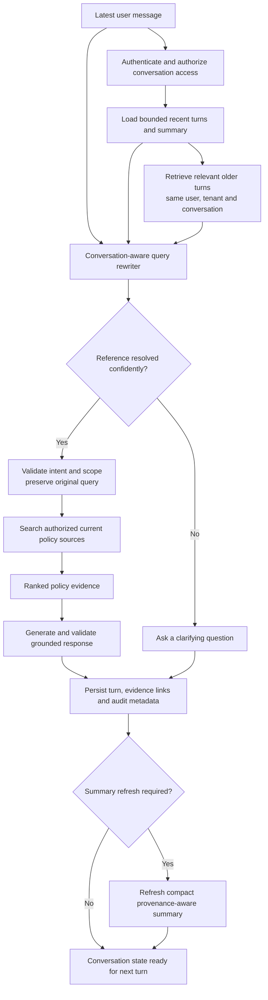
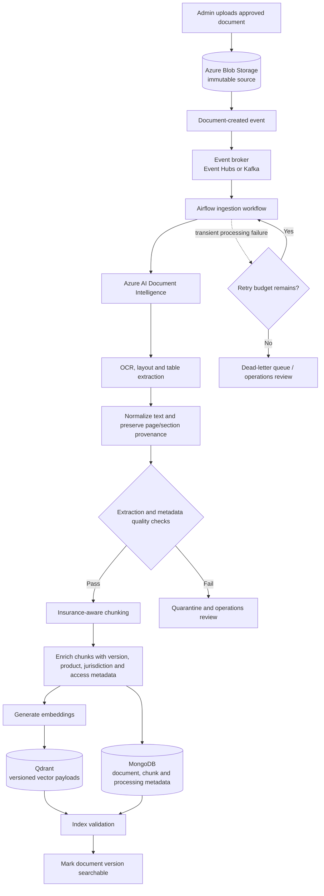
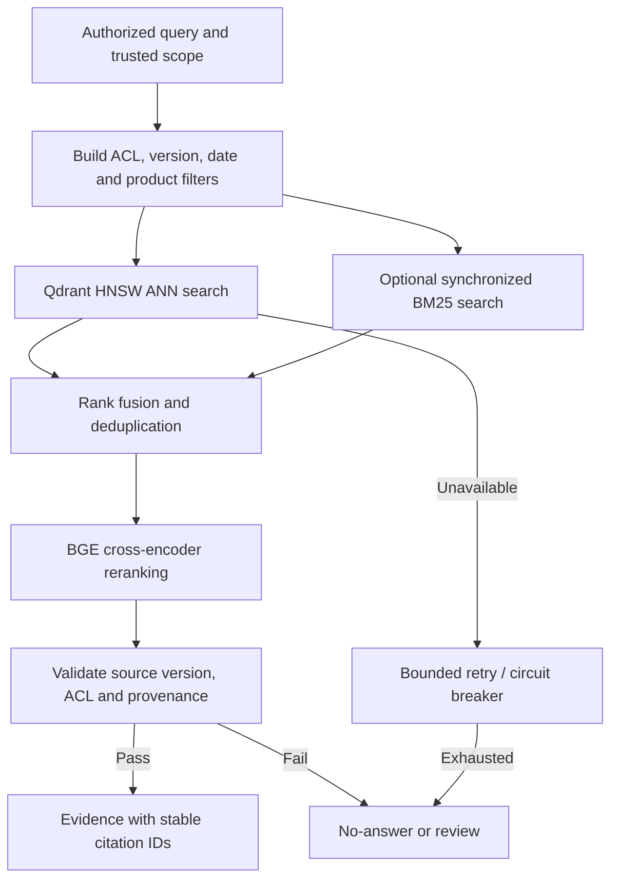
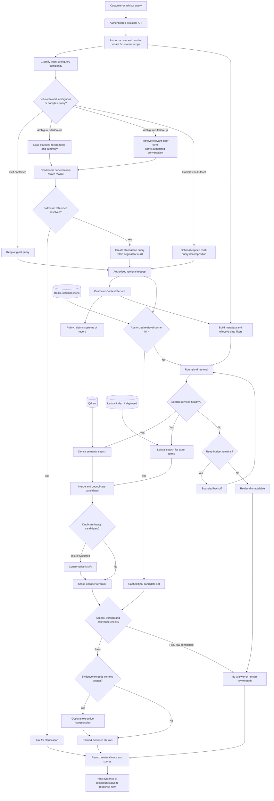
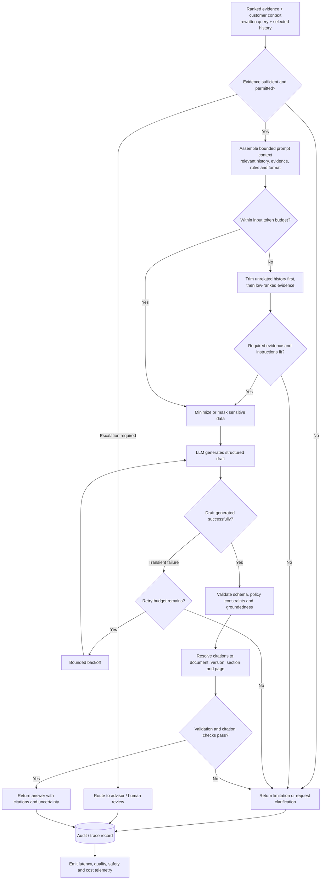
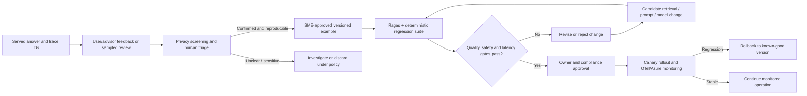
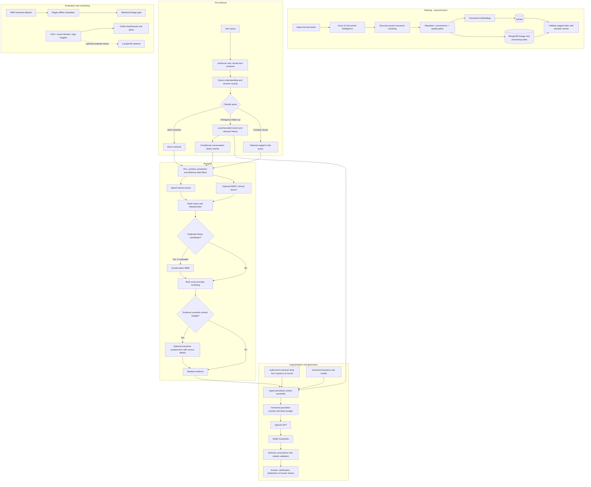

# RAG Architecture for Insurance AI Assistant

## Overview

This document describes the Retrieval-Augmented Generation (RAG) architecture for the insurance AI assistant. The goal is to answer customer and advisor questions with high accuracy, enterprise-grade security, source-grounding, and policy-aware reasoning.

The RAG layer is the heart of the system because insurance knowledge is mostly in long, dense, policy-heavy documents such as:

- policy documents
- terms and conditions
- product brochures
- claims procedures
- FAQs
- regulatory guidance

The system must not rely on the LLM to "remember" policy rules. It must retrieve the relevant evidence first, then reason over it, and then answer with citations.

---

## Conversation History & Context Management

Multi-turn conversation history is a first-class input to query understanding, but it is not a substitute for authoritative policy documents or customer systems of record. Conversation memory helps resolve references and preserve continuity; every policy or coverage claim must still be verified against currently authorized, version-valid sources.

### Conversation state and storage

- Assign each conversation a stable opaque ID, tenant/owner scope, creation time, last activity, and retention/expiry policy.
- Store the canonical message history in the approved conversation store with encryption at rest and in transit, access checks on every read, and audit logging. MongoDB may hold durable conversation metadata/history where approved by the enterprise data-retention policy; Redis is only an optional short-lived cache, not the source of truth.
- Keep message roles, timestamps, turn IDs, and links to retrieved evidence and generated answers. Do not store credentials or unnecessary sensitive data in conversation memory.
- Apply deletion, retention, legal-hold, and subject-access requirements consistently to raw turns, summaries, embeddings, caches, and trace records.
- Scope history retrieval to the authenticated user, tenant, conversation ID, and permitted customer/policy context. Never retrieve across users or conversations merely because text is similar.

### Conversation-aware query rewriting

For a follow-up such as “What about the waiting period?”, the query understanding service should resolve the missing subject from the current conversation before document retrieval.

1. Keep the user’s latest message unchanged as the canonical input.
2. Load a compact session summary and retrieve a bounded set of relevant prior turns (see relevant-history retrieval below).
3. Resolve references such as “it”, “that plan”, or “the waiting period” using recent turns and explicit customer/product context.
4. Produce a standalone rewritten search query and structured carry-forward constraints (for example, product, coverage type, jurisdiction, policy year, and unresolved ambiguity).
5. Validate that the rewrite preserves the user’s intent and does not broaden customer, policy, or authorization scope. Keep the original query alongside the rewrite for tracing.
6. Run document retrieval using the rewritten query and current authorization/effective-date filters. Do not treat prior assistant statements as factual policy evidence.

For example, after discussing the Health Plus policy, “What about the waiting period?” can be rewritten as “What waiting period applies under the Health Plus policy?” while retaining the original question and the policy scope from verified context.

Rewriting is a query transformation, not answer generation. It should use a low-latency model or deterministic logic where suitable, return a typed result containing the original query, standalone query, resolved entities/constraints, source turn IDs, confidence, and clarification status, and have a bounded timeout. If references cannot be resolved confidently, ask a clarifying question rather than guessing.

### Relevant-history retrieval

- First include the most recent turns needed to preserve conversational continuity, subject to the token budget.
- For older turns, retrieve only semantically relevant messages or compact turn summaries scoped to the same authorized conversation and subject.
- Initial operating limit: include at most the latest four user/assistant turn pairs or the history token allocation (15% of the model context budget), whichever is reached first; retrieve no more than five older turns/summaries unless an evaluated workflow has a documented need.
- Prefer user statements and explicit confirmed details over previous assistant-generated prose. Carry forward user-provided preferences or facts only as conversational context; verify policy/customer facts against systems of record.
- Apply recency and relevance ranking, deduplicate overlapping turns, and exclude unrelated or superseded discussion.
- Do not allow retrieved history to override current permissions, current customer context, or current policy/document versions.
- If no relevant history is found, the latest question remains a standalone query; if a critical reference remains ambiguous, ask the user to clarify.

### Summarization and long-conversation management

- Maintain a compact rolling summary when a conversation exceeds the recent-turn budget. Summaries should capture topic, confirmed user-provided details, selected product/policy context, unresolved questions, and relevant turn IDs.
- Clearly label summary fields by provenance: user-provided, system-of-record verified, or assistant-generated. Treat summaries as navigation/context only, never as authoritative evidence.
- Refresh summaries from canonical turns, not from a previous summary alone; preserve links to source turns so a summary can be checked or corrected.
- Keep a sliding window of recent turns plus retrieved relevant older turns. Do not append the complete transcript to the model prompt.
- Start summary refresh when the recent-turn window would exceed its budget or before adding a new topic segment; enforce maximum summary tokens using the same model-specific tokenizer as prompt construction.
- On topic change, start a new topic segment or summary scope while retaining the conversation ID; on a new conversation, do not reuse history unless explicitly requested and authorized.
- If summary generation or storage fails, continue with the bounded recent-turn window when possible; otherwise ask the user to restate the required context.

### Context-window and token-budget policy

Use model-specific tokenization and configure budgets per model/version. A starting model-context budget (including reserved completion capacity) can allocate approximately:

| Context element | Starting budget | Policy |
|---|---:|---|
| System, safety, and output instructions | 10% | Fixed and never displaced by history |
| Latest user message and rewritten query | 10% | Always preserve the original message |
| Relevant recent turns and summary | 15% | Select only relevant, scoped context |
| Customer context and business rules | 15% | Minimize data; authoritative sources only |
| Retrieved document evidence | 40% | Rank and trim to the strongest citation-ready chunks |
| Reserved output and safety margin | 10% | Protect completion length and model/tokenizer variance |

These are initial planning values, not fixed limits. Enforce a hard input-token ceiling below the model context limit after reserving output tokens, and trim in this order: unrelated older history, redundant summary details, low-ranked evidence, then nonessential customer context. Never trim safety instructions, authorization constraints, the latest user message, or citation requirements. If the remaining evidence cannot fit without losing necessary qualifications, split the workflow, retrieve a narrower evidence set, or ask a clarifying question; do not silently truncate policy clauses.

### Privacy, correctness, and evaluation controls

- Encrypt stored conversation data and embeddings; apply least-privilege access, retention, deletion, and audit policies.
- Do not place sensitive raw conversation text in cache keys, metrics, or ordinary logs. Use opaque IDs and redacted/aggregated telemetry.
- Isolate history retrieval and caches by tenant, user, conversation, and relevant authorization version. Invalidate cached context when permissions or policy scope change.
- Defend against prompt injection contained in prior user or assistant messages. History is untrusted input and must not alter system/developer instructions or access policy.
- Measure rewrite intent preservation, reference-resolution accuracy, correct clarification rate, history-retrieval precision, token usage, latency, and downstream retrieval/citation quality. Test ambiguous follow-ups, topic switches, stale summaries, revoked access, and very long conversations.

### Conversation-aware query flow



The history store and relevant-turn retrieval provide bounded conversational context; the rewriter converts a follow-up into a standalone search query while preserving scope and the original wording. The confidence gate prevents guessing when a reference is ambiguous. Policy retrieval remains a separate authoritative step, and evidence links are stored with the new turn so later history can distinguish verified sources from assistant text. Summarization is refreshed only as needed and remains traceable to canonical turns.

---

## 1. Objectives of the RAG Layer

The RAG architecture must:

- retrieve policy-relevant evidence with high precision
- filter results by product, policy version, region, coverage type, and user permissions
- improve retrieval quality with re-ranking
- ground answers in source documents and chunks
- support both FAQ and policy reasoning use cases
- resolve multi-turn follow-up questions using bounded, permission-scoped conversation history
- reduce hallucinations and unsupported conclusions
- support auditability and explainability for regulated workflows

---

## 2. Major RAG Workflows

The RAG lifecycle is split into three workflows so ingestion, query-time retrieval, and response generation can be scaled, secured, monitored, and recovered independently:

1. **Document ingestion pipeline** prepares approved source documents and publishes versioned chunks to the search index.
2. **Query retrieval pipeline** authenticates and scopes a request, finds relevant evidence, and returns a ranked evidence set.
3. **Final RAG response flow** generates a constrained answer, validates it, attaches citations, and escalates when confidence or risk requires human review.

---

## 3. RAG Design Principles

### 3.1 Retrieval-first design
The model should not answer from raw memory alone. It should retrieve evidence first and reason over it.

### 3.2 Policy-aware filtering
A customer’s answer depends on:

- policy number or policy ID
- product type
- coverage type
- policy effective date
- claim type
- region / jurisdiction
- document version / issue date
- user role and permission scope

### 3.3 Evidence-first answering
Every answer must map back to one or more source chunks. The final response should cite relevant policy references and claim procedures.

### 3.4 Precision over recall
For insurance content, an overly broad retrieval set causes poor answers. The system should prefer smaller, higher-quality evidence sets with good reranking.

---

## 4. Knowledge Sources

The RAG system draws on multiple sources:

- insurance policy documents
- product brochures
- claim manuals and claim guidelines
- terms and conditions
- FAQs and internal knowledge articles
- customer policy records and claims data
- regulatory and legal references where needed

These are not all treated equally. Some are internal and role-restricted. Others are public-facing or advisor-facing only.

### Source classes and authority

- **Unstructured evidence:** approved policy/procedure PDFs, brochures, manuals, FAQs and regulatory sources. The approved source repository is authoritative; Blob Storage retains the immutable ingestion copy.
- **Structured facts:** customer, policy lifecycle, claims status and eligibility inputs come from their respective enterprise systems and governed rules services at request time.
- **Derived stores:** MongoDB holds document/chunk lineage and processing/version metadata; Qdrant holds rebuildable embeddings and retrieval payloads; Redis is an ephemeral cache/session layer. None overrides source systems or approved documents.

---

## 4.1 Document formats and extraction boundaries

The ingestion design targets text PDFs, scanned PDFs, and table/form-heavy documents. Azure AI Document Intelligence is selected to combine OCR with layout, table, and form extraction; a plain text extractor would lose important relationships and page/layout provenance.

| Content | Intended handling | Boundary / control |
|---|---|---|
| Text PDF | Extract text and layout, normalize, retain page anchors | Validate page coverage and citation offsets |
| Scanned PDF | OCR and layout extraction via Document Intelligence | Confidence/coverage gates; quarantine poor OCR rather than indexing it as trusted evidence |
| Tables and forms | Extract cells/structure and retain heading, row/column, page and section association | Validate table completeness and numeric/label alignment; do not flatten if it changes meaning |
| Images, including embedded policy images | Process only when the selected Document Intelligence model/input path supports the format and task | The supported MIME/size allowlist and visual-semantic coverage are not defined here; charts, photos, handwriting, or visual damage interpretation are not guaranteed and require a separately evaluated workflow |
| Unsupported/corrupt/encrypted files | Reject or quarantine with operator-visible reason | Do not silently publish partial extraction |

The exact upload format allowlist, file-size limits, password-protected-file policy, language coverage, and OCR confidence thresholds are implementation gaps and must be set in the ingestion contract. Do not describe image interpretation as supported solely because OCR/layout extraction exists.

---

## 5. Document Ingestion Pipeline



### Pipeline explanation

The ingestion workflow turns an approved source file into searchable, traceable evidence. Blob Storage retains the immutable original; the event broker decouples uploads from processing bursts; and Airflow coordinates retryable, observable steps. Document Intelligence extracts OCR, layout, and table structure, while normalization and quality checks catch extraction problems before indexing. Insurance-aware chunking keeps clauses and tables interpretable, and enriched metadata supports policy, version, and access filters. Qdrant serves vector retrieval; MongoDB records document lineage, chunk metadata, and processing state. Index validation ensures a version is not exposed as searchable until its vectors and metadata are consistent. Failed or low-quality documents are quarantined or retried rather than silently published.

---

## 6. Chunking Strategy

Insurance documents are often long and clause-heavy. Therefore, simple chunking is not enough.

### Recommended chunking rules

- Prefer semantic chunking over arbitrary fixed-size splitting
- Preserve section boundaries where possible
- Keep table data and policy terms together when they belong to the same clause
- Avoid splitting across legal definitions or exclusions if it creates ambiguity
- Add metadata at chunk level
- Prefer deterministic structure-aware chunking from Document Intelligence headings, paragraphs, clause IDs, table cells, page boundaries, and document hierarchy; use semantic boundary detection only where structure is absent or unreliable
- Retain raw extracted text and stable source offsets so chunks and later compressed passages can resolve to exact page/section citations
- Add ingestion quality gates for missing pages, low OCR confidence, broken tables, empty/oversized chunks, duplicate chunks, missing required metadata, and invalid provenance; quarantine rather than index failures
- preserve explicit references such as “see Section 8.2” as extracted text and, where verified, normalized reference metadata; cross-document reference resolution is not currently specified as a working service

### Example chunk metadata

- document_id
- version_id
- product_type
- policy_year
- coverage_line
- jurisdiction
- section_title
- page_number
- source_url
- extraction_quality_score
- created_at

### Chunk, embedding, and re-index versioning

Persist document/source version, parser and normalization version, chunker version, metadata schema version, embedding model/version and dimension, and index generation ID. Do not mix incompatible embedding spaces in one collection. Stage reprocessing into a non-active generation, compare expected/actual chunk IDs and counts with MongoDB metadata, run retrieval evaluation, and activate only after consistency checks pass. Preserve the previously approved generation for rollback until retention/effective-date rules allow its removal.

### Cross-document references and citation integrity

Keep each chunk linked to an immutable source document/version, stable chunk ID, page, section/clause path, and character/source offsets. Preserve references to other clauses/documents during extraction; follow a reference only when the target has been resolved to an approved current source and passes the same user/tenant, jurisdiction, effective-date, and version filters. Cite every used source independently. A generic textual reference (“see Section X”) is not proof the target was retrieved or that the target is accessible. Automated reference resolution and link coverage are gaps until implemented and measured.

---

## 7. Hybrid Retrieval Strategy

Hybrid retrieval is a strong candidate for insurance documents and should be retained only with synchronized indexing and measured quality gains over the semantic-only baseline.

### 7.1 Semantic search
Semantic retrieval uses embeddings to find conceptually similar text.

Use cases:

- vague questions such as “what does this policy cover after hospitalization?”
- cross-document paraphrases
- broad contextual intent matching

### 7.2 Lexical search
Lexical search helps with exact terms and policy wording.

Use cases:

- clause names
- exclusions such as “pre-existing condition”
- policy wording like “deductible” or “waiting period”

### 7.3 Metadata filtering
This is essential in enterprise insurance contexts.

Examples:

- policy type = health insurance
- region = India / United States / APAC
- effective_date between X and Y
- document version = latest approved version only
- customer segment = retail / SME / corporate

### 7.4 Why hybrid retrieval matters
Insurance questions often combine vague natural language with exact policy terminology. Semantic search alone is not enough; lexical + metadata filtering increases precision.

### Recommended dense + lexical strategy

Retain Qdrant for dense semantic retrieval and add a lexical/BM25 retriever where the corpus and platform support it. Use both with identical authorization, product, jurisdiction, effective-date, and version filters. Merge and deduplicate candidates with a rank-fusion method such as reciprocal rank fusion before the existing BGE cross-encoder. This helps exact clause IDs, defined terms, claim codes, product names, and amounts while semantic search handles paraphrases. If no lexical backend is deployed, describe and operate the system as semantic-only rather than claiming hybrid retrieval.

### Qdrant index design, scale and alternatives

Qdrant is retained as the dedicated vector store because the current design needs dense semantic retrieval with payload metadata filters and a separately operated lexical retriever where required. The intended ANN index is HNSW: it avoids exhaustive vector scans at larger corpus sizes, trading exactness and memory/build work for query speed. HNSW construction/search settings (`m`, `ef_construct`, `ef`, quantization, shard/replica layout) are not specified or benchmarked here; treat them as deployment tuning parameters, not established production values. Validate recall/latency/memory on the representative insurance corpus before changing them.

Index payloads must include stable document/chunk IDs and the minimum validated product, jurisdiction, effective-date, version, language and authorization attributes needed by server-built filters. Index payload fields used for filtering deliberately; every request still derives filters from authenticated scope, not from model output. Replicas/shards and snapshots are deployment choices subject to consistency, recovery, and capacity testing.

| Alternative | When to compare | Trade-off against this design |
|---|---|---|
| Azure AI Search | Azure-managed lexical + vector retrieval and integrated enterprise search are priorities | May reduce separate lexical-index/fusion operations; compare feature fit, filtering semantics, ranking control, cost and portability |
| pgvector | Vectors are modest in scale and transactional SQL joins are a strong requirement | Simpler single-store operations may come with different ANN/filtering and scale characteristics |
| Weaviate, Milvus, Pinecone or another vector service | Managed operations, ecosystem, deployment model or existing enterprise standard favors it | Compare filter correctness, tenant isolation, backup/restore, availability, latency, total cost and migration path |

No alternative is selected by name alone. Qdrant remains the documented choice; changing it requires a workload-specific benchmark and operational comparison. “Thousands of documents” is feasible as a design target but is not a measured capacity result. Corpus size is not enough to size the index: chunk count, vector dimensions, payload indexes, concurrency, filter selectivity and replication drive capacity.



### Query routing and retrieval expansion policy

- **Self-contained simple FAQ:** direct retrieval; no query-rewrite or multi-query LLM call.
- **Ambiguous follow-up/pronoun:** conversation-aware rewriting from the bounded history defined above; ask clarification below the resolution-confidence threshold.
- **Complex multi-facet comparison or compound claim question:** optional capped multi-query decomposition, only when a planner determines distinct facets need separate evidence. Preserve the same ACL and document-version filters for each subquery, then fuse and deduplicate.
- **Policy query:** route to policy/product corpus with effective-date and jurisdiction filters.
- **Claim query:** obtain claim status from the claims system of record and retrieve claim procedures/policy clauses separately; do not answer claim status from documents.
- **Uncertain domain:** use deterministic routing rules or a low-cost classifier with confidence; clarify or escalate instead of broad unrestricted search.

Multi-query is not the default query expansion method. It can increase candidate volume and latency; cap the number of subqueries and measure recall gain against precision and cost.

---

## 8. Re-ranking Layer

After retrieval, the system should rerank candidate chunks to keep only the strongest evidence.

### Recommended approach

- Use a cross-encoder model such as BGE cross-encoder or a comparable reranker
- Rank top-k chunks based on relevance to the query and customer context
- Use metadata weighting as part of the ranker decision

### Why reranking is necessary

Naive vector search often retrieves many nearby but irrelevant chunks. Re-ranking reduces noise and dramatically improves answer quality for legal and policy content.

### MMR and contextual compression

- **MMR:** Optional, not a default extra stage. Apply conservatively between candidate fusion and BGE only when evaluation shows duplicate-heavy results. It reduces near-duplicates but can remove complementary clauses, exceptions, or repeated wording that is legally meaningful.
- **Contextual compression:** Optional after BGE ranking and before final context assembly when long chunks exceed the token budget. Prefer extractive span selection with original chunk IDs and source offsets. Retain the source chunk as the authority and validate that conditions, exceptions, amounts, and qualifiers remain available. Avoid LLM-generated summaries as evidence.
- **BGE:** Retain as the primary relevance reranker. It complements dense/lexical retrieval and optional diversity; it cannot recover missed candidates or certify policy correctness.

### Query Retrieval Pipeline



The query pipeline authenticates the caller and resolves customer and tenant scope before any conversation history is loaded. Self-contained questions go directly to retrieval; only ambiguous follow-ups load a bounded recent-turn window, compact summary, and scoped relevant-history before conversation-aware rewriting. If the reference remains ambiguous, the system asks for clarification instead of guessing. The original wording is retained for audit. Customer context produces metadata filters for product, jurisdiction, effective date, document version, and permissions. Dense search in Qdrant handles paraphrases, while an optional lexical index finds exact clause terms; candidate fusion, optional measured diversity filtering, and cross-encoder reranking improve precision. Access, version, and relevance gates prevent unauthorized or stale evidence from proceeding. Redis can reduce repeat-query latency only when the cache key includes authorization, conversation, and policy scope. Retrieval scores and source identifiers are traced for evaluation and audit; weak or disallowed evidence leads to an explicit no-answer or review status rather than forced generation.

---

## 9. Context Assembly

Once the relevant chunks are selected, the system assembles a grounded context for the model.

### Context may include

- the standalone rewritten query plus the original latest user message
- a compact conversation summary and only the relevant prior turns needed for continuity
- provenance labels for remembered details (user-provided, system-verified, or assistant-generated)
- top retrieved chunks
- top metadata-filtered chunks
- customer policy details
- claim-specific context
- separately identified business-rule outputs and reason codes
- answer-style rules and formatting instructions

Conversation history is context for resolving references and maintaining continuity, not evidence for policy claims. Do not pass the complete transcript. The prompt builder enforces the model-specific token budget defined in [Conversation History & Context Management](#conversation-history--context-management), preserving system/safety instructions, the current question, required policy qualifications, and citations before optional older history.

### Context trust and priority

Pass each source as a distinct typed block, not as an undifferentiated transcript:

1. **System/security instructions:** immutable policy, safety, access boundaries, and response contract.
2. **Current user request:** original message plus a validated standalone rewrite; user intent never grants data access.
3. **Customer-specific facts:** fresh, authorized facts from customer/policy/claims systems of record, with timestamps and provenance.
4. **Business-rule results:** versioned rule output and reason codes from the governed deterministic rule service.
5. **Retrieved policy evidence:** approved document version, jurisdiction/effective date, exact chunk and citation metadata.
6. **Conversation history:** selected relevant turns and summary for reference resolution only; assistant text is untrusted continuity context, not a source of policy or customer truth.
7. **Output format:** structured answer fields and citation requirements.

This ordering is a prompt-layout/trust boundary, not an instruction to silently settle contradictions. If authoritative policy text, customer data, and a business rule conflict or have incompatible effective dates, stop and clarify/escalate. Do not let conversation memory override systems of record, active policy documents, authorization, or governed rule results.

The response contract should distinguish:

- `policy_facts`: statements supported by approved retrieved policy chunks and citations
- `customer_facts`: customer-specific facts from authorized systems of record, with freshness/provenance
- `business_rule_results`: eligibility or workflow outcomes from the versioned rule service, with reason codes
- `explanation_or_recommendation`: model-generated explanation only, bounded by the preceding evidence and approved suitability constraints

Never present model-generated explanation as a contractual fact or imply that a recommendation is a binding coverage/eligibility decision.

### Example of context payload

```json
{
  "original_query": "What about the waiting period?",
  "rewritten_query": "What waiting period applies under the Health Plus policy?",
  "conversation_context": {
    "summary": "User is asking about Health Plus inpatient coverage.",
    "relevant_turn_ids": ["turn-18", "turn-19"],
    "authority": "continuity-only"
  },
  "customer_facts": {
    "policy_id": "POL-1245",
    "product": "Health Plus",
    "coverage_type": "inpatient",
    "verified_at": "2025-01-01T00:00:00Z",
    "source": "policy-system"
  },
  "business_rule_results": [],
  "resolved_constraints": {
    "jurisdiction": "authorized policy jurisdiction",
    "policy_version": "current version for effective date"
  },
  "retrieved_chunks": [
    {
      "doc_id": "policy-health-2025",
      "chunk_id": "c-341",
      "evidence_id": "ev-982",
      "score": 0.94,
      "section": "Waiting Periods",
      "page": 14,
      "version": "2025.01"
    }
  ]
}
```

The example is illustrative; production payloads should use typed schemas, protect identifiers, and avoid copying redundant fields when building the model prompt.

---

## 10. Grounded Answer Generation

The LLM should answer only from the retrieved context and policy rules. It should be explicitly instructed to:

- answer conservatively
- cite supporting evidence
- mention uncertainty where policy language is unclear
- avoid assuming customer coverage without evidence
- produce structured responses when needed
- label policy facts, customer-specific facts, deterministic rule outcomes, and model-generated explanations separately
- emit only citation IDs supplied in the evidence bundle; citation URLs/page labels are resolved and validated server-side

### Example answer behavior

- “According to Section 3.2 of the Health Plus policy, emergency inpatient treatment is covered when admitted within 24 hours of an accident.”
- “This answer is based on the latest policy version effective 1 Jan 2025.”

### Final RAG Response Flow



This response flow invokes generation only when retrieved evidence is both authorized and sufficient. Bounded context assembly includes only a rewritten query, selected history, relevant evidence, and approved rules—not the full transcript. The token-budget gate reserves room for safety instructions and output; it trims unrelated history and then low-ranked evidence, and falls back to clarification/review if required evidence cannot fit intact. Data minimization reduces unnecessary exposure of customer information. Structured generation is followed by schema, policy, groundedness, and citation checks so unsupported or malformed answers do not reach users. The audit record links the request, selected history references, evidence, model/configuration, validation outcome, and citations; telemetry supports production monitoring and continuous evaluation.

---

## 11. Guardrails in the RAG Layer

The RAG pipeline must include safety and compliance checks.

### Input guardrails

- detect prompt injection
- sanitize user input
- prevent malicious retrieval manipulation

### Retrieval guardrails

- filter out documents the user is not authorized to read
- block stale or superseded policy versions
- remove irrelevant or low-quality documents before ranking

### Output guardrails

- enforce groundedness checks
- prevent unsupported claims
- require citation presence for factual or policy-based answers
- flag answers requiring human review

### Sensitive scenarios

- claim denial explanation
- legal interpretation of policy clauses
- premium disputes
- customer-specific coverage decisions
- ambiguous exclusions or regulatory concerns

These should often route to human review or advisor workflows.

---

## 12. Citation Strategy

Citations are not optional in an enterprise insurance assistant.

### Required citation components

- source document name
- section name or clause title
- document version
- page or chunk identifier
- time of policy validity
- stable evidence ID and mapping to the exact retrieved chunk/source offsets

Treat model citation generation as reference selection, not proof. A server-side validator must reject unknown, unauthorized, stale, or mismatched citation IDs and ensure material policy claims have supporting evidence. Validate customer facts and rule outputs against their own system-of-record provenance; policy citations do not substantiate customer-specific facts.

### Example

“Coverage is available for emergency hospitalization under the Health Plus policy, Section 4.3, Policy Version 2025.01 (source: Policy Doc 2025, chunk H-173).”

This helps with:

- auditability
- compliance review
- advisor trust
- customer transparency

---

## 13. RAG Evaluation Strategy

A production-grade RAG system needs repeatable offline evaluation and separate online operational monitoring. Ragas is recommended for offline evaluation of curated datasets. LangSmith is optional for LLM-specific experiments and trace inspection; OpenTelemetry, Azure Monitor, and Application Insights remain the production observability system.

### Offline evaluation

Maintain a versioned, SME-reviewed dataset containing query intent, user/customer scope, expected evidence IDs, policy version/effective date, expected answer facts, expected citations, and expected clarification/escalation outcomes. Run evaluations when changing extraction, chunking, metadata, embeddings, hybrid fusion, MMR, BGE, compression, prompts, models, or conversation rewriting.

Use Ragas selectively for:

- **Faithfulness:** Are answer claims supported by retrieved context? Pair with deterministic citation checks.
- **Answer Relevancy:** Does the response address the actual user intent, including correct clarification or abstention?
- **Context Precision:** Are retrieved chunks useful and relevant? Evaluate alongside recall to avoid dropping exclusions.
- **Context Recall:** Does the retrieved set contain required evidence? Requires complete reference evidence labeled by insurance SMEs.

Keep deterministic checks in the release gate for citation ID resolution, authorization filters, source version/effective date, response schema, required disclosures, and token/timeout limits. Ragas/LLM-judge scores are estimates: pin evaluator/model/metric versions, calibrate against human review, and do not approve a release based on a single aggregate score.

Additional retrieval metrics may include recall@k, precision@k, nDCG, MRR, and document hit rate, segmented by product, jurisdiction, query type, and policy version.

### Online / production monitoring

The user request path uses deterministic controls and does not wait for Ragas or a model judge. OTel/Azure Monitor/Application Insights measure request and stage latency, errors, dependency health, token cost, retrieval/reranker scores, index freshness, cache behavior, no-hit/low-confidence, citation rejection, clarification, guardrail, and escalation rates.

If model-judged Faithfulness or Answer Relevancy is used online, run it asynchronously on a privacy-reviewed sample with an explicit budget. Store the evaluator version and sample provenance; evaluator failure must not block the user response. Use sampled human review and user/advisor feedback to calibrate signals.

### LangSmith placement

LangSmith may be used in development/staging to inspect traces, compare prompts/models, and manage experiment datasets. It overlaps with OTel/Azure tracing, so it is optional, not another mandatory production telemetry plane. If approved for production trace inspection, export only minimized/redacted content; define data residency, access, retention, sampling, and outage behavior. User requests must not depend on LangSmith availability.

### Feedback-to-improvement loop

User/advisor feedback and sampled human review are signals for investigation, not automatic labels or automatic model/prompt updates. A reviewer should confirm the issue and expected evidence/answer, redact or minimize sensitive data, and add an approved example to a versioned regression set. Candidate retrieval, prompt, chunker, model, or routing changes run through offline evaluation and release approval before rollout.



This creates a controlled feedback → evaluation → improvement → regression-testing loop. Automated online learning, automatic prompt mutation, and direct writes from thumbs-up/down into a training corpus are not specified and should not be enabled without separate governance and validation.

### Additional answer-quality signals

- groundedness
- citation correctness
- answer faithfulness
- refusal correctness
- usefulness for customer or advisor workflow
- intent-preservation and clarification correctness for multi-turn follow-ups

### Example evaluation scenarios

- claim eligibility question
- product comparison question
- claim procedure question
- policy exclusion question
- answer requiring routing to a human advisor
- simple FAQ routed directly without an unnecessary rewrite/model call
- follow-up query with a correctly resolved antecedent and one with ambiguous antecedents
- compound claim query with recall across policy evidence and claims-system facts

---

## 14. Failure Modes in RAG

### Retrieval failure
- no relevant chunks found
- wrong document version selected
- too many irrelevant results

### Answer failure
- the model hallucinates policy language
- the answer is too generic and not policy-specific
- the citation is missing or wrong

### Data failure
- stale document remains indexed
- OCR extraction is poor
- table data is misread
- metadata is incomplete

### Mitigation

- validation before indexing
- retrieval quality checks
- citation requirement as a hard gate
- reprocessing and version correction pipeline
- human review for domain-sensitive results

---

## 15. Security and Compliance in RAG

The RAG layer must enforce strict access rules.

### Key requirements

- user can only access authorized documents
- customer data access follows RBAC/ABAC policies
- conversation-history retrieval is scoped to the authenticated tenant, user, and conversation; stored turns and summaries are untrusted continuity context, not authorization or evidence
- ACL, effective-date, and version filters are built from trusted identity and enterprise metadata, not inferred or widened by a model
- documents with expired or superseded versions should not be used
- PII should be masked before model execution when necessary
- all retrievals and answers should be auditable
- traces and evaluation exports are minimized/redacted and governed by retention, residency, and access policy

No answer should be generated from a document the user is not allowed to access, even if it exists in the index.

---

## 16. Performance and Scaling Considerations

RAG must scale across both user queries and ingestion workloads.

### Scaling techniques

- asynchronous ingestion workers
- horizontal scaling of retrieval and API services
- metadata filtering to reduce search cost
- vector index replication or sharding where needed
- Redis caching for common retrieval patterns and FAQ summaries
- query-time pruning of low-value documents

### Latency optimization

- do not retrieve full-document context for simple FAQ lookups
- precompute common retrieval patterns
- keep chunk sizes tight and context-aware
- use reranking only on a limited candidate set

---

## 17. Final Recommended RAG Architecture



### Execution policy

1. Keep Document Intelligence, Qdrant, MongoDB, conversation-aware history, LangGraph, GPT, NeMo, and server-side citation validation.
2. Add structure-aware chunking, extraction/chunk quality gates, complete metadata/provenance, embedding-version tracking, staged index activation, and tested re-index rollback.
3. Authorize and route every query. Use direct retrieval for self-contained simple questions; invoke query rewriting only for ambiguous follow-ups; invoke capped multi-query only for complex decomposable questions.
4. Use Qdrant dense search plus a lexical/BM25 index where deployed, with identical ACL/version filters and rank fusion. Retain BGE; enable conservative MMR only when duplicate-heavy retrieval is demonstrated; compress extractively only when context size warrants it.
5. Assemble separately typed system/security instructions, user query, customer facts, governed rule outputs, policy evidence, conversation history, and output contract. Conversation history is continuity context only and cannot override authoritative sources.
6. Generate structured output that distinguishes retrieved policy facts, customer-specific facts, business-rule results, and model-generated explanation/recommendation. Resolve citations server-side and abstain/escalate on unsupported or conflicting facts.
7. Run Ragas metrics offline on curated SME-reviewed evaluations; keep OTel/Azure online monitoring. LangSmith and online LLM-judge scoring remain optional, privacy-reviewed, asynchronous, and non-blocking.

## 18. RAG Architecture Decision Summary

The recommended architecture is:

- Qdrant for vector storage and retrieval
- metadata-aware authorization, policy, jurisdiction, and version filtering
- dense Qdrant + lexical/BM25 hybrid retrieval where deployed, fused before reranking
- cross-encoder re-ranking for precision
- structure-aware chunking, quality gates, versioned embeddings, and staged re-indexing
- conditional query rewriting and domain routing; capped multi-query only for complex requests
- optional MMR/compression only where evaluated gains justify complexity
- evidence-grounded answer generation with citations
- explicit separation of customer facts, policy facts, rule results, history, and model explanations
- strict guardrails and access control
- async ingestion from source documents to vector index
- offline Ragas evaluation and online OTel/Azure monitoring; LangSmith optional

This architecture gives the best balance of accuracy, safety, enterprise readiness, and explainability for an insurance assistant.

---

## 19. Edge Case & Failure Handling

RAG must fail closed whenever source quality, authorization, version, or grounding cannot be verified. The ingestion, retrieval, and response diagrams above show the primary quarantine, retry, no-answer, validation, and escalation paths.

### Scenario: Duplicate upload or replayed ingestion event

- **Why it can happen:** Event brokers provide at-least-once delivery, admins may retry an upload, or an orchestrator may replay a job after timeout.
- **How the architecture detects it:** Use a stable document ID plus source checksum, version ID, and idempotency key; compare processing state and index records before writes.
- **How the system handles/recover from it:** Make workflow stages idempotent. Reuse completed extraction results when valid, or replace the same version atomically; do not create duplicate chunks or embeddings.
- **Fallback behavior:** Keep the last validated searchable version while the duplicate/replay is reconciled; quarantine conflicting content for operations review.
- **Impact on the user/system:** Normally none; unresolved conflicts can delay publication of the affected version.
- **Monitoring/alerting required:** Count duplicate events, idempotent no-ops, conflicting checksums, and replay attempts; alert on repeated conflicts or unusual event bursts.

### Scenario: OCR or layout extraction is incomplete or corrupt

- **Why it can happen:** Scanned or rotated pages, low-resolution images, handwritten annotations, unsupported tables, encrypted PDFs, or Document Intelligence outages.
- **How the architecture detects it:** Validate extraction completeness, page coverage, table structure, OCR confidence, required metadata, and document-level quality thresholds.
- **How the system handles/recover from it:** Retry transient service failures with bounded backoff; apply approved preprocessing or alternate extraction for supported cases; persist the original and extraction diagnostics; route low-quality documents to manual review.
- **Fallback behavior:** Do not index a document/version that failed required quality checks; retain an older version only if its validity period still applies.
- **Impact on the user/system:** Newly updated content may not be searchable; the assistant avoids giving answers from corrupted or partial text.
- **Monitoring/alerting required:** Track extraction latency, confidence, page/table coverage, retries, quarantine volume, and failure rates by source type.

### Scenario: Partial indexing or inconsistent document-version publication

- **Why it can happen:** Qdrant writes succeed while MongoDB metadata writes fail, indexing is interrupted, or an update is made searchable before all chunks are validated.
- **How the architecture detects it:** Compare expected and actual chunk counts, IDs, version metadata, and checksums across MongoDB and Qdrant before marking a version active.
- **How the system handles/recover from it:** Stage writes under a non-searchable version, retry idempotently, validate cross-store consistency, and activate the version only after validation. Remove or rebuild incomplete staged data.
- **Fallback behavior:** Continue serving the last validated version only when effective-date rules allow; otherwise return an unavailable-source result and escalate.
- **Impact on the user/system:** Index freshness may be delayed, but incomplete or mixed-version policy evidence is not served.
- **Monitoring/alerting required:** Alert on index/metadata count mismatch, activation delay, failed validation, orphan vectors, and active-version drift.

### Scenario: Unauthorized or cross-tenant retrieval/cache collision

- **Why it can happen:** Incorrect ACL metadata, a missing tenant filter, stale permissions, or a retrieval cache key that omits user/customer scope.
- **How the architecture detects it:** Enforce authorization before retrieval and again before context assembly; test tenant boundaries; include access scope and policy version in cache keys and verify cached payload metadata.
- **How the system handles/recover from it:** Reject the result, invalidate affected cache entries, prevent prompt assembly, and raise a security event for investigation. Restrict cache use if scope cannot be proven.
- **Fallback behavior:** Return a generic access failure without confirming the existence or contents of protected documents.
- **Impact on the user/system:** Affected requests fail safely; a confirmed leak is a security incident requiring containment and response.
- **Monitoring/alerting required:** Alert on ACL-filter failures, cache scope mismatches, cross-tenant test failures, and anomalous denied/allowed retrieval patterns.

### Scenario: No relevant, current, or sufficiently confident evidence

- **Why it can happen:** Query is ambiguous, a policy is not indexed, metadata is wrong, the requested coverage is not documented, or retrieval/reranking misses relevant clauses.
- **How the architecture detects it:** Apply minimum relevance and evidence coverage thresholds; check document effective dates, required source types, and expected citation availability.
- **How the system handles/recover from it:** Optionally reformulate or broaden the query within the same authorization scope and run a bounded second retrieval; preserve the original query and scores for audit.
- **Fallback behavior:** Do not fabricate an answer. Ask a clarifying question, state that supporting evidence was not found, or route to an advisor.
- **Impact on the user/system:** Reduced self-service resolution and possible human workload, but lower risk of unsupported insurance guidance.
- **Monitoring/alerting required:** Track no-hit and low-confidence rates by product, question intent, document version, and retrieval configuration; alert on regressions from baseline.

### Scenario: Grounding, citation, or model output validation fails

- **Why it can happen:** Model output is malformed, cites a nonexistent chunk, combines conflicting clauses, omits a required qualification, or a prompt/model update regresses quality.
- **How the architecture detects it:** Validate response schema, citation IDs against retrieved evidence, document version and page references, policy constraints, and groundedness thresholds.
- **How the system handles/recover from it:** Reject the draft; allow at most a bounded regeneration using the same validated evidence if policy permits; otherwise record the failed trace and route to review. Roll back a harmful prompt/model change.
- **Fallback behavior:** Return a safe limitation or human-review path, never the unvalidated draft.
- **Impact on the user/system:** The user may receive a delayed or limited answer; incorrect citations and unsupported coverage statements are withheld.
- **Monitoring/alerting required:** Monitor validation rejection, regeneration, citation mismatch, groundedness, safety escalation, and model/prompt-version quality metrics.

### Scenario: Hybrid retrievers disagree or lexical index is stale

- **Why it can happen:** BM25/lexical indexing lags behind Qdrant, analyzers tokenize policy identifiers differently, or one retriever returns a different document generation.
- **How the architecture detects it:** Compare index generation/version IDs, per-retriever freshness and hit rates, and source/version metadata during candidate fusion.
- **How the system handles/recover from it:** Exclude stale generations; use only candidates whose ACL/version metadata validates; retry or rebuild the lexical index through the staged re-index process.
- **Fallback behavior:** Use validated Qdrant dense results if their quality threshold passes; otherwise abstain or escalate rather than merging inconsistent sources.
- **Impact on the user/system:** Temporary reduction in recall or latency while index synchronization is restored; no mixed-version evidence is presented.
- **Monitoring/alerting required:** Track freshness lag and hit/error/latency metrics per retriever, fusion candidate source, and index generation; alert on drift or mismatch.

### Scenario: MMR or contextual compression removes a material qualification

- **Why it can happen:** Diversity selection suppresses related clauses, or compression omits an exception, waiting-period qualifier, amount, or table relationship.
- **How the architecture detects it:** Evaluate reference-evidence recall before/after these stages; retain source chunk IDs/offsets and require citation/grounding checks for every material claim.
- **How the system handles/recover from it:** Disable MMR/compression for the affected domain/query class; retrieve the original full chunk; reject summaries without source offsets or where required conditions do not fit.
- **Fallback behavior:** Use the uncompressed validated chunk if it fits; otherwise ask a focused question or route to review.
- **Impact on the user/system:** Additional latency or context use; prevents incomplete coverage guidance caused by optimization.
- **Monitoring/alerting required:** Measure token reduction against evidence recall, citation correctness, qualifier retention, and answer quality by configuration.

### Scenario: Offline evaluator or trace platform is unavailable or exposes sensitive data

- **Why it can happen:** Ragas evaluator/model outage, LangSmith export failure, misconfigured sampling, or insufficient redaction/retention controls.
- **How the architecture detects it:** Evaluation-job failures, export errors, data-loss-prevention alerts, privacy scanning, and trace access audits.
- **How the system handles/recover from it:** Retry or pause offline evaluation without affecting serving; quarantine unapproved traces, disable export, and follow incident response for exposure.
- **Fallback behavior:** Continue production with deterministic request-path controls and OTel/Azure telemetry; do not use unreviewed external traces.
- **Impact on the user/system:** Delayed experiment/release evidence or reduced debugging detail; user responses remain independent of evaluators and trace SaaS.
- **Monitoring/alerting required:** Alert on evaluation backlog/failures, trace export status, sensitive-data detections, access anomalies, and evaluator version drift.

### Scenario: Follow-up reference is ambiguous or rewritten query changes intent

- **Why it can happen:** The user changes topics, multiple products or waiting periods were discussed, or the rewriter incorrectly resolves “it”, “that plan”, or another reference.
- **How the architecture detects it:** Compare the rewritten query and extracted constraints with the current message and relevant turn references; use a confidence threshold and detect competing antecedents.
- **How the system handles/recover from it:** Preserve the original query, reject an intent-changing rewrite, and ask a targeted clarification when the intended subject cannot be selected reliably.
- **Fallback behavior:** Do not search or answer against a guessed product or coverage context. The user may restate the subject or start a new topic.
- **Impact on the user/system:** One additional interaction may be needed; prevents retrieval against the wrong policy.
- **Monitoring/alerting required:** Measure rewrite confidence, intent-preservation failures, clarification rate, and retrieval/citation quality for follow-up questions.

### Scenario: Long conversation, stale summary, or summary-generation failure

- **Why it can happen:** The conversation exceeds the prompt budget, a topic changes, a summary omits a qualifier, or the summarizer/storage dependency fails.
- **How the architecture detects it:** Track token estimates and summary age/version; retain source-turn references; validate summary fields and compare resolved constraints with recent canonical turns.
- **How the system handles/recover from it:** Rebuild summaries from canonical turns, segment by topic, and retrieve only relevant scoped history. Apply the defined trimming order and never truncate required policy evidence or safety instructions.
- **Fallback behavior:** Use the bounded recent-turn window if the summary is unavailable; if required context no longer fits or cannot be verified, ask the user to restate it.
- **Impact on the user/system:** May add latency or require restatement, while keeping prompt size bounded and preventing lost qualifications from silently affecting the answer.
- **Monitoring/alerting required:** Track summary refresh failures/age, token-budget overruns, history-retrieval latency, context-trim counts, and clarification/restatement rates.

### Scenario: Conversation history is inaccessible, revoked, or belongs to another scope

- **Why it can happen:** Conversation ownership changes, session IDs are guessed or reused, permissions are revoked, cache keys omit scope, or history storage is unavailable.
- **How the architecture detects it:** Reauthorize every history read against user, tenant, conversation, and customer scope; validate cache metadata and reject missing ownership/version claims.
- **How the system handles/recover from it:** Fail closed for unauthorized history, invalidate affected cached context, and emit a security audit event. For storage outages, use only history already loaded and verified in the current request if policy permits.
- **Fallback behavior:** Treat the latest message as standalone or request the user to restate context; never borrow history from a different conversation or tenant.
- **Impact on the user/system:** Reduced continuity or a clarification step; no cross-session or cross-tenant disclosure.
- **Monitoring/alerting required:** Alert on denied history access, cache-scope mismatch, history-store outages, and anomalous conversation-ID access patterns.

---
