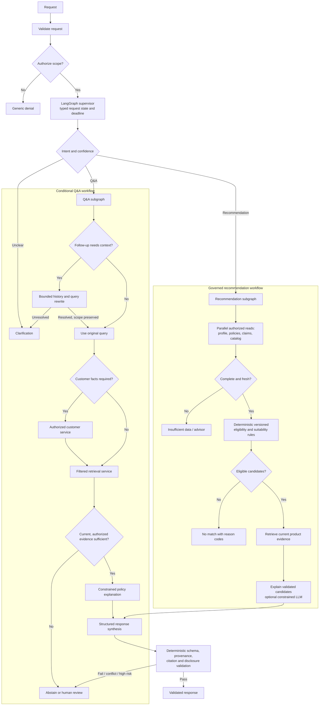
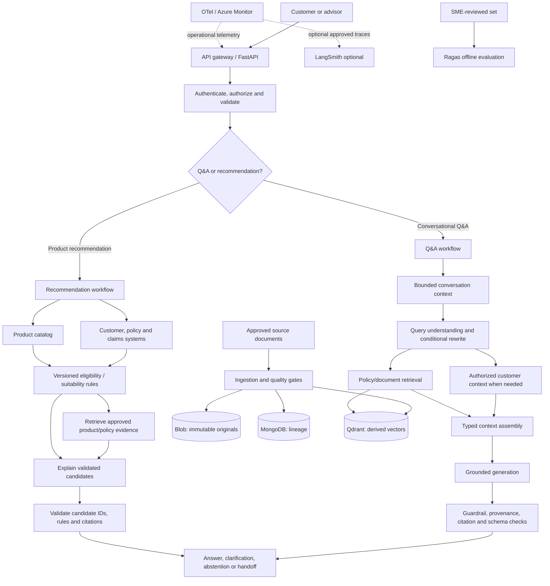
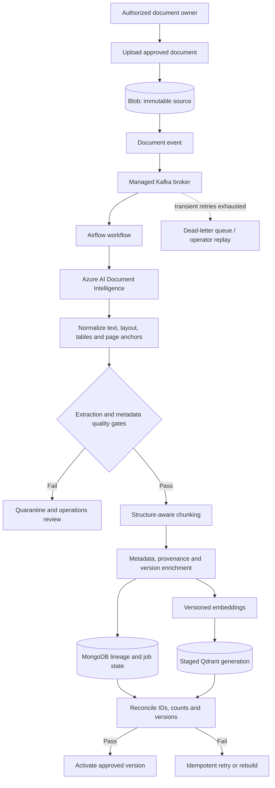
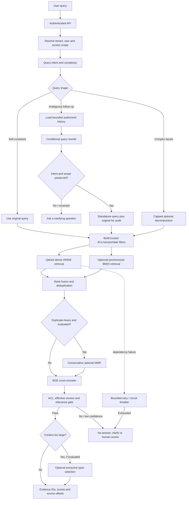
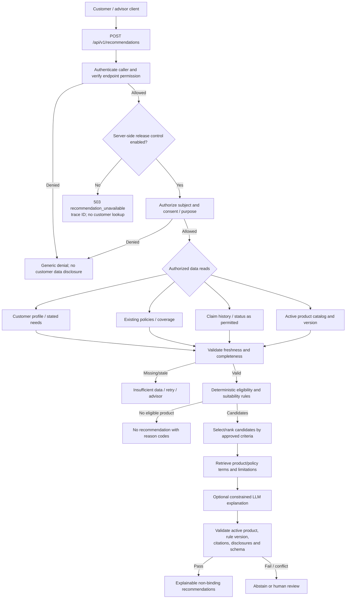
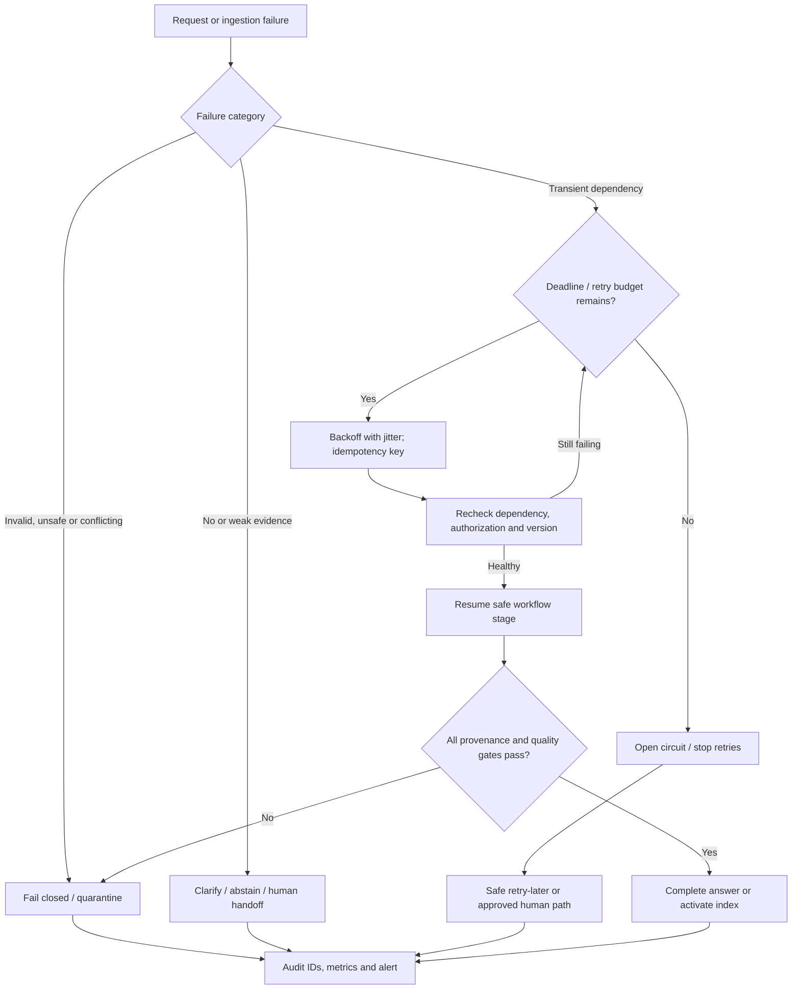

# RAG Architecture for Insurance AI Assistant

## 1. Overview & Business Use Cases

This document describes an enterprise Retrieval-Augmented Generation (RAG) architecture for insurance customer and advisor workflows. It supports two distinct capabilities:

1. **Conversational Q&A:** explain approved policy terms, coverage wording, exclusions, waiting periods, claims procedures, and related documents with source citations.
2. **Product recommendation:** return eligible, explainable candidate products using authorized customer/policy/claims data, a product catalog, deterministic eligibility/suitability rules, and RAG evidence. Recommendations are not coverage decisions or policy contracts.

The LLM interprets language and explains validated inputs; it is not a policy system of record, eligibility engine, customer database, or source of product suitability rules. Every material insurance fact must be traceable to an authorized current source or a governed rule result. Where evidence, authorization, eligibility, or policy validity cannot be established, the system clarifies, abstains, or hands off to a human.

**Architecture status:** this is a target design documented for review. Named technologies, diagrams, endpoint contracts, and operational controls below do not by themselves prove implementation, benchmark, or production approval. Explicit gaps are identified rather than silently assumed.

## 2. Enterprise RAG Architecture

### Components and responsibilities

| Component | Responsibility | Authority / boundary |
|---|---|---|
| API gateway and FastAPI backend | Validate request shape, size and rate; authenticate; attach correlation IDs; route Q&A or recommendation requests | Does not determine customer access from user-supplied identifiers alone |
| Conversation service | Load bounded recent history, summary and relevant same-conversation turns | Continuity only; never policy or customer truth |
| Query understanding / router | Classify intent and select a workflow; determine whether rewrite/decomposition is warranted | Deterministic-first; low-confidence classification leads to clarification or escalation |
| Customer context service | Fetch profile, active policies, coverage and claims facts | Authorized enterprise systems of record with source and freshness metadata |
| Catalog service | Return current products, product attributes, and catalog version | Product catalog is an assumed integration; concrete system/API is not selected in this architecture |
| Document ingestion pipeline | Extract, normalize, quality-check, chunk, enrich, embed, stage and publish approved documents | Original approved source remains authoritative |
| Retrieval service | Apply trusted metadata filters, dense/optional lexical retrieval, fusion, deduplication and ranking | Qdrant is the vector index; lexical index is conditional |
| BGE cross-encoder | Rerank a bounded candidate set | Improves relevance ordering; does not certify truth or recover missed candidates |
| Policy / eligibility rules | Evaluate versioned deterministic business rules and produce reason codes | Rules and enterprise facts—not the LLM—decide eligibility |
| LangGraph orchestrator | Execute conditional workflow nodes, joins, error paths and bounded model calls | Request-scoped typed state; not unrestricted autonomous agents |
| LLM gateway | Perform query transformation or grounded response explanation where needed | Must not make authorization or binding eligibility decisions |
| NeMo/application guardrails | Check input/output behavior and safety policy | Not a replacement for authZ, PII controls, rule evaluation, or citation validation |
| Citation/response validator | Resolve evidence IDs and verify authorization, version, provenance and response schema | Deterministic application gate before returning an answer |
| Observability/evaluation | OTel/Azure operational telemetry; offline Ragas and optional LangSmith workflows | Evaluation/trace outages never block serving |

### Data and source-of-truth boundaries

**System roles:** CRM (Customer Relationship Management) holds customer profile and relationship information; the policy administration system holds policy, coverage, status and effective-date records; the claims system holds claim submissions, status, decisions and history. These are role descriptions, not confirmation that specific products or APIs are integrated. The assistant reads relevant facts through authorized enterprise services; these systems remain authoritative.

| Data | Authoritative source | Derived or runtime store |
|---|---|---|
| Policy documents, procedures, brochures, FAQs | Approved document repository | Immutable source copy and extraction artifacts in Azure Blob Storage |
| Customer profile, policy lifecycle, claims status, coverage facts | CRM, policy administration and claims systems | Read at request time through authorized services; never inferred from conversation memory |
| Eligibility and suitability logic | Governed rule service/catalog policy | Versioned deterministic rule result with reason codes |
| Document/chunk lineage, source version, processing status | Source identity and approved document metadata | MongoDB metadata/lineage store |
| Embeddings and retrieval payloads | Derived from approved document versions | Qdrant vector index; rebuildable and not a source of policy truth |
| Session/cache data | No business authority | Redis ephemeral cache/session state with scoped keys and TTL |
| Conversation history | Canonical conversation store only if enterprise retention/privacy permits | MongoDB persistence is conditional; Redis is not durable authority |

Cross-store version/checksum reconciliation is required before publication. Customer and policy facts do not become authoritative by being copied into MongoDB, Qdrant, Redis, prompts, or summaries.

## Multi-Agent Architecture & Justification

### What “multi-agent” means here

This design uses **LangGraph as a supervisor-controlled workflow with specialized nodes**, some of which may use an LLM for bounded language tasks. It does not mean a collection of unconstrained autonomous agents. Authorization, customer-data access, retrieval filters, eligibility/suitability, citation checks, and response validation remain deterministic services or tools. The LLM is used only where language understanding or explanation adds value.

### Why this is better than one LLM chain for insurance

A single linear chain tends to apply the same steps to every question, even when the task differs. That is a poor fit for insurance, where a public policy FAQ, an ambiguous follow-up, a customer-specific claim question, and a product recommendation have different evidence sources, permissions, rules, and failure consequences.

The graph makes those differences explicit:

- **Specialized reasoning:** query understanding resolves intent; policy reasoning explains retrieved clauses; recommendation explanation summarizes already validated candidates. These roles have distinct inputs and output contracts.
- **Conditional execution:** self-contained FAQs skip query rewriting and customer lookups; ambiguous follow-ups load bounded history; claims questions use the claims system; recommendations enter a separate governed workflow.
- **Customer-context integration:** authorized profile, policy and claim reads are explicit dependencies, parallelized only when independent, then joined with source/freshness provenance before reasoning.
- **Recommendation safety:** candidate eligibility and suitability are deterministic versioned rule evaluations; the LLM cannot create a product, change eligibility, or rank outside approved criteria.
- **Reliability and explainability:** each node has a bounded responsibility, typed input/output, deadline and failure path. The graph can abstain when a required dependency or evidence gate fails, while traces identify which stage and evidence contributed.
- **Maintainability:** retrieval, rules, prompts and workflow routes can be evaluated and changed independently, with regression tests scoped to the affected behavior.

This separation has real value only when the workflows differ or require independently testable controls. If a request is a simple FAQ, execute the short route rather than invoking every specialist.

### Specialist roles and authority boundaries

Treat the roles below as **workflow responsibilities**, not nine separate autonomous LLM agents. Merge roles when they perform one deterministic function; keep a distinct node only when its input/output contract, failure behavior, or evaluation target is meaningfully different.

| Proposed role | Optimized responsibility | Recommended implementation | Must not do |
|---|---|---|---|
| **1. Query Understanding Agent** | Classify intent, extract entities, detect ambiguity, assess complexity, and request a follow-up rewrite only when needed | One query-planning node: deterministic rules first, optional bounded classifier/rewriter for uncertain language; retain original query and confidence | Retrieve evidence, generate final answers, or broaden authenticated scope |
| **2. Domain Routing Agent** | Select FAQ, policy, claim-status, eligibility, or recommendation workflow | Merge with query understanding into the same router/supervisor decision; route to typed tools/subgraphs | Perform business reasoning or answer the user |
| **3. Customer Context Agent** | Fetch required profile, existing policies, coverage and claim facts with source/freshness provenance | Authorized deterministic enterprise API service/tool; parallelize only independent reads after authorization | Infer customer facts from conversation/RAG, or decide eligibility |
| **4. Retrieval Agent** | Build the search request, apply trusted metadata filters, call Qdrant and optional synchronized lexical retrieval, fuse/deduplicate results | Constrained retrieval service/tool, not an autonomous agent; filters come from authenticated scope and trusted metadata | Remove ACL/version filters, decide policy meaning, or cite unretrieved sources |
| **5. Re-ranking Agent/Node** | Rerank a bounded candidate set and expose scores/evidence IDs | BGE cross-encoder inference stage within the retrieval pipeline; separate graph node only if independently scaled, timed, or monitored | Generate natural-language answers or certify policy correctness |
| **6. Policy Reasoning Agent** | Explain validated clauses/conditions and identify unresolved conflicts | Separate deterministic rule evaluation from optional constrained LLM evidence synthesis. Rules decide governed eligibility; LLM may explain cited evidence and reason codes | Invent missing policy information, override source terms/rules, or make unsupported binding coverage/claim decisions |
| **7. Recommendation Agent** | Form candidate recommendations from authorized facts, catalog and approved criteria | Deterministic recommendation workflow: validate inputs/catalog, run versioned eligibility/suitability rules, select eligible candidates; optional LLM explanation only afterward | Independently determine regulatory/business eligibility, invent products, or rank outside approved criteria |
| **8. Response Generation Agent** | Present validated facts, evidence and outcomes clearly with citations/disclosures | One shared structured generation stage for Q&A or recommendation explanation when natural-language synthesis is useful; deterministic templates may handle simpler outcomes | Introduce unsupported facts, alter rule outcomes, or fabricate citations |
| **9. Guardrail/Validation Agent** | Enforce safety, prompt-injection handling, PII policy, grounding, citation, schema and response constraints | Split by control type: NeMo/application checks for configured dialogue safety; approved PII/DLP detector where required; deterministic authorization, provenance, rules and citation validators | Rewrite business logic, make policy decisions, or serve as the sole security/factuality control |

#### Why these roles are optimized

- **Merge query understanding and domain routing:** they consume the same request and produce one typed route/plan; separate agents would add hand-offs and potentially duplicate classification.
- **Keep retrieval and BGE ranking as stages, not agents:** retrieval is a constrained data operation; BGE is a ranking inference step. A separate ranking agent would add orchestration/token cost without adding decision authority.
- **Separate policy evidence synthesis from rule decisions:** retrieved text supports explanation; deterministic governed rules produce eligibility outcomes. They must not be collapsed into an LLM “policy decision” agent.
- **Keep recommendation distinct from Q&A, but not LLM-led:** recommendation has unique catalog, suitability, candidate-selection and disclosure controls. Its eligibility/candidate logic is deterministic; only the explanation may use an LLM.
- **Combine final response generation across workflows where practical:** one structured generator can render validated outcomes with workflow-specific schemas. Do not add an extra generation agent after an answer already exists.
- **Decompose guardrails by control owner:** NeMo does not reliably replace PII detection, authorization, or citation validation; separate deterministic controls avoid treating a single “guardrail agent” as a catch-all.

Accordingly, the graph has a supervisor, conditional workflow nodes/subgraphs, deterministic services, and only a small number of bounded language-model calls. A simple FAQ should take a short direct path; a multi-step recommendation uses more nodes because its distinct data and rule gates justify the complexity.

### Model-call budget by route

Use one request-scoped call ledger recording every external model/provider attempt, including any model invocation configured inside a guardrail, with node, model/configuration version, attempt, token usage, deadline time and outcome. The expected route shape is:

| Route | Model calls allowed by default | Control |
|---|---|---|
| Self-contained simple FAQ/policy question | One grounded response-generation call at most; no routing, policy-reasoning or guardrail-judge LLM call | Deterministic route and retrieval; abstain/template for supported fixed outcomes |
| Ambiguous follow-up | One bounded rewrite/planning call only when needed, then at most one grounded response call | Preserve original query; validate intent/scope; clarification instead of retrying uncertain rewrites |
| Complex multi-facet Q&A | One bounded planning/decomposition call only when deterministic parsing is insufficient, then at most one grounded response call | Cap subquery/fan-out count and total tokens; no per-subquery generation |
| Product recommendation | Zero or one constrained explanation call after deterministic rules/candidate validation | Never call a model to decide eligibility, rank candidates, fill missing inputs or repair a dependency failure |

Do not add a separate policy-reasoning call when the grounded response call can synthesize already validated evidence and deterministic results. Do not call an LLM to select a domain when deterministic routing is confident; do not call an online judge after generation. Retries are governed by the shared request deadline and retry budget, and every attempt—including guardrail/provider calls—is included in cost/telemetry. If a route would exceed its approved call/token budget, skip optional planning/explanation or return the safe clarification/abstention outcome. Numeric caps for complex fan-out and token budgets are model- and workload-specific configuration approved after evaluation, not implied here.

### LangGraph state and execution

Use a request-scoped typed state containing correlation/trace ID, authenticated scope, workflow type, original query, bounded history references, routing decision/confidence, validated customer facts and freshness, evidence IDs/source versions, catalog/rule versions, deadline/retry budget, and final status. Pass immutable source references between nodes where possible; do not place raw unbounded transcripts or global cross-request memory in graph state. Durable checkpoint storage, encryption, retention and replay policy are not selected; keep persistence disabled until those controls are approved.



### Trade-offs and controls

Compared with a single chain, a graph adds routing/state management, node contracts, partial-failure handling and more integration tests. It can also increase token cost if every node is implemented as an LLM call. Control that cost by making routine nodes deterministic, invoking rewrite/classification only when needed, sharing validated evidence rather than repeating retrieval, parallelizing only independent authorized reads, bounding retries/deadlines, and using a single final explanation call where possible.

Measure graph-level and per-node latency, model calls/tokens, route accuracy, tool failures, evidence/citation validation, escalation and recommendation outcomes. Release changes through route-specific regression tests and SME-reviewed evaluation. If graph orchestration provides no measurable separation, conditionality or control benefit for a simple workflow, use a direct service path rather than forcing it through a multi-agent graph.

## 3. High-Level Architecture Diagram



The diagram shows separate answer and recommendation paths. They share document evidence, authorization, orchestration, guardrails and telemetry where appropriate, but product eligibility is evaluated by deterministic business rules and an authoritative catalog, not by general Q&A generation.

## 4. Document Ingestion & Indexing

### Formats and extraction

The architecture targets text PDFs, scanned PDFs, and table/form-heavy insurance documents. Azure AI Document Intelligence is selected for OCR and layout-aware extraction so headings, page locations, tables and form structure can be preserved more faithfully than by plain text extraction alone.

| Input | Intended processing | Control / boundary |
|---|---|---|
| Text PDF | Extract text/layout; retain page and section anchors | Check page coverage, reading order and citation offsets |
| Scanned PDF | OCR plus layout extraction | Gate on confidence and completeness; quarantine poor scans |
| Tables/forms | Extract structure and cell/field relationships | Verify row/column and label/value integrity; do not flatten material qualifications |
| Images/charts/handwriting | Only where the configured Document Intelligence model/input path supports the task | General visual interpretation is not guaranteed; no VLM is enabled by default |
| Corrupt, encrypted, unsupported or oversized input | Reject or quarantine with a visible reason | Exact allowlist, file/page limits, language support and OCR thresholds are implementation decisions still required |

Document Intelligence extracts content; it does not decide policy meaning, eligibility, or general visual semantics. A concrete image/chart workflow would require a separate benchmark, evidence/citation design and human-review policy.

### Structure-aware chunking and metadata

Use deterministic structure-aware chunks aligned to document hierarchy: headings, clause IDs, definitions, exclusions, tables, page boundaries and related qualifications. Use semantic-boundary detection only when document structure is absent or unreliable. Avoid splitting an exclusion from its exception or table value from its heading. Preserve raw normalized text and stable source offsets.

Required chunk metadata should include document ID, immutable source/version ID, chunk ID, page, section/clause path, product, coverage line, jurisdiction, effective interval, language, access labels, extraction quality, parser/chunker/schema version, embedding model/version/dimensions, and index generation. ACL attributes must come from trusted sources, not LLM inference.

Before embedding/indexing, validate page coverage, extraction confidence, table integrity, empty/oversized chunks, duplicate chunks, required metadata and citation anchors. Quarantine failures and expose their status to operators.

### Embeddings, versioning and publication

Generate embeddings with the selected, versioned embedding model and record model/version, dimensions, normalization assumptions, source hash and chunker version. Do not mix incompatible embedding spaces. Re-indexing after a source, parser, chunker, metadata or embedding change is staged:

1. Build a non-active generation from immutable source artifacts.
2. Reconcile expected and actual chunk IDs/counts/versions in MongoDB and Qdrant.
3. Run retrieval and citation regression evaluations.
4. Activate only after consistency and quality gates pass.
5. Keep the previous generation available for rollback while its retention/effective-date policy permits.

### Ingestion Pipeline Diagram



The selected architecture uses one managed Kafka broker to decouple upload bursts; Airflow coordinates durable stages; bounded Kafka consumers/workers process independent documents within service quotas. Partition by stable document/job key and treat delivery as at-least-once, not exactly-once. Use idempotent stage writes, explicit acknowledgements and DLQ replay. The concrete managed Kafka offering, partition/retention settings, consumer counts, Airflow executor, quotas, retry limits and DLQ owner are deployment settings that must be recorded and load-tested; do not introduce a second broker for this flow.

### Cross-document references and citations

Preserve references such as “see Section 8.2” in extracted text with source page/section anchors. Follow a reference only when its target is resolved to an approved current document and passes identical authorization, jurisdiction, effective-date and version filters. Cite each source separately. Automated cross-document link extraction/resolution and completeness measurement are not specified as implemented capabilities.

Thousands of source documents are an intended target, not a measured capacity result. Chunk count, vector dimensions, payload indexes, concurrency, quotas, re-index overlap, and recovery capacity must be benchmarked before committing throughput SLOs.

## 5. Query/Retrieval Pipeline

### Retrieval sequence

1. Validate request; authenticate and resolve tenant/user/customer scope before accessing history or customer records.
2. Classify intent/domain deterministically first. Route claims status to the claims system; policy questions to approved policy evidence.
3. For self-contained queries, retrieve directly. Rewrite only ambiguous follow-ups; decompose only complex multi-facet questions.
4. Fetch only required authorized customer context and construct trusted ACL, product, jurisdiction, effective-date and version filters.
5. Query Qdrant dense ANN search; add BM25/lexical retrieval only if a synchronized, ACL-equivalent index is deployed.
6. Fuse and deduplicate candidates; apply optional MMR only when duplicate-heavy retrieval is measured and evaluation shows no loss of complementary clauses.
7. Rerank a bounded candidate set with the existing BGE cross-encoder.
8. Apply an evidence relevance/version/permission gate. If long passages exceed context budget, optionally select extractive spans with source offsets; preserve the original chunk as authority.
9. Return ranked evidence with stable IDs, provenance and confidence indicators; no evidence or low confidence routes to clarification, abstention or human review.

### Qdrant, filtering and alternatives

Qdrant is the selected vector store for dense semantic retrieval with metadata payload filters. HNSW is the intended approximate-nearest-neighbor family: it trades exact exhaustive search for lower-latency search at scale, with memory/build/recall trade-offs. HNSW `m`, `ef_construct`, query `ef`, quantization, payload indexes, shard/replica topology and recall/latency targets are not selected or benchmarked. Tune against representative corpus recall@k, p95 latency, memory and filter selectivity.

Filters must be built from authenticated scope and trusted metadata, never model output. Index only needed validated payload fields. Qdrant is a derived retrieval index and cannot prove source authority or policy correctness.

Azure AI Search may reduce separate lexical/vector operations; pgvector may suit smaller SQL-centric workloads; Weaviate, Milvus, Pinecone or other services may fit an enterprise standard. Compare ACL/filter semantics, tenant isolation, freshness, backups/restore, availability, latency and total cost before switching. No current benchmark justifies replacing Qdrant.

### Query Retrieval Pipeline Diagram



## 6. Conversation & Memory

Conversation history is first-class **continuity context**, not policy evidence or authoritative customer memory. Store canonical turns only in an approved conversation store under encryption, retention/deletion, legal-hold, access and audit controls. MongoDB persistence is governance-dependent; Redis is an optional short-lived cache. Never retrieve history across user, tenant or conversation boundaries.

### Follow-up query rewriting

For “What about the waiting period?”:

1. Preserve the canonical latest user text.
2. Load a bounded recent-turn window and compact summary; retrieve relevant older turns only from the authorized conversation.
3. Resolve the missing product/subject from user-confirmed context, but verify customer/policy facts from current systems.
4. Emit a typed standalone query, resolved entities/constraints, source turn IDs, confidence and ambiguity status.
5. Verify intent and access scope did not widen. Keep original and rewritten query for privacy-governed audit.
6. Clarify rather than guess when multiple antecedents are plausible.

Do not call an LLM rewriter for self-contained questions. Rewriting transforms a query; it does not answer it.

### Long conversations and token bounds

- Keep the latest relevant turns up to the lesser of four user/assistant turn pairs or 15% of the model context budget as an initial tunable ceiling.
- Retrieve at most five older relevant turns/summaries by default; change only after evaluation.
- Maintain a compact rolling summary when the recent window would exceed budget. Build it from canonical turns, label provenance (user-provided, system-verified, assistant-generated), keep source turn IDs, and refresh rather than recursively summarizing only summaries.
- On summary failure, use the bounded recent window; if essential context is missing, ask the user to restate it.
- Treat history and summaries as untrusted context. They cannot override current authorization, current policy versions, customer systems, or rules.

Starting model-context budget is a planning point, not a fixed threshold: system/safety/output instructions 10%; latest message/query 10%; history/summary 15%; customer/rule context 15%; evidence 40%; completion reserve/safety margin 10%. Use the selected model tokenizer and a hard input budget below the context limit. Trim unrelated old history first, redundant summary second, then low-ranked evidence; never silently trim safety instructions, current request, required qualifiers or citations.

## 7. Customer Context

Customer context is fetched through authorized service calls to CRM, policy administration, claims and governed rules. Request only fields required by the specific workflow and attach source, retrieval time/freshness, policy/version, and authorization provenance.

- Customer profile, active policies, coverage and claims facts are not derived from LLM memory, old assistant messages, Qdrant, or a stale cache.
- Check authorization before retrieval and before prompt assembly; validate freshness and response schema.
- Keep claim status separate from claims procedure/policy evidence: the former comes from claims system of record, the latter may come from RAG.
- Eligibility and suitability are evaluated by deterministic, versioned rules using validated customer facts and current catalog data.
- If a required source is unavailable or stale beyond its approved freshness window, do not return a customer-specific determination.

The architecture requires authenticated adapters to the enterprise systems of record, but does not name or claim existing APIs. Before enabling personalized answers, define each adapter's schema, authorization/purpose contract, freshness bound, timeout, and unavailable/stale response. Before enabling recommendations, the profile, policy/coverage, permitted claims, catalog, and deterministic rule interfaces must all be selected and contract-tested. A missing integration is a workflow launch blocker, not permission to infer facts or fall back to LLM memory.

## 8. Q&A Flow

### Conversational Q&A sequence

```text
User
→ API validation and authorization
→ Query understanding / domain route
→ Bounded conversation context (only for continuity or follow-up resolution)
→ Authorized customer context (only when the question requires it)
→ Policy/document retrieval with ACL/version filters
→ Candidate fusion, deduplication and BGE reranking
→ Evidence sufficiency and policy reasoning
→ Typed context assembly
→ LLM explanation
→ Guardrails and deterministic validation
→ Citation resolution
→ Answer, clarification, abstention or human handoff
```

### Q&A Flow Diagram

```mermaid
flowchart LR
    USER[User question] --> API[Validate and authorize]
    API --> ROUTE[Query understanding]
    ROUTE --> HIST[Selected conversation context if needed]
    HIST --> REWRITE[Rewrite only ambiguous follow-ups]
    ROUTE --> CUSTOMER[Fetch authorized customer context if needed]
    REWRITE --> RETRIEVE[Filtered RAG retrieval]
    ROUTE --> RETRIEVE
    CUSTOMER --> CONTEXT[Typed context assembly]
    RETRIEVE --> RERANK[BGE reranking and evidence sufficiency]
    RERANK --> CONTEXT
    CONTEXT --> LLM[Grounded response generation]
    LLM --> GUARD[NeMo/application guardrails]
    GUARD --> VALIDATE[Schema, provenance and citation validation]
    VALIDATE -->|Pass| ANSWER[Cited answer]
    VALIDATE -->|Fail / uncertain| SAFE[Clarify, abstain or hand off]
```



The policy reasoning step explains retrieved clauses and their conditions; it does not override policy source text or deterministic rules. Personalized answers require current authorized customer facts. Generic policy answers may continue without customer context if authorization and wording make that safe.

## 9. Product Recommendation Flow

### Separation from Q&A

Product recommendation is a dedicated use case and API, not an implicit side effect of general Q&A:

```http
POST /api/v1/recommendations
```

This is the target endpoint contract; no implementation is asserted. The route must remain disabled until the enterprise customer, current catalog, and versioned eligibility/suitability rule integrations and their governance contracts pass the launch gates below. Authenticate and authorize the subject customer, enforce consent/purpose requirements, and validate product catalog and rules versions.

Example request:

```json
{
  "customer_id": "opaque-customer-reference",
  "needs": ["hospitalization", "family coverage"],
  "jurisdiction": "example-jurisdiction",
  "as_of": "2026-10-07",
  "max_results": 3
}
```

Send an `Idempotency-Key` header for retryable client submissions. The key is scoped to caller/tenant and endpoint; identical payload retries within the approved idempotency retention window return the same operation result, while reuse with a different payload returns `409 idempotency_conflict`. The retention period is a deployment/API contract value, not set here.

Example response:

```json
{
  "status": "completed",
  "outcome": "recommended",
  "evaluated_at": "2026-10-07T00:00:00Z",
  "customer_data_as_of": "2026-10-07T00:00:00Z",
  "catalog_version": "catalog-version",
  "rules_version": "rule-version",
  "recommendations": [
    {
      "product_id": "catalog-product-id",
      "product_name": "Catalog display name",
      "eligibility": {
        "status": "eligible",
        "rule_version": "rule-version",
        "reason_codes": ["validated-rule-code"]
      },
      "matched_needs": ["hospitalization"],
      "limitations": ["Applicable waiting period applies"],
      "explanation": "Non-binding explanation based on validated inputs.",
      "citations": [
        {
          "document_id": "approved-document-id",
          "version": "current-version",
          "section": "Relevant clause",
          "page": 1,
          "evidence_id": "retrieved-evidence-id"
        }
      ]
    }
  ],
  "disclosures": ["Recommendation is not a coverage or claim determination."],
  "trace_id": "opaque-correlation-id"
}
```

The example illustrates the target response shape, not a released API. Initial recommendations are a **synchronous, bounded request** with a request deadline; asynchronous job submission is out of scope unless later workload measurements show it is required and a separate operation-status contract is approved. Publish a versioned OpenAPI schema with field constraints, authentication/subject authorization, consent/purpose, idempotency, freshness timestamps, catalog/rule versions, citation provenance, disclosures, and stable outcomes/errors.

For HTTP `200`, set `status: "completed"` and `outcome` to `recommended`, `no_eligible_products`, `insufficient_data`, or `review_required`; return no candidate list when there is no eligible, supported recommendation. Use `401` for unauthenticated callers, `403` for authorization/purpose denial without disclosing whether a customer exists, `422` for invalid input, `409` for idempotency-key reuse with a different request, `429` for rate limiting, `503` when a required dependency is unavailable or its source/version is not trustworthy, and `504` when the bounded request deadline expires. Errors use a stable `{ "code", "message", "trace_id", "retryable" }` envelope; include `Retry-After` for throttling when available. Do not return partial recommendations when a required dependency fails.

### Recommendation data and node responsibilities

1. **API/auth node:** validate request, identity, subject-customer relationship, consent/purpose and rate limits.
2. **Customer context node:** fetch only required profile, needs, current policies/coverage and claim-history fields from their authoritative systems; attach freshness/provenance.
3. **Catalog node:** obtain active products, jurisdiction, terms, version and availability from the product catalog (specific service is a gap).
4. **Eligibility/suitability node:** apply deterministic versioned business rules; produce eligible/ineligible/insufficient-data status and reason codes. LLM does not decide eligibility or regulated suitability.
5. **Candidate selection node:** filter to eligible products and rank using approved deterministic criteria/weights. The ranking method and compliance constraints must be owned by the product/business team.
6. **Evidence node:** retrieve current product/policy documents for candidate claims, benefits, exclusions, waiting periods and limitations. Apply the same authorization/version/effective-date controls.
7. **Explanation node:** optionally use one constrained LLM call to express already validated candidate/rule/evidence results. It cannot introduce candidates, change eligibility, or invent benefits.
8. **Response validation node:** verify product IDs remain active, rule/catalog versions are current, citations resolve to authorized evidence, disclosures are present, and schema is valid.
9. **Audit/monitoring node:** record opaque trace ID, rule/catalog/source versions, evidence references, decision reason codes, and human review outcome under approved data retention.

### Recommendation-specific failures

- Missing/stale profile, policy or claim data → return `insufficient_data` or source-unavailable status; do not assume eligibility.
- Catalog/rule version mismatch → stop before ranking and retry/reconcile; fallback is no recommendation, not an older product list unless explicitly valid.
- No eligible candidates → return no-match with approved reason codes; do not ask LLM to invent an alternative.
- Dependency timeout/throttle or retry → obey the request deadline and provider retry guidance; deduplicate client retries with the scoped idempotency key; return the defined unavailable/deadline error without partial candidates.
- RAG source missing or conflicting → omit unsupported product claims, request review, or return no recommendation when material terms cannot be verified.
- Unsupported suitability/regulatory situation → human advisor review; the LLM explanation is non-binding.

**Recommendation launch gate:** Keep the endpoint disabled by default using a server-side release control. Enable it only after customer/policy/claims (as permitted), catalog, and deterministic rules interfaces are implemented and contract-tested; data freshness and version conflicts are enforced; candidate ranking and reason codes have named business/compliance owners; consent/purpose, disclosures, audit retention, idempotency, and error semantics are approved; and no-match, insufficient-data, stale-source, timeout, throttling, and dependency-outage cases pass tests. While disabled, authenticate the caller and verify endpoint-level permission without looking up the customer, then return a generic `503 recommendation_unavailable` response with a trace ID. When enabled, verify subject authorization and consent/purpose before reading customer data. Do not expose rollout state or customer existence, return partial candidates, route the request through conversational Q&A as a substitute, or use an LLM to fill integration gaps.

### Recommendation Flow Diagram



## 10. Retrieval Optimization

### Dense and lexical retrieval

Dense Qdrant retrieval handles semantic paraphrase; lexical/BM25 retrieval helps exact clause numbers, defined terms, product names, claim codes and amounts. Use hybrid retrieval only when a synchronized lexical index is deployed and has identical ACL, version, jurisdiction and effective-date filters. Fuse with a rank-fusion method such as reciprocal rank fusion and monitor each leg separately. If no lexical index exists, document and operate semantic-only retrieval.

### MMR, BGE and compression

- **BGE cross-encoder — recommended:** retain as primary reranker after candidate retrieval/fusion. Bound candidate count and batch inference. It improves relevance ordering, cannot recover a missed source, and does not prove correctness.
- **MMR — optional:** use conservatively before BGE only if duplicate-heavy candidates are demonstrated and evaluation confirms it does not discard complementary exclusions, definitions or exceptions.
- **Contextual compression — optional:** apply before final context assembly only when evidence exceeds the token budget. Prefer extractive span selection preserving source offsets and chunk IDs; retain source chunks as authority. Avoid generated paraphrases being treated as quotes/evidence.
- **Top-K — recommended to tune empirically:** bound dense/lexical candidates and reranker input, but choose values using recall@k and clause-level evaluation, not a generic heuristic.
- **Deduplication — recommended:** deduplicate stable chunk IDs and near duplicates after fusion, while preserving version-, endorsement- and exception-distinct content.

### Retrieval tuning and promotion protocol

Maintain a frozen, versioned offline baseline using the same source corpus, ACL/effective-date filters, query set and embedding/index generation. Evaluate candidate changes (candidate K, fusion, BGE top-N, MMR and extractive compression) against:

- evidence Recall@K/Context Recall for SME-labelled clauses, especially exclusions, waiting periods, exceptions and tables;
- Precision@K, nDCG@K and MRR for ranking/usefulness, segmented by exact identifiers/terms versus semantic paraphrases;
- citation/source-version correctness and preservation of qualifying spans;
- retrieval, reranking and context-assembly P50/P95/P99, candidate/prompt token count, compute/provider cost and failure rate.

Compare each feature to the semantic-only + BGE baseline, one change at a time where practical. Hybrid lexical retrieval is promoted only if measured exact-term retrieval improvement justifies a separately synchronized ACL/version-equivalent index and its operational cost. MMR/compression stay off by default and are promoted only if they improve measured diversity/context budget without regressing any approved critical case or citation/qualifier integrity. Select top-K/top-N at the smallest values that meet the SME-approved evidence-recall and latency/cost gates; no universal value or score threshold is prescribed. Version the query set, corpus, index, retriever/reranker settings and evaluation code; retain baseline results for rollback comparison. Failed gates prevent promotion; do not silently alter production retrieval settings.

## 11. Context Augmentation

Build a structured prompt from separately typed and provenance-labelled blocks:

1. **System/security instructions and output contract** — fixed; never displaced.
2. **Current user request and validated standalone rewrite** — preserve original wording.
3. **Customer facts** — authorized source, timestamp/freshness and data purpose.
4. **Business-rule results** — rule version and reason codes; deterministic output.
5. **Retrieved policy/product evidence** — stable evidence IDs, source/version/page/section, effective period.
6. **Conversation context** — selected turns/summary for reference resolution only.

The priority is a trust boundary, not merely prompt ordering. History, user text and retrieved documents are untrusted content; they cannot override system controls, permissions, current customer facts, policy versions or governed rules. On authoritative conflict, ask clarification or escalate. Remove duplicate context without merging materially distinct clauses. Token selection must retain qualifications, exceptions, amounts and evidence provenance.

## 12. Generation & Citations

Generate a structured answer only after evidence and customer/rule context pass authorization and sufficiency gates. The output must distinguish:

- retrieved policy/product facts;
- customer-specific facts with system-of-record provenance;
- deterministic eligibility/business-rule outcomes with rule version and reason codes;
- model-generated explanation or recommendation narrative, explicitly non-binding.

The LLM may reference only evidence IDs supplied in the context. A server-side validator resolves each ID and verifies source, version, page/section, access and material claim support. Customer facts and rule results are validated against their respective provenance; policy citations do not prove customer-specific facts. Invalid citation IDs, unsupported material claims, unresolved conflicts or malformed structured output fail closed.

Recommended citation fields: document name/ID, version/effective date, section/clause, page, stable evidence ID and source offset. Return a clarification, limitation, abstention or human handoff rather than a fluent unsupported answer.

## 13. Guardrails & Security

### Request, retrieval and response controls

- Validate schemas, payload sizes, attachment allowlists, rate limits and authorization at API boundaries.
- Authenticate/authorize before history, customer, catalog or document retrieval; apply the same scope at cache reads and prompt assembly.
- Treat user messages, conversation summaries and retrieved text as untrusted data; screen for prompt injection and never execute instructions found in evidence.
- Minimize customer data before external model/trace boundaries. If classified PII may cross an external boundary, detect and mask it with Microsoft Presidio (reference implementation) or an approved equivalent DLP control before export; verify output and trace redaction as well.
- Use NeMo Guardrails for configured dialogue/input/output behavior, backed by deterministic application authorization, rule, schema, provenance, grounding and citation validation.
- Redact/minimize telemetry; use opaque IDs; control trace access, retention, residency and deletion.
- Sensitive claim denial, disputed coverage, legal ambiguity and suitability decisions require human review where governed policy says so.

### Presidio vs NeMo Guardrails

Microsoft Presidio is the reference PII detection/masking implementation when classified PII would otherwise cross an external model or trace boundary; an approved enterprise DLP service may replace it if it meets the same tested requirements. NeMo checks configured dialogue/input/output and safety policy. They are complementary, not substitutes. Minimize structured customer fields before constructing prompts, mask sensitive identifiers before external model/trace export, and redact traces independently. Do not restore masked identifiers inside model context; if a response requires a customer identifier, render it through an authorized application path after response validation. Test regional insurance identifiers, false negatives/positives, model usefulness after masking, trace redaction, retention/deletion, and fail-closed behavior when required controls are unavailable. Neither tool is an authorization or factuality boundary.

## Token & Cost Optimization

| Optimization | Status | Application / safeguard |
|---|---|---|
| Query rewriting only when required | **Recommended** | Direct retrieval for self-contained queries; rewrite ambiguous follow-ups only; preserve original and validate scope |
| Avoid unnecessary model/agent calls | **Recommended** | Deterministic-first routing, no autonomous agent per backend service, one final generation call where possible |
| Conversation summarization | **Recommended** | Refresh compact summary from canonical turns when bounded recent history exceeds budget; do not summarize recursively as sole source |
| Relevant-history retrieval | **Recommended** | Load scoped recent window and at most a bounded number of relevant older turns; never send full transcript |
| Top-K optimization | **Recommended** | Tune candidate K and reranker top-N against evidence recall, critical exceptions and p95; cap fan-out |
| BGE reranking before generation | **Recommended** | Use bounded candidates to improve evidence precision and reduce irrelevant prompt tokens |
| Contextual compression | **Optional** | Extractive offsets-preserving spans only when long context justifies processing; test qualifier retention |
| Deduplication | **Recommended** | Remove duplicate chunk IDs/near duplicates after fusion without collapsing version-specific content |
| Prompt optimization | **Recommended** | Version concise templates, remove repeated boilerplate and constrain structured output; regression-test every change |
| Model selection by task complexity | **Recommended, gated** | Small/low-cost model or deterministic code for routing/rewrite where qualified; stronger model only for supported complex explanation; do not change model without quality/privacy evaluation |
| Redis caching | **Optional** | Cache only safe repeatable results with tenant/auth/version/purpose-aware keys and TTL/invalidation; never use cache as source of truth |
| Hard token budgets | **Recommended** | Model-specific tokenizer, completion reserve and safety margin; never truncate instructions, latest question, qualifications or citations |
| MMR | **Optional** | Only if duplicate-heavy results are measured and no evidence loss occurs |
| Hybrid retrieval | **Recommended when deployed and measured** | Can reduce misses for exact terminology, but adds index synchronization/search cost |

Track token usage, request count and provider cost per workflow and stage: query embedding, rewrite/planning, generation, embeddings for ingestion, OCR, BGE, optional evaluation and retries. Attribute by model/provider, configuration version, outcome and privacy-safe low-cardinality dimensions such as route and product class; do not use raw customer IDs as metric labels. Include unsuccessful, timed-out and retried work so the reported cost per successful workflow is complete.

Enforce a model-specific hard input/output token budget before every call, including a reserved completion and safety margin. Keep a call ledger and per-route call/fan-out ceiling; honor provider RPM/TPM quotas and retry-after within the overall deadline. Set operational spend budgets and alert thresholds with finance/platform owners from measured usage; stop or shed optional work when a budget is exhausted rather than degrade grounding or silently overspend. Report spend and tokens by route, model, stage and successful outcome, including monthly aggregate and re-index batch cost.

Batch ingestion embeddings when supported by provider limits; reuse embeddings only when the immutable chunk content, embedding model/version, dimensions and preprocessing configuration all match. A mismatch requires re-embedding and staged index validation, never reuse by approximate name. Keep interactive and background provider concurrency separately bounded so bulk embedding, OCR or Ragas work cannot consume unreserved interactive capacity. Use cheaper models for routing/rewrite only after the same privacy, safety and per-segment quality gates as generation; deterministic routing remains preferred. Do not add an extra LLM reasoning call merely to reduce prompt size.

Alert on token/call budget exhaustion, provider throttling, retry amplification, unexpected model/config changes, cost per successful task, failed-work cost, embedding duplication and ingestion backlog. Cost reductions are accepted only after the critical evidence/citation regression set still passes.

### Cache contract

Caching is disabled unless a measured hot path justifies it. Default candidates are immutable public/role-scoped FAQ evidence or retrieval outputs over an approved index generation. Cache keys must include tenant and authorization scope plus every answer-affecting dimension: jurisdiction, effective/as-of date, product/document scope, active index generation, retrieval configuration and prompt/schema version where relevant. Recheck authorization on every cache read; invalidate on ACL, document/version, effective-date, index-generation or configuration changes. Redis TTL and eviction limits must be approved and tested against freshness requirements; this architecture does not prescribe numeric TTLs.

Never cache customer profile/policy/claims facts, eligibility or suitability decisions as authoritative. Generated personalized responses remain uncached by default. If a measured use case requires such caching, require explicit security/business approval, scoped identity and source versions in the key, freshness enforcement, invalidation tests, and an audited bypass path. Redis outage, stale entry, missing scope or uncertain invalidation must bypass the cache and read authoritative sources when safe; otherwise return the normal safe unavailable response. Cache failure must never skip authorization or change the answer's source-of-truth.

## 15. Edge Cases & Failure Handling

The table gives the required response pattern: **detection → handling → fallback → user/system impact**. Monitoring should also alert on rates, duration, repeated retries and affected document/product/version; operational ownership and thresholds must be configured.

| Scenario | Detection | Handling | Fallback | User/system impact |
|---|---|---|---|---|
| No relevant documents | Empty results or no candidate above calibrated relevance threshold | Check route, filters and index freshness; do not force generation | Ask a narrower question, provide safe general limitation, or human handoff | No policy-specific answer; request may need clarification |
| Low-confidence retrieval | Calibrated retrieval/reranker score or insufficient required evidence | Re-retrieve within bounded budget or check current source/version; do not equate score with truth | Abstain or send for review | Delayed/incomplete answer, reduced hallucination risk |
| Ambiguous/follow-up query | Multiple antecedents, low rewrite confidence, scope mismatch | Resolve from bounded authorized history; preserve original; validate intent/scope | Ask a clarifying question | One extra turn; avoids wrong policy/product |
| Very long conversation / summary failure | Token budget exceeded, summary stale/missing, summary job/storage error | Refresh from canonical turns; retrieve bounded relevant older turns; retain mandatory prompt/evidence | Use recent window or ask user to restate context | Continuity may be reduced; no full transcript sent |
| Conflicting documents or versions | Multiple current candidates, inconsistent metadata/effective dates, conflicting clauses | Verify source approval, endorsement and jurisdiction; retrieve authoritative version; require human interpretation when still conflicting | Abstain/escalate; never silently choose one | Answer unavailable pending review |
| Expired policy/document | Effective-date filter or source validation shows expired/superseded version | Exclude unless the user's explicitly dated historical query authorizes that period | State current evidence unavailable or retrieve valid historical version under policy | No present-tense coverage claim from expired terms |
| Duplicate documents | Checksum/source hash, duplicate chunk IDs or near-duplicate metrics | Idempotent ingestion; retain distinct versions/endorsements where material | Quarantine checksum conflicts; serve validated active generation | Usually none; unresolved conflict delays indexing |
| Corrupt/scanned PDF or poor OCR | Parser error, low confidence, page coverage/table-integrity check | Bounded retry/preprocess if supported; quarantine and operator review | Keep prior version only while legally/effectively valid; otherwise no answer from it | Revised content not searchable; manual processing may be needed |
| Extraction/OCR service failure | Timeout, throttling, malformed output, failed extraction gate | Retry transient failures with jitter and quotas; record diagnostics | DLQ/quarantine; do not publish partial content | Ingestion delay; old valid version may remain |
| Embedding timeout/rate limit | Provider timeout/429, dimension/schema mismatch, retry exhaustion | Backoff within job deadline; resume idempotently; verify model/dimension version | Keep staged generation inactive; replay later | New/reindexed content delayed |
| LLM timeout/rate limit/malformed output | Provider status/deadline, parse/schema failure | Retry only transient errors within request budget; retain attempt IDs | Safe retry response, abstention or human handoff; qualified alternate model only if approved | Slower or unavailable generated response |
| Qdrant failure | Health/query errors, timeout, missing active generation | Bounded retry/circuit breaker; restore/fail over only to validated replica | No policy answer without evidence; safe unavailable response | RAG temporarily unavailable |
| MongoDB metadata/lineage failure | Read/write errors or cross-store version mismatch | Stop publication; repair/reconcile from immutable source and staged index | Keep previous valid generation if effective; otherwise no-answer | Stale/new documents unavailable |
| Redis cache failure/stale cache | Cache errors, TTL/invalidation or scope/version mismatch | Bypass cache; reauthorize and fetch source; invalidate suspect entries | Rebuild session context or ask user to restate it | Higher latency or lost continuity; not correctness change |
| Agent/graph node failure | Node timeout/exception, invalid state transition, exhausted deadline | Fail node explicitly; retry only idempotent transient operation; cancel siblings | Route to safe terminal state (clarify/abstain/escalate) | Workflow incomplete; avoid success-shaped fallback |
| Duplicate Kafka event | Idempotency key already completed, replay count/checksum mismatch | Acknowledge idempotent no-op; reconcile partial stages | Conflicting checksum/non-retryable poison event to DLQ | Normally none; affected version may be delayed |
| Partial ingestion/index publication | Expected/actual IDs/counts differ across MongoDB/Qdrant; incomplete stage state | Keep staging generation non-searchable; repair/replay idempotently | Continue prior generation only if effective; else unavailable | Fresh policy content delayed |
| Prompt injection | Input/document screening signal, tool/scope request mismatch, unusual route | Treat as untrusted data; ignore embedded instructions; enforce auth and filters independently | Refuse unsafe request, clarify, or human review | Request denied/limited; possible reduced capability |
| PII leakage risk | DLP/PII scan, trace redaction audit or policy classification check | Minimize/mask according to approved policy; prevent raw content trace export | Fail closed when mandatory masking/security control is unavailable | Sensitive workflow unavailable rather than exposed |
| Hallucination/unsupported claim | Citation/evidence validator, sampled Faithfulness review, complaint or SME finding | Reject or revise only from validated evidence; add confirmed case to regression set | Abstain, clarify or human handoff | Answer withheld/corrected; prevents misleading insurance statement |
| Unsupported recommendation or eligibility | Candidate not in active catalog, rule/data version mismatch, invalid reason code or unsupported claim | Reject candidate; rerun only after authoritative inputs/rules reconcile | `insufficient_data`, no-match, or advisor review; never let LLM create eligibility | Recommendation unavailable or limited |
| Recommendation data/catalog/rules dependency failure | Dependency timeout, stale source timestamp, missing catalog version or rule-service error | Apply bounded retry/circuit breaker; validate all versions before ranking | `insufficient_data`/unavailable or advisor handoff; do not use stale cache as eligibility authority | Recommendation delayed or unavailable |
| No eligible product or insufficient needs data | Deterministic rules return no eligible candidate or required fields are absent | Return approved reason codes; request only missing permitted information | No-match/insufficient-data response; never ask the LLM to invent an eligible product | No recommendation; user may need to supply data or contact an advisor |
| Unsupported suitability case | Rule coverage missing, regulated situation unresolved, or required human approval absent | Stop automated recommendation and route to authorized review | Advisor/compliance review; no LLM-only suitability conclusion | Longer turnaround, with lower risk of unsuitable guidance |
| Invalid citation | Unknown ID, unauthorized source, stale version, mismatch with claim/page/offset | Reject the draft and record validation failure | No cited answer; clarification or escalation | User receives safe limitation instead of unsupported citation |
| Evaluation/telemetry outage | Failed jobs, export errors, dropped spans or backlog | Continue deterministic request gates; pause release promotion; retry background export within retention limits | Serve without optional external trace/evaluator; use Azure operational telemetry | No direct response impact; reduced diagnosis/release evidence |

### Failure and recovery flow



## 16. Scalability & Performance

Scale API/orchestration, retrieval/reranking and ingestion independently. Ingest asynchronously; use bounded worker pools and provider quotas; apply backpressure, rate limits and admission control. Scale on queue depth/age, consumer lag, API concurrency/latency, CPU/memory, Qdrant query latency and reranker saturation.

For Qdrant, size by chunk/vector count, vector dimensions, payload indexes, filter selectivity, concurrency, replication and backup/restore targets. HNSW tuning and sharding/replication are workload-dependent. Qdrant snapshots/backups and MongoDB backups must have agreed RPO/RTO, tested restore, and cross-store reconciliation before traffic resumes.

Latency/cost controls: direct retrieval for simple FAQs; parallelize independent authorized reads; cap query expansion, candidate count and reranker input; avoid repeated model calls; use Redis only as a bounded, scope-aware cache. Do not degrade authorization, evidence validation or citation requirements to meet latency.

### Reliability and disaster recovery

Keep immutable source documents and extraction artifacts in durable Blob storage; back up MongoDB lineage and Qdrant snapshots under approved retention. Define RPO/RTO per business workflow, document dependency-ordered recovery, and rehearse restore/failover. After restoration, reconcile MongoDB document/version/chunk manifests against Qdrant vectors and active-generation markers before enabling retrieval. If integrity or freshness cannot be proven, keep the affected corpus/workflow disabled and route users to a safe unavailable response or human support. Region-level failover, replica layout and recovery objectives are not specified or tested by this architecture.

**Not yet measured:** p50/p95/p99 end-to-end and per-stage latency, capacity at thousands of files and expected concurrency, extraction/embedding throughput and quotas, Qdrant HNSW recall/memory, failover performance, RTO/RPO, and cost per successful workflow. Establish from representative load/failure tests.

## 17. Observability & Evaluation

### Production observability

OpenTelemetry with Azure Monitor/Application Insights is the operational source of truth. Record correlation IDs and opaque evidence/source/version IDs, route, model/prompt/retrieval configuration versions, per-stage latency/errors, token/cost, retries, cache outcome, index freshness, retrieval scores, route confusion, no-hit/low-confidence, citation rejection, guardrail results, user correction, clarification, abstention, escalation and recommendation outcomes. Define route/product/version alert thresholds from an approved baseline and page only on actionable SLO or critical-quality breaches. Do not place raw conversation/PII/full passages in ordinary logs. Export to LangSmith only after privacy, residency, access and retention approval; export failure must not block serving.

### Offline evaluation

Ragas is recommended for versioned SME-reviewed evaluation sets:

- **Faithfulness:** whether answer claims are supported by supplied context; not proof that context itself is authoritative.
- **Answer Relevancy:** whether the response addresses the actual intent, including suitable clarification/refusal.
- **Context Precision:** whether retrieved/reranked evidence is useful; interpret alongside recall.
- **Context Recall:** whether all required expected evidence, including exclusions/qualifiers, was retrieved.

Also test deterministic authorization, current-version selection, citation resolution, structured schema, disclosures, rules and reason codes. Segment results by product, jurisdiction, channel, workflow and policy version; pin dataset/evaluator/model versions; calibrate LLM judge metrics against insurance SMEs. Do not release on a single aggregate score.

For recommendations, separately regression-test rule versions, eligibility outcomes, reason codes, catalog-effective dates, no-match/insufficient-data behavior and candidate explanations against business-approved cases. Ragas does not validate deterministic suitability or rule correctness.

### Release quality gates

Maintain a versioned reference set owned by insurance SMEs and segmented by workflow (simple FAQ, ambiguous follow-up, personalized policy/claims Q&A, recommendation), product, jurisdiction, policy/effective version, and channel. Include material clauses, exclusions, waiting periods, endorsements, table values, conflicting/expired documents, no-hit/ambiguous questions, and rule/catalog edge cases. Each case records expected route, required evidence/citations, authorization outcome, expected deterministic rule result where applicable, and acceptable answer/abstention behavior.

Before release, owners must baseline and approve per-segment thresholds for Context Recall and Precision, answer faithfulness/relevancy, citation correctness, retrieval/routing behavior, and latency/cost. Do not invent universal score cutoffs or approve from an aggregate alone. Hard gates: all deterministic authorization, current-version, citation-integrity, response-schema, disclosure, rule-version and reason-code tests pass; no known critical unsupported coverage/eligibility claim remains in the release corpus; any change fails its release gate if it regresses an approved critical case. SME approval is required to set or change score thresholds and accept a documented trade-off.

In production, alert on route confusion, no-hit/low-confidence, citation rejection, correction, abstention/escalation, stale-index and rule/catalog mismatch rates by route/product/version. Use deterministic controls in the request path. Ragas/LLM-judge scoring runs offline or asynchronously on privacy-reviewed samples and is an investigation signal, not a synchronous response gate.

### Feedback and improvement

User/advisor feedback and sampled human review are investigation signals, not automatic labels. Privacy-screen and triage confirmed cases; add SME-approved cases to a versioned regression set; evaluate retrieval, chunking, routing, rules, prompts and models; require quality/safety/latency gates and owner approval; canary and monitor; rollback on regression. No automatic online learning or prompt mutation is specified.

## 18. End-to-End Examples

### Example A: Conversational policy Q&A

Conversation: user and assistant discussed Health Plus; the user asks, “What about the waiting period?”

1. API authenticates the caller and authorizes the customer/policy scope.
2. Router detects an ambiguous follow-up and loads only bounded, same-conversation history.
3. Rewriter proposes “What waiting period applies under the Health Plus policy?” with source turn IDs and confidence; if uncertain, it asks which policy.
4. Retrieval applies trusted jurisdiction, product, effective-date and version filters; searches Qdrant and optional synchronized BM25; fuses, deduplicates, reranks with BGE.
5. Evidence gate detects whether waiting period and exception clauses are both present. Missing/conflicting evidence triggers clarification or advisor review.
6. Context builder adds only required current customer facts (if personalized), evidence, concise history, fixed instructions and output schema.
7. LLM drafts a structured explanation using evidence IDs; NeMo/application controls and server validator check schema, provenance and citations.
8. The response cites the effective policy version/section/page and distinguishes contract facts from explanation.

### Example B: Product recommendation

An authorized advisor posts to `/api/v1/recommendations` with an opaque customer reference and stated needs. The endpoint validates identity/purpose, fetches profile/current policies/coverage/claims facts and active catalog version, then runs eligibility/suitability rules. Only eligible candidates are ranked under approved business criteria. RAG retrieves current product wording, limitations, exclusions and waiting periods. The optional LLM explains already validated results; server validation checks product IDs, catalog/rule versions, reason codes, citations and disclosures. Missing data, rule/catalog conflict, or unsupported suitability causes `insufficient_data`, no recommendation or human review. The LLM cannot create a candidate or decide eligibility.

## 19. Architecture Decisions / Trade-offs

| Decision | Recommendation | Trade-off / reason |
|---|---|---|
| Azure AI Document Intelligence | Retain for OCR/layout/table/form extraction | Better structure input for chunking/citations; extraction cost and quality gates remain |
| Structure-aware chunking and rich provenance | Recommended | More ingestion complexity/index metadata, but preserves clauses, exceptions and source traceability |
| Qdrant dense search with trusted metadata filters | Retain | Focused vector capability; separate backup, tuning and consistency burden |
| BM25/lexical hybrid | Recommended when a synchronized index is available and measured | Exact terminology recall improves; adds index operations/fusion/partial-failure complexity |
| BGE cross-encoder | Retain | Better candidate ordering; adds bounded inference latency/cost and cannot recover missing candidates |
| MMR | Optional, measured only | Reduces duplicates but may remove legally complementary clauses |
| Contextual compression | Optional, extractive only and budget-triggered | Saves tokens but can drop qualifiers; preserve offsets and source chunk |
| Conditional rewriting | Recommended for ambiguous follow-ups only | Improves reference resolution; can change intent and add a model round trip |
| Multi-query generation | Optional for complex decomposable questions only | Recall may improve; fan-out, latency and noise increase |
| LangGraph | Retain as controlled workflow | Explicit routing/state, but replay/checkpoint and node failure require controls |
| NeMo Guardrails | Retain as configured guardrail layer | Useful dialogue safety; not authorization, PII, rule or citation validation |
| Presidio/DLP | Required when classified PII may cross an external model/trace boundary; Presidio is the reference implementation and approved DLP equivalent is acceptable | Complementary to NeMo; adds latency and recognizer maintenance; deployment and tests remain release gates |
| Redis | Optional cache/session acceleration | Lower latency, but invalidation/scope collision risk; never authoritative |
| MongoDB durable conversation history | Conditional on governance | Continuity/audit benefit vs sensitive retention/deletion burden |
| Ragas | Recommended offline | Quality measurement with SME data; judge scores are estimates and add batch cost |
| LangSmith | Optional | LLM experiment UX overlaps OTel; privacy/vendor and export outage controls required |
| Multimodal LLM/VLM | Not by default | Document Intelligence covers expected OCR/layout; add only for a proven visual-semantic use case |
| Multiple autonomous specialist agents | Not by default | Deterministic services/rules are more auditable for authorization and eligibility |

Optimize accuracy, grounding, explainability, reliability, latency, cost and maintainability—not the count of techniques.

## 20. Production Readiness Checklist

### Data and ingestion

- [ ] Approved source-of-truth owners, supported file allowlist/limits, languages and OCR/table acceptance thresholds are documented.
- [ ] Page/section offsets, effective dates, access metadata, document/chunker/embedding/index versions and stable citation IDs are validated.
- [ ] Duplicate events/uploads are idempotent; poison events have owned DLQ and replay procedures.
- [ ] Staged Qdrant/MongoDB versions reconcile before atomic activation; rollback and delete propagation are tested.
- [ ] Cross-document reference resolution limits are documented; no unsupported link-following is implied.

### Retrieval, Q&A and recommendation

- [ ] ACL/version/date filters are derived from trusted context and tested against cross-tenant leakage.
- [ ] Hybrid lexical index is deployed/synchronized or architecture is explicitly semantic-only.
- [ ] BGE candidate limits, timeout and fallback/abstention thresholds are evaluated.
- [ ] No-evidence, low-confidence, ambiguity, conflicting source and expired-policy paths are tested.
- [ ] Recommendation endpoint, catalog, eligibility/suitability rules, ranking ownership, freshness, disclosures and audit contract are approved.
- [ ] LLM cannot determine eligibility, invent products, facts or citations; all are server-validated.

### Security, reliability and operations

- [ ] Data minimization, PII classes, approved detector/DLP, masking/restoration, retention, deletion, residency and trace controls are approved.
- [ ] Prompt-injection tests cover user input, retrieved documents and conversation summaries.
- [ ] Per-dependency deadlines, bounded retry/backoff, circuit breakers, admission control and side-effect idempotency are verified.
- [ ] Redis is non-authoritative and cache keys/TTLs/invalidation include authorization and source-version scope.
- [ ] LangGraph state/checkpoint persistence, encryption, retention and replay are explicitly selected or disabled.
- [ ] Qdrant HNSW/payload/shard/replica settings, backups, MongoDB backups, RPO/RTO, restore drills and cross-store recovery are validated.
- [ ] Capacity/performance load tests cover thousands of documents, chunk count, expected concurrency, burst ingestion, re-index overlap, p95 latency and cost.
- [ ] OTel/Azure alerts cover stage errors/latency/cost, queue lag/DLQ, stale index, no-hit/low confidence, citation rejects, safety events and recommendation outcomes.
- [ ] Ragas gold-set coverage and release thresholds are SME-reviewed, versioned and calibrated; feedback requires triage and approval before entering regression sets.
- [ ] Canary, rollback, incident ownership, human escalation and service-unavailable user messaging are exercised.
