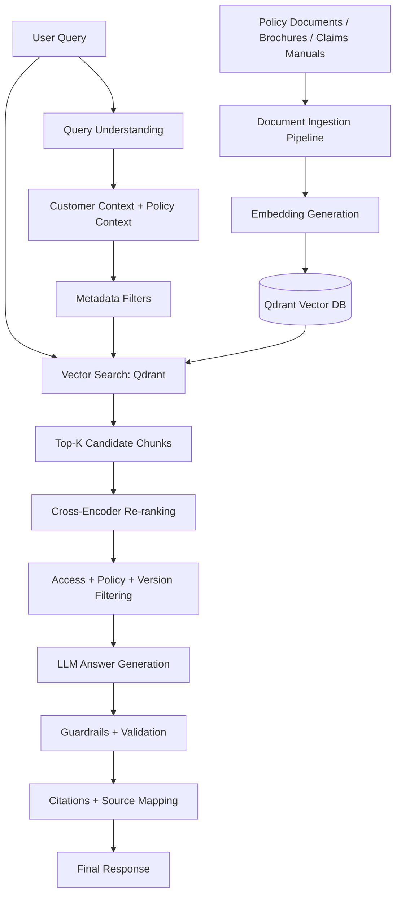
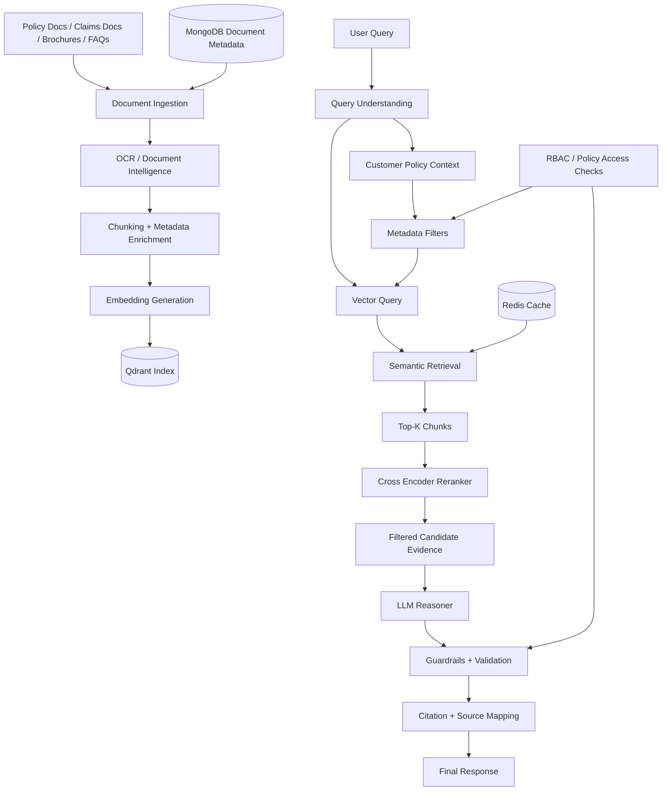
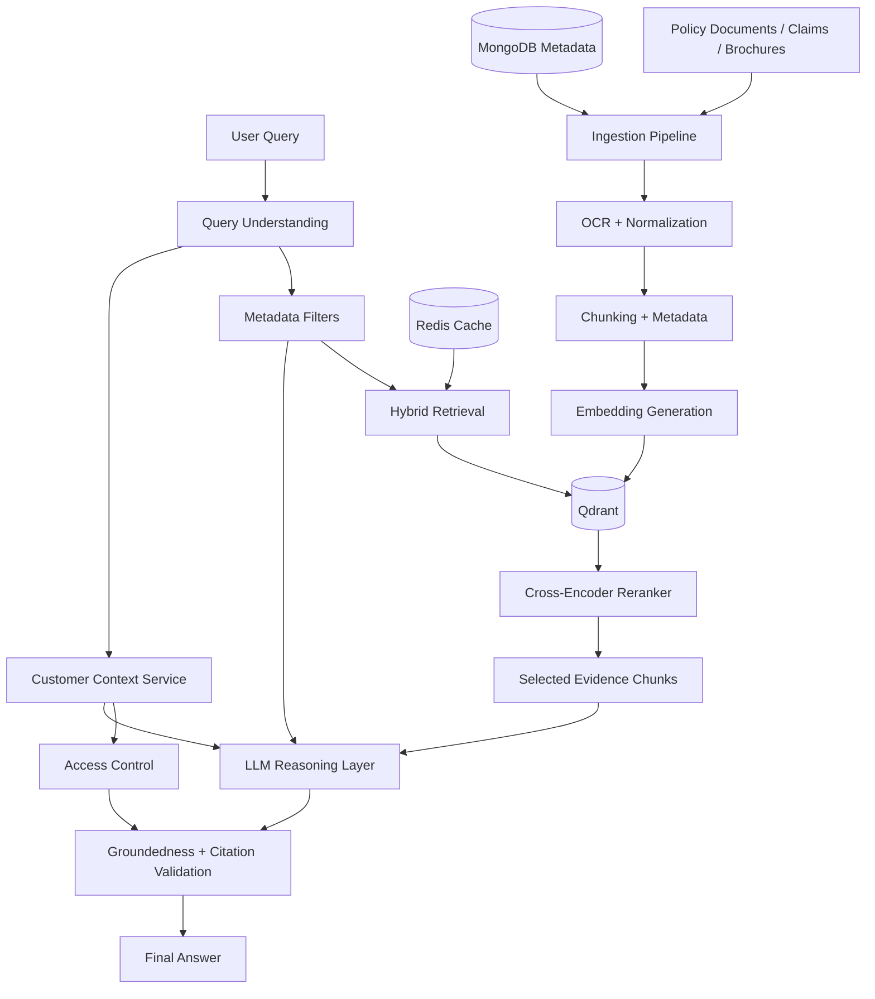

# RAG Architecture for Insurance AI Assistant

## Overview

This document describes the Retrieval-Augmented Generation (RAG) architecture for the insurance AI assistant. The goal is to answer customer and advisor questions with high accuracy, enterprise-grade security, source-grounding, and policy-aware reasoning.

The RAG layer is the heart of the system because insurance knowledge is mostly in long, dense, policy-heavy documents such as:

- policy documents
- terms and conditions
- product brochures
- claims procedures
- FAQs
- regulatory guidance

The system must not rely on the LLM to "remember" policy rules. It must retrieve the relevant evidence first, then reason over it, and then answer with citations.

---

## 1. Objectives of the RAG Layer

The RAG architecture must:

- retrieve policy-relevant evidence with high precision
- filter results by product, policy version, region, coverage type, and user permissions
- improve retrieval quality with re-ranking
- ground answers in source documents and chunks
- support both FAQ and policy reasoning use cases
- reduce hallucinations and unsupported conclusions
- support auditability and explainability for regulated workflows

---

## 2. High-Level RAG Flow



---

## 3. RAG Design Principles

### 3.1 Retrieval-first design
The model should not answer from raw memory alone. It should retrieve evidence first and reason over it.

### 3.2 Policy-aware filtering
A customer’s answer depends on:

- policy number or policy ID
- product type
- coverage type
- policy effective date
- claim type
- region / jurisdiction
- document version / issue date
- user role and permission scope

### 3.3 Evidence-first answering
Every answer must map back to one or more source chunks. The final response should cite relevant policy references and claim procedures.

### 3.4 Precision over recall
For insurance content, an overly broad retrieval set causes poor answers. The system should prefer smaller, higher-quality evidence sets with good reranking.

---

## 4. Knowledge Sources

The RAG system draws on multiple sources:

- insurance policy documents
- product brochures
- claim manuals and claim guidelines
- terms and conditions
- FAQs and internal knowledge articles
- customer policy records and claims data
- regulatory and legal references where needed

These are not all treated equally. Some are internal and role-restricted. Others are public-facing or advisor-facing only.

---

## 5. Document Processing Pipeline for RAG


### Pipeline explanation

- User or admin uploads a document
- It is stored in immutable blob storage
- An event triggers the ingestion workflow
- Airflow orchestrates the processing steps
- Azure AI Document Intelligence handles OCR and complex layouts
- Documents are normalized and chunked
- Metadata enrichments include product type, year, issue date, state, coverage, and version
- Vectors are generated and indexed in Qdrant
- MongoDB tracks document lineage and metadata, including chunk metadata and processing status

---

## 6. Chunking Strategy

Insurance documents are often long and clause-heavy. Therefore, simple chunking is not enough.

### Recommended chunking rules

- Prefer semantic chunking over arbitrary fixed-size splitting
- Preserve section boundaries where possible
- Keep table data and policy terms together when they belong to the same clause
- Avoid splitting across legal definitions or exclusions if it creates ambiguity
- Add metadata at chunk level

### Example chunk metadata

- document_id
- version_id
- product_type
- policy_year
- coverage_line
- jurisdiction
- section_title
- page_number
- source_url
- extraction_quality_score
- created_at

---

## 7. Hybrid Retrieval Strategy

Hybrid retrieval performs best for insurance documents.

### 7.1 Semantic search
Semantic retrieval uses embeddings to find conceptually similar text.

Use cases:

- vague questions such as “what does this policy cover after hospitalization?”
- cross-document paraphrases
- broad contextual intent matching

### 7.2 Lexical search
Lexical search helps with exact terms and policy wording.

Use cases:

- clause names
- exclusions such as “pre-existing condition”
- policy wording like “deductible” or “waiting period”

### 7.3 Metadata filtering
This is essential in enterprise insurance contexts.

Examples:

- policy type = health insurance
- region = India / United States / APAC
- effective_date between X and Y
- document version = latest approved version only
- customer segment = retail / SME / corporate

### 7.4 Why hybrid retrieval matters
Insurance questions often combine vague natural language with exact policy terminology. Semantic search alone is not enough; lexical + metadata filtering increases precision.

---

## 8. Re-ranking Layer

After retrieval, the system should rerank candidate chunks to keep only the strongest evidence.

### Recommended approach

- Use a cross-encoder model such as BGE cross-encoder or a comparable reranker
- Rank top-k chunks based on relevance to the query and customer context
- Use metadata weighting as part of the ranker decision

### Why reranking is necessary

Naive vector search often retrieves many nearby but irrelevant chunks. Re-ranking reduces noise and dramatically improves answer quality for legal and policy content.

---

## 9. Context Assembly

Once the relevant chunks are selected, the system assembles a grounded context for the model.

### Context may include

- top retrieved chunks
- top metadata-filtered chunks
- customer policy details
- claim-specific context
- answer-style rules and formatting instructions

### Example of context payload

```json
{
  "query": "Is this claim eligible for emergency treatment under the basic health policy?",
  "customer_context": {
    "policy_id": "POL-1245",
    "product": "Health Plus",
    "policy_year": 2025,
    "coverage_type": "inpatient"
  },
  "retrieved_chunks": [
    {"doc_id": "policy-health-2025", "chunk_id": "c-341", "score": 0.94},
    {"doc_id": "claims-procedure-2025", "chunk_id": "c-112", "score": 0.91}
  ]
}
```

---

## 10. Grounded Answer Generation

The LLM should answer only from the retrieved context and policy rules. It should be explicitly instructed to:

- answer conservatively
- cite supporting evidence
- mention uncertainty where policy language is unclear
- avoid assuming customer coverage without evidence
- produce structured responses when needed

### Example answer behavior

- “According to Section 3.2 of the Health Plus policy, emergency inpatient treatment is covered when admitted within 24 hours of an accident.”
- “This answer is based on the latest policy version effective 1 Jan 2025.”

---

## 11. Guardrails in the RAG Layer

The RAG pipeline must include safety and compliance checks.

### Input guardrails

- detect prompt injection
- sanitize user input
- prevent malicious retrieval manipulation

### Retrieval guardrails

- filter out documents the user is not authorized to read
- block stale or superseded policy versions
- remove irrelevant or low-quality documents before ranking

### Output guardrails

- enforce groundedness checks
- prevent unsupported claims
- require citation presence for factual or policy-based answers
- flag answers requiring human review

### Sensitive scenarios

- claim denial explanation
- legal interpretation of policy clauses
- premium disputes
- customer-specific coverage decisions
- ambiguous exclusions or regulatory concerns

These should often route to human review or advisor workflows.

---

## 12. Citation Strategy

Citations are not optional in an enterprise insurance assistant.

### Required citation components

- source document name
- section name or clause title
- document version
- page or chunk identifier
- time of policy validity

### Example

“Coverage is available for emergency hospitalization under the Health Plus policy, Section 4.3, Policy Version 2025.01 (source: Policy Doc 2025, chunk H-173).”

This helps with:

- auditability
- compliance review
- advisor trust
- customer transparency

---

## 13. RAG Evaluation Strategy

A production-grade RAG system needs systematic evaluation.

### Retrieval metrics

- recall@k
- ndcg@k
- MRR
- precision@k
- document hit rate

### Answer quality metrics

- groundedness
- citation correctness
- answer faithfulness
- refusal correctness
- usefulness for customer or advisor workflow

### Example evaluation scenarios

- claim eligibility question
- product comparison question
- claim procedure question
- policy exclusion question
- answer requiring routing to a human advisor

---

## 14. Failure Modes in RAG

### Retrieval failure
- no relevant chunks found
- wrong document version selected
- too many irrelevant results

### Answer failure
- the model hallucinates policy language
- the answer is too generic and not policy-specific
- the citation is missing or wrong

### Data failure
- stale document remains indexed
- OCR extraction is poor
- table data is misread
- metadata is incomplete

### Mitigation

- validation before indexing
- retrieval quality checks
- citation requirement as a hard gate
- reprocessing and version correction pipeline
- human review for domain-sensitive results

---

## 15. Security and Compliance in RAG

The RAG layer must enforce strict access rules.

### Key requirements

- user can only access authorized documents
- customer data access follows RBAC/ABAC policies
- documents with expired or superseded versions should not be used
- PII should be masked before model execution when necessary
- all retrievals and answers should be auditable

No answer should be generated from a document the user is not allowed to access, even if it exists in the index.

---

## 16. Performance and Scaling Considerations

RAG must scale across both user queries and ingestion workloads.

### Scaling techniques

- asynchronous ingestion workers
- horizontal scaling of retrieval and API services
- metadata filtering to reduce search cost
- vector index replication or sharding where needed
- Redis caching for common retrieval patterns and FAQ summaries
- query-time pruning of low-value documents

### Latency optimization

- do not retrieve full-document context for simple FAQ lookups
- precompute common retrieval patterns
- keep chunk sizes tight and context-aware
- use reranking only on a limited candidate set

---

## 17. RAG Architecture Decision Summary

The recommended architecture is:

- Qdrant for vector storage and retrieval
- metadata-aware filtering for policy relevance
- hybrid retrieval for semantic + lexical matching
- cross-encoder re-ranking for precision
- evidence-grounded answer generation with citations
- strict guardrails and access control
- async ingestion from source documents to vector index
- version-aware and auditable document processing

This architecture gives the best balance of accuracy, safety, enterprise readiness, and explainability for an insurance assistant.

---

## 18. Mermaid Diagram: Full RAG Architecture



This diagram shows the complete life cycle: documents are ingested and indexed, user queries are contextualized and filtered, retrieval is reranked, and the model produces a grounded, cited answer.

## Service Interaction Diagram



This diagram clarifies how retrieval, filtering, re-ranking, and answer validation interact within the RAG stack for insurance knowledge workflows.
